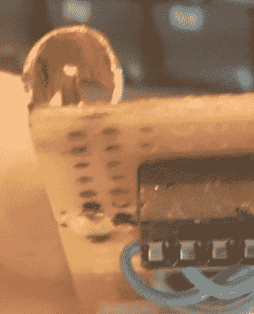

# 桶底连接器:告诉我们你的插座黑客

> 原文：<https://hackaday.com/2018/12/26/bottom-of-the-barrel-connector-tell-us-your-socket-hacks/>

有时你会对一个将改变世界的项目有所顿悟。一个简单的设备，在一个定制的电路板上，带有廉价的部件，将会打破现状，让你立刻赚到十亿美元。有时候，你需要向原型板扔碎铜，用任何必要的手段扼杀 9 伏电压。

这是关于后者的。在我们[的一次黑客聊天](https://hackaday.io/project/5373-hack-chat)，【[早上。Star](https://hackaday.io/Jez.Boxall) 分享了几张需要桶形连接器的图片，但没有时间等待邮件。必要性诞生了最直接的解决方案，不涉及粉碎电源适配器的插头。没有链接，[斯图尔特·朗兰]又名[红帽子]截屏了图像交换，并在[提示行](https://hackaday.com/submit-a-tip/)上提醒我们。

很可能你自己也面临过这个问题。每个人都有一盒旧的壁疣，展示了各种大小的桶连接器。如果你不能采取简单的方法切断连接器，你有什么诀窍？鳄鱼夹是一种可怕的方法，没有任何明确的赢家出现在脑海中。【早上好。Star 的 hack 其实挺可敬的！它似乎是一卷铜(也许来自管道？)在桶的外部弯曲一点弹簧张力。内部由具有扭结的粗铜线接触，以再次提供弹簧作用。

所以，说吧。你的筒形连接器有什么诀窍，它工作可靠吗？