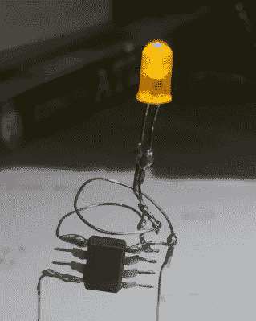

# 点燃一根很硬的蜡烛

> 原文：<https://hackaday.com/2018/12/23/lighting-up-a-very-wiry-candle/>

电路雕塑大赛的参赛作品本质上倾向于极简主义，这个由[Amal Mathew]设计的 LED 蜡烛就是一个完美的例子。这里的想法是再现一个真实蜡烛的纤细和简单的本质，但有一个数字扭曲，我们认为他用最少的零件数和夸张的电线长度很好地完成了它，使它看起来像一个细柱蜡烛。

 为了给 LED 一个淡入淡出的效果，[Amal]使用了用 Arduino IDE 编程的 ATtiny85。他的代码使用循环中的`analogWrite()`来逐渐增加然后降低 PWM 频率。将 LED 直接连接到 ATtiny85 的一个引脚上，这个简单的程序无需任何额外元件就能实现渐变效果。

在蜡烛的另一边，由长铜线连接的是为电路供电的单个 CR2032。令人欣慰的是，[Amal]将电池相对于电路的其余部分转动了 90 度，因此它可以作为一个加重的底座。从外表上看，我们认为让它竖立起来可能有点复杂，但一旦它竖立起来，并愉快地淡入淡出，这真的有助于推销蜡烛的想法。

成品可能看起来相当直接，但在他关于 Hackaday.io 的文章中，[Amal]详细说明了如果你不是一个纯粹的微控制器向导，如何构建自己的版本。这包括如何使用 Arduino Uno 对 ATtiny85 进行编程的指导；即使你不打算在不久的将来制作蜡烛，这也是一个很好的技巧。下一个合乎逻辑的步骤是让你可以“吹灭”LED，这[应该只需要增加一个电阻和一些更新的代码](https://hackaday.com/2018/08/21/an-led-you-can-blow-out-with-no-added-sensor/)。

仍然有足够的时间在电路雕塑比赛中输入你自己的功能性艺术作品。只要在 Hackaday.io 上写出来[在 2019 年 1 月 8 日截止日期](https://hackaday.io/contest/162559-circuit-sculpture-contest)前提交就可以了。

 [https://www.youtube.com/embed/j6zfR01csL8?version=3&rel=1&showsearch=0&showinfo=1&iv_load_policy=1&fs=1&hl=en-US&autohide=2&wmode=transparent](https://www.youtube.com/embed/j6zfR01csL8?version=3&rel=1&showsearch=0&showinfo=1&iv_load_policy=1&fs=1&hl=en-US&autohide=2&wmode=transparent)

