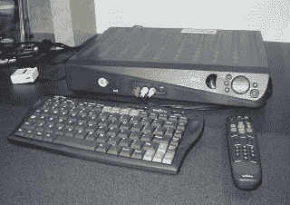
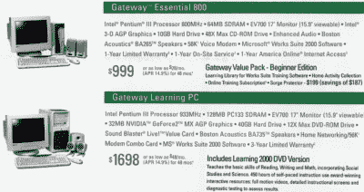

# Alexa，让我想起你的产品类别第一次失败的时候

> 原文：<https://hackaday.com/2019/01/21/alexa-remind-me-of-the-first-time-your-product-category-failed/>

在过去的几年里，消费电子行业的最后一大希望是语音助手。Alexas、Echos、Google Homes 和脸书门户网站风靡一时。Alexa 设备已经售出超过 1 亿台，这是一个令人印象深刻的壮举，因为美国只有大约 1.2 亿个家庭，欧洲也有类似的数字。看看你的左边，看看你的右边，你们中的一个人住在一个有互联网语音助手的房子里。

2018 年，互联网连接的语音助手出现了巨大的爆炸，有时形式因素很奇怪。有一个声控微波炉，如果你想通过互联网解冻一只鸡的话，这是一个很好的选择。[你可以获得硬件](https://hackaday.com/2018/09/20/new-part-day-put-an-alexa-in-everything/)来开发自己的语音助手设备。2019 会更大。脸书正在大力宣传[脸书门户](https://portal.facebook.com/)。如果你还没有删除你的脸书帐户，你可以把脸书门户网站放在你的厨房柜台上，通过 Facebook Messenger 与你的家人和朋友进行视频通话。有了 [Google Home Hub](https://store.google.com/us/product/google_home_hub) 和 Nest 门铃摄像头，你也可以像来自 *Rugrats* 的 Stu Pickles 一样。

这并不是世界第一次迷恋联网助手。这不是消费电子行业第一次把所有的希望都放在一个产品类别上。这种情况以前发生过，所有这些设备都失败了。这些是 1999 年至 2001 年间发布的互联网设备:互联网繁荣的最后一次欢呼。他们那时是哑巴，现在也是哑巴。

### 互联网设备的开端

虽然互联网自 9 月份就已经存在，但直到 90 年代初它才成为一种东西。直到 1994 年，《今日秀》才问道，[什么是互联网？](https://www.youtube.com/watch?v=UlJku_CSyNg)’，凯蒂·柯丽克说，“这是一个很大的计算机网络，现在正变得非常大。”

正是在这种环境下，计算机成为了连接互联网的设备。个人电脑作为扩展人类思维能力的设备的整个概念被抛弃了，变成了你可以用来发送电子邮件的设备。如果说 20 世纪 80 年代承诺的电脑可以帮你报税和组织唱片收藏，那么 20 世纪 90 年代承诺的是一种可以让你阅读报纸的设备。电脑不再是技术，而是 T2 的小玩意。互联网是家庭个人电脑的杀手级应用，这意味着一个连接互联网的东西的热切市场。

WebTV, the predecessor to Microsoft’s MSN TV. This was a dedicated web browser that connected to your 200 pound projection TV. [Image credit](https://commons.wikimedia.org/wiki/File:Webtv.jpg)

第一个这样的设备是 MSN TV，这是一个可以在电视上上网的机顶盒。这不是一个单一的设备，而是由包括索尼和菲利普斯在内的不同制造商生产的一系列设备。无论怎么想象，它都不是一台电脑，但它可以让你连接到互联网。你可以在电视上阅读互联网上的任何内容。

说实话，在 NTSC 分辨率的 CRT 上浏览互联网的想法听起来很痛苦，但网站并不总是需要今天 AMP 移动页面的资源。[看看 1996 年的太空堵塞网站](https://www.warnerbros.com/archive/spacejam/movie/jam.htm)。它在一台旧的阴极射线管电视上非常易读。对一些人来说，网络电视是第一个让互联网进入家庭的设备。虽然大多数人只是买了一台电脑，但这个市场非常有趣，公司将大量资源投入到专用设备上，这些设备只用于浏览互联网。

这些设备中最著名的是 [3Com Audrey](https://en.wikipedia.org/wiki/3Com_Audrey) ，这是一款设计精美的硬件，功能与五年后的功能手机一样。Audrey 不是为家庭办公室设计的，它是为厨房设计的，表面上是为了查找食谱，与脸书门户网站和谷歌 Home Hub 今天的营销方式非常相似。你能拿奥黛丽做什么？嗯，你可以浏览互联网。你可以发电子邮件。有一个日历和一个钟。与许多其他互联网设备不同，有一个 USB 以太网适配器，用于拥有宽带连接的上层社会。哦，你也可以同步两个 Palm OS 设备。奥黛丽可能是家庭的中枢神经系统，在这里你和你的伴侣可以分享时间表和笔记，甚至可能涂鸦。

还有其他设备符合“一台计算机，但只是为了互联网”的理念。康柏 iPaq 是一台糟糕的 x86 计算机，没有任何扩展，只能运行微软的网络浏览器。盖特威加入了这场争斗。在 2000 年，你可以走进西尔斯的一个电子部门，找到一些连接互联网的设备。不，他们没有软驱，也没有 DVD 驱动器。他们都有可怕的显示器，奇怪的是，他们中的大多数都有无线键盘。

### 为什么这些设备会失败？

像 Audrey 和 iPaq 这样的网络设备都是在世纪之交的时候发布的，在一个狭窄的 18 个月的窗口中，民主党呼吁将一个孩子驱逐回古巴，乔治·布什对 T2 外交能力的第一次重大考验(T3)(这是一个成功)。*《连线》*是一份关于互联网的纯印刷出版物；HotWired 和 Wired News 是在线印记。是的，90 年代很奇怪。难以想象的怪异。人们很容易将互联网设备的失败归咎于赫曼米勒 Aeron chairs 的 U-Haul，我们现在称之为网络泡沫破裂，但我认为，原因远比这微妙得多。

Behold! The December 2000 issue of Computer Shopper

第一，硬件。在 2000 年，花大约 1000 美元就可以买到一台标准的台式机——一台能让你在信息高速公路上冲浪的台式机。花大约 1500 美元，你就会得到一台带 DVD-ROM 驱动器的电脑，一个真正的图形卡，一个 128 MB 的内存，甚至可能是一份微软作品。像戴尔和 Gateway 这样的公司售出了成千上万台。是的，今天的规格是可笑的，但这将是一个完美的可用电脑。如果你幸运的话，你甚至可以得到一台漂亮的平板显示器。

另一方面，互联网设备的价格却低得多，尽管这仍然是一大笔钱。3Com Audrey 配备了由国家半导体公司制造的 x86 芯片，运行速度仅为 200 MHz。它配有 32 兆内存和 640 x 480 的显示屏。500 美元 Audrey 的初始价格——你可以买一台二手笔记本电脑，你可以运行 Windows，而不是基于 QNX 的操作系统。当然，在 Audrey 中发现了一些简洁的功能，如向其他 Audrey 发送“潦草”电子邮件的能力，但没有人真正使用它，因为它要求接收者也有一个 Audrey。

康柏 iPaq 设备同样动力不足。ARM 只是在一些古老怪异的英国计算机中发现的被遗忘的芯片组，所以它也带有 AMD 的 x86 芯片，但内存最高为 32 MB。闪存被限制在 16 MB，没有真正的操作系统可言。iPaq 的操作系统是微软的 MSN Companion 2.0，是 Windows CE 的一个更加有限的版本。你可以运行任何你喜欢的浏览器，只要它是 Internet Explorer 4.0。不，你不能像使用二手笔记本电脑那样安装 RealPlayer。iPaq 的初始价格为 599 美元，月费为 21.95 美元。Gateway Touch Pad——2000 年 11 月发布的一款完全不可谷歌的设备——售价也是 599 美元。它配备了一个缓慢的 Transmeta Crusoe CPU，并且只能浏览 AOL。这些网络设备的价格是 500 或 600 美元，再多花几百美元就能买到一台真正的电脑。如果你在二手电脑市场，你可以买一台邦迪蓝色的 iMac。确保获得第一个硬件版本，因为那是带有夹层插槽的版本。

互联网设备之所以失败，是因为只要多花一点钱，你就可以得到一台完整的电脑。他们动力不足，真的没做那么多。是的，你可以打一封电子邮件，但你不可能从苹果公司下载一部电影的预告片，并在这些设备上观看。简单地说，有更好的选择。互联网设备是消费电子行业想尽一切办法来运输更多产品的结果。

我觉得我们在用语音助手重复同样的事情，但这次更糟糕。每部安卓手机都配有嘿谷歌，每部 iPhone 都配有 Siri。如果你有一部过去几年制造的智能手机，你已经有一个语音助手了。如果你能把手机靠在咖啡机上，你就已经拥有了一个脸书门户网站。

当前在你家里每个房间安装奥威尔式电幕的趋势将会消亡，就像互联网设备一样。我们现在需要的是苹果重新创造 iPod，并给这个行业另一个目标。