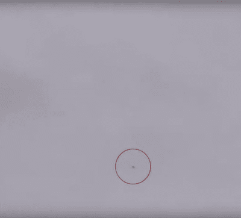
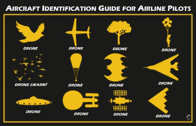

# 哦，我们是不是因为目击不明飞行物而关闭了一个机场？

> 原文：<https://hackaday.com/2018/12/26/ooops-did-we-just-close-an-airport-over-a-ufo-sighting/>

想象一下:在英格兰南部一个寒冷、黑暗、多风的 12 月夜晚，伦敦第二国际机场盖特威克机场的一名机场工作人员看到泛光灯上方的黑暗中有东西飞过。天气和黑暗使得很难看到物体是什么，但报告是打电话给安全。那是什么？一群鸟？一片被风吹了一夜的塑料垃圾？在这种情况下，呼叫被记录为无人机。因为这个神奇的 D 字已经发出，一个安全计划开始行动，机场进入高度戒备状态，航班暂停。

[![Gatwick by night, on an evening far less inclement than last week. News Oresund [CC BY 2.0].](img/489f553351017ed48d04fcfb6648dfa5.png)](https://hackaday.com/wp-content/uploads/2018/12/Gatwick_Norwegian_2015mar27_0007_16333812524.jpg) 

盖特威克的夜晚，一个远没有上周那么严酷的夜晚。新闻 Oresund [ [CC BY 2.0](https://commons.wikimedia.org/wiki/File:Gatwick_Norwegian_2015mar27_0007_(16333812524).jpg) 。整个工地上成千上万的人都处于戒备状态，等待无人机的到来。当然，无人机报告滚滚而来，故事呈现出自己的生命。不知道无人机在空中是什么样子的人现在希望看到一架，所以当然当一群鸟或被风吹走的塑料袋穿过他们的周边视觉时，他们也确信那是无人机。夜晚变成了白天，在报道中有一个间歇，所以机场重新开放，只是在一系列新的目击事件后再次关闭。全国各地的航班都被转移，成千上万的乘客滞留在候机楼。

No, it’s not a speck of dirt on your screen, it’s a drone! BBC (Fair use)

接下来是为期三天的机场关闭闹剧。尽管该网站上成千上万的人几乎每个人都有拍照手机，他们可以通过手机在推特上发布关于航站楼排队的照片，但没有照片出现。有一段模糊的视频，但很模糊，关键是视频中没有任何可以识别为盖特威克的东西。与此同时，警方在搜寻无人机操作者的过程中遇到了挫折，事实证明很难确定谁喜欢他们的无人机

第三天晚上[宣布逮捕了一对本地夫妇](https://www.bbc.co.uk/news/uk-england-46658868)。警察化险为夷，罪犯已被关押起来。每个人都松了一口气，机场重新开放，一切都结束了。当然，事实并非如此，因为不方便的是，这对夫妇[被认定无罪](https://www.bbc.co.uk/news/uk-england-46665615)并被释放。当在采访中被追问时，警方发言人尴尬的承认[有可能根本就没有无人机](https://www.standard.co.uk/news/uk/gatwick-drone-latest-police-say-it-is-a-possibility-there-was-never-a-drone-a4024626.html)。

## 你编不出来

![If these are the drone parts they've found, they're doing it wrong. Francis Wood [CC BY-SA 3.0]](img/49f817ee30b46ca719810452fdf35721.png)

如果这些是他们找到的无人机零件，他们就做错了。弗朗西斯·伍德[ [CC BY-SA 3.0](https://commons.wikimedia.org/wiki/File:Dunn_Chanter_%26_Drones_Chantry.jpg) ]

你可能会认为这是惊悚小说的虚构情节，但遗憾的是不是这样。除了第一段的大部分内容是我们对第一次无人机目击事件的猜测之外，以上都是英国新闻中最近几天事件的故事。在撰写本文时，仍有可能在盖特威克上空有一架无人驾驶飞机，但鉴于目前缺乏证据，这似乎是站不住脚的。有关于无人机残骸的报道，但由于记性好的读者会记得英国警方曾将 RepRap 零件识别为 3D 打印枪，我们将等到看到它后再这样称呼它。

如果确实有一架无人驾驶飞机，那么我们当然希望看到它的操作者立即被绳之以法。但我们在 Hackaday 关注的是这一事件对我们社区中那些对多旋翼感兴趣的人的影响。通常的呼声是要求政府对此做些什么，我们知道这将意味着对负责任的多旋翼飞机所有者制定一套新的繁重的法规，而对罪犯却无动于衷，因为罪犯当然不尊重法律。

因此，如果我们要从这个糟糕的烂摊子中发现什么，我们必须从几个角度来审视它。为什么缺乏到位的无人机探测技术？在地面上，无人机报告最初应该如何处理和调查？在官方调查中应该如何处理他们，然后立法者应该如何看待他们？由于所讨论的事件，这将不可避免地带有英国色彩，但这些观点在世界范围内都同样有效。

## 当无人机报告进来时，我们需要一个可靠的方法来评估它

An oft-shared drone identification guide for airline pilots, of uncertain provenance ([phantompilots.com](https://phantompilots.com/threads/aircraft-identification-guide-for-airline-pilots.75482/)).

当我们被告知一些新的事情时，它会在我们的头脑中经过一个评估的过程。我们查看来源，权衡故事本身。如果街上一个头发疯长的家伙告诉我们，外星人已经着陆了，正在用射线枪控制首相，那大概就要打折扣了。但是，如果 Hackaday 告诉我们，有人入侵了 VGA 芯片组，使其作为软件定义的无线电工作，我们猜测你们大多数人确实会非常感兴趣。

当一个新的无人机事件被报道时，这种评估过程在历史上似乎是有缺陷的。我们之前讨论过官方事故报告，这些报告没有无人机的实物证据，但包含了对无人机的描述，这些无人机的能力甚至是喷气式战斗机无法比拟的。似乎任何目击者的报告，其中的罪魁祸首被命名为无人机，自动采取表面价值，无论它可能是多么不可能。报告可能来自飞行员的事实有时被认为是对其可信度的提升，但这是一个错误的假设。一个不熟悉无人驾驶飞机如何从远处出现或无人驾驶飞机在空中的能力的飞行员只能被认为是一个不可靠的证人，因为尽管他们可能知道很多关于飞机的知识，但他们缺乏做出这种判断所需的专业知识。那么，怎样做才能帮助提高报告的质量，并立即突出可信的报告，同时要求更多可疑的报告呢？

在开阔空域发生未遂事件时，对地面设施的影响可能很小，但在盖特威克这样的机场，当局不能冒险。一架飞机在最后进近时与无人机相撞可能导致数百人死亡，因此在接到报告后，他们肯定别无选择，只能关闭跑道。盖特威克机场似乎缺乏无人机探测技术，这意味着机场唯一可用的来源是目击者自己，因为我们已经充分证明了目击者报告不可靠的可能性，所以当前的混乱是不可避免的。如果必要，安装或开发更可靠的检测技术是必要的。当预防性关闭延续几分钟或几小时，导致制造世界新闻的延误时，情况尤其如此，就像在这种情况下发生的那样。

## 胜任的警方调查和负责任的无人机报道

[![The mass media tech story cycle. Our apologies to Gartner. Curve image: Jeremykemp [ CC BY-SA 3.0 ]](img/96ec01ac37520752298a293483f4f9be.png)](https://hackaday.com/wp-content/uploads/2016/04/media-tech-cycle-800px1.png) 

大众传媒科技故事循环。我们向 Gartner 道歉。curve image:Jeremy Kemp[[CC BY-SA 3.0](https://commons.wikimedia.org/wiki/File:Gartner_Hype_Cycle.svg)]

一旦事件发生，并且有消息传出，就会对我们社区的成员产生影响。远离机场的合法无人机飞行员将会发现自己受到更多的审查，因为在飞行过程中听到警察被召来已经是一个常见的故事，这意味着他们可能会面临骚扰和非法逮捕。事实上，尽管我们不知道在盖特威克附近被捕的两人的所有细节，但这似乎意味着他们是在当地无人机爱好者的一次围捕中被捕的，而不是有意义的调查的结果。这两人的名字被泄露，他们成为媒体狂热的对象，这进一步表明他们所处的危险，以及报道他们困境的记者的不负责任。

## 也许最重要的是:我们需要准确的官方事故报告

无论无人机报告中发生了什么，无论是逮捕还是令人尴尬的崩溃，都不可避免地会有来自英国民用空域监管机构民航局的官方事件报告。这将形成事件的官方记录，因此应该努力尽可能准确，但在这里，该过程达不到最后一次。似乎没有对现有证据进行评估，也没有对实物证据的要求。因此，如果一名目击者报告了无人驾驶飞机的行为，而这些行为是任何无人驾驶飞机都不可能做到的，那么这将被郑重记录为事实。我们之前关于这个主题的文章强调了许多这样的报道，这是很重要的一点，因为作为官方记录，这些报道是立法者的信息来源。当他们制定关于无人机的法律时，他们的决定必须基于准确的证据，很明显事实并非如此。鉴于他们毫无疑问会在这次惨败后审查无人机立法，调查人员咨询该领域的专业知识人士，要求实物证据而不是纸上谈兵，最重要的是质疑延伸可信度的说法，这一点尤为重要。

似乎很明显，多旋翼爱好者陷入了无能的当局、漏洞百出的调查、粗制滥造的新闻和无能的立法者的完美风暴中。这一事件暴露了一些缺点，希望从中吸取一些教训，以减少未来无人机事件的灾难性后果。这仍然是一个发展中的故事，所以可能会有突破，整个故事将会改变，如果事实证明是这样，那么我们希望他们这次找到正确的肇事者，并在女王陛下的喜悦下将他们送走很长一段时间。不过我们猜测，他们会尽一切努力把这件事隐藏得尽可能深，以挽回官场中的红脸。作为多旋翼爱好者，我们必须保持调查不力的问题，因为如果我们让它再次被埋葬，它会再次回来困扰我们。