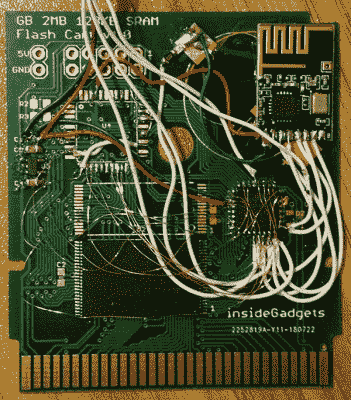

# 使用你的游戏机作为无线控制器

> 原文：<https://hackaday.com/2019/01/02/use-your-game-boy-as-a-wireless-controller/>

像许多复古的最爱一样，Game Boy 并没有消亡——通过它的众多粉丝，发展仍在继续。但是硬件方面呢？这是一个特别有趣的问题:[亚历克斯]想知道游戏机是否可以很容易地用作无线控制器。着手实现它，最终产品是一个游戏盒，它使传统的手持设备变成了一个无线控制器。

 它实现得相当优雅，用一个定制的盒子把游戏机变成一个控制器，而不需要对手持设备进行任何修改。该盒式磁带包含一个存储 ROM 的闪存芯片，以及一个 ATmega48PA 微控制器和一个 NRF24L01 来进行通话。上电后，Game Boy 从 rom 中运行代码，微控制器负责读取按钮状态并将其发送到 NRF24L01 进行传输。存储在 ROM 中的程序还允许从 Game Boy 本身进行配置更改，例如选择合适的无线频道。

盒式发射机可以与各种接收机一起使用。[Andy]开发了一个 USB HID 游戏杆模拟器，可以让 Game Boy 与 PC 一起使用，也可以作为 GameCube 的接收器。是的，没错——你现在可以用一个比你所有朋友都更奇怪的控制器来玩《超级粉碎兄弟》。一个超级任天堂版本也正在开发中。然而，也许最酷的功能是，手推车可以使用它的无线电链接与另一个运行相同墨盒的游戏机进行通信。[Andy]用两个 Game Boy Advances 之间玩的基本游戏 Pong 演示了这一点。

从事复古硬件的工作可能会很有趣——事情都有据可查，零件很便宜，也会有很多粉丝为你加油。[安迪]甚至在[Tindie](https://www.tindie.com/products/insidegadgets/wireless-gameboy-controller-device/)和[他的网站](https://shop.insidegadgets.com/product/wireless-gameboy-controller/)上提供硬件，如果你不太习惯自己动手的话。

Game Boy 平台仍然适合黑客攻击——[如今你甚至可以用逻辑分析仪截图。休息后的视频。](https://hackaday.com/2017/08/01/using-a-logic-analyzer-to-generate-screenshots-from-a-game-boy/)

 [https://www.youtube.com/embed/yeJDouGYPuk?version=3&rel=1&showsearch=0&showinfo=1&iv_load_policy=1&fs=1&hl=en-US&autohide=2&wmode=transparent](https://www.youtube.com/embed/yeJDouGYPuk?version=3&rel=1&showsearch=0&showinfo=1&iv_load_policy=1&fs=1&hl=en-US&autohide=2&wmode=transparent)

