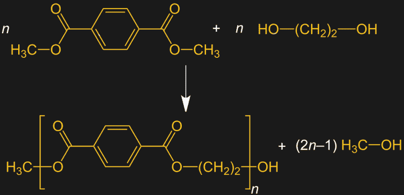
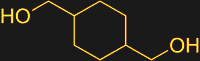

# 塑料:PETG

> 原文：<https://hackaday.com/2019/01/29/plastics-petg/>

你几乎很难走过现代食品店的任何一条过道而不碰到塑料制品。从一罐罐花生酱到一瓶瓶汽水，以及牢牢固定饼干以防破损的托盘，或者让一顿饭直接从冰箱进入微波炉，食物经常与一种专为这项工作设计的塑料密切接触:聚对苯二甲酸乙二醇酯，或 PET。

对于非食品物品的制造商来说，PET，更重要的是它的衍生物 PETG，也恰好具有优异的性能，使它们成为某些应用中 3D 打印细丝的首选。让我们来看看聚酯树脂的化学成分，以及如何通过一个微小的变化将合成纤维变成非常有用的 3D 打印细丝。

## 不仅仅是衣服

像许多有实际用途的塑料一样，PETG 是一种共聚物。它所基于的均聚物是 PET，即聚对苯二甲酸乙二醇酯。1941 年，英国化学家约翰·韦恩菲尔德和詹姆斯·迪克森首次为聚酯聚合物家族中的 PET 申请专利。像许多其他人一样，他们寻找合成纤维，如尼龙，几年前由杜邦公司推出时引起了很大的轰动。

Whinfield 和 Dickson 发现有机酸对苯二甲酸(最初从松节油中分离出来的化合物)和二醇乙二醇(汽车防冻剂的主要成分)之间的缩合反应。他们发现这些单体会连接成长链，产生一种可以被拉成细纤维和纱线的物质。战时保密法将他们的发明“涤纶”保密到 1946 年。

如今，PET 是通过其他工艺生产的。DMT 法使用对苯二甲酸二甲酯，它是带有两个甲基的对苯二甲酸。当乙二醇与 DMT 在高温和碱性条件下反应时，发生酯交换反应，将 DMT 的长链与乙二醇的小片段连接在一起。该反应产生甲醇，需要除去甲醇以继续聚合反应。

The DMT method of producing PET. On the top row, DMT on the left and ethylene glycol on the right undergo transesterification, producing methanol while growing the PET chain. Source: Jü [[CC BY-SA 4.0](https://creativecommons.org/licenses/by-sa/4.0)], [from Wikimedia Commons](https://commons.wikimedia.org/wiki/File:PET_by_Transesterification_V1.svg)

尽管宠物多才多艺，但它也有弱点。虽然它非常适合制造合成纤维，但它在其他热塑性塑料擅长的应用中表现不佳，如挤出或注射成型。这就是 PETG 的用武之地。“G”代表“乙二醇改性”，这是一个有点混乱的命名法。许多消息来源似乎认为这意味着乙二醇被加入到聚合反应中，但正如我们所见，乙二醇已经是聚合反应的一部分。乙二醇改性是指增长链中的一些乙二醇被另一种单体取代，导致共聚物具有与均聚物不同的性质。

Cyclohexane dimethanol (CHDM)

在 PETG 的情况下，共聚单体是另一种二醇，环己烷二甲醇(CHDM)。这种分子比紧密的乙二醇大得多，但与较小的分子进行酯交换的方式大致相同。加入 CHDM 的效果是对苯二甲酸残基之间的距离增加，使得相邻的聚合物链更难紧密结合在一起。这导致水透明的塑料具有比 PET 更低的熔化温度，可以被模制和挤压。

## 两全其美

这些性能使 PETG 和其他 PET 共聚物非常适用于商业产品。对于家庭游戏玩家来说，PETG 是 3D 打印灯丝的常见选择，基本上结合了 ABS 和 PLA 的最佳特性，成为一种易于使用的灯丝。它比 PLA 具有更大的强度和更好的柔韧性，并且其低收缩率、良好的层粘附性和牢固的床粘附性使其在印刷过程中不太可能翘曲或分层。与 PLA 和 ABS 相比，一个很好的特点是 PETG 在印刷的时候闻起来不太像。因此，如果你厌倦了让你的商店闻起来像有机化学实验室的烟雾，PETG 可能值得一试。

在环境因素方面，PETG 也胜过解放军。PETG 耐多种溶剂，比 PLA 更耐风、雨和紫外线，是户外应用的绝佳选择。未着色的 PETG 在印刷时也是半透明的，这可以给印刷品增添一种其他细丝所没有的美感。PETG 被认为是一种食品安全塑料，但是在使用它接触食物之前，你需要考虑其他因素。

当然，PETG 并不完美。它比 ABS 或 PLA 更灵活，这对于某些应用可能是个问题。当压力超过极限时，它也有突然破碎的趋势，而不是逐渐屈服。正如你可能从纺织品中提取的聚合物中所料，PETG 在印刷时会产生拉丝现象。这很容易用热风枪解决，但如果你追求的是形式而不是功能，还是要记住这一点。

如果你还没有让 PETG 尝试 3D 打印机，你应该试试。