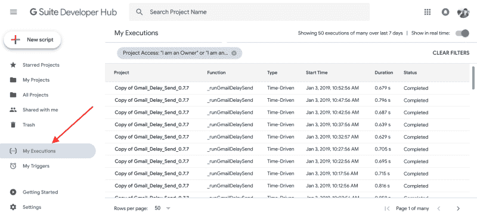

# 破解你的 Gmail:谷歌应用脚本快速入门

> 原文：<https://hackaday.com/2019/01/17/hack-your-gmail-a-quick-start-for-google-app-scripting/>

对许多人来说，Gmail 是电子邮件的同义词。有些人喜欢通过云访问一切，有些人讨厌在云中存储任何个人数据。不管你怎么想，拥有桌面软件的一个好处是你可以相对容易地破解它。如果你不喜欢你的桌面邮件客户端的工作方式，你有很多选择:使用不同的程序，编写你自己的程序，破解你当前程序的可执行文件，或者在开源的情况下，只是分叉它，并做出你足够聪明的任何改变。

谷歌的所有产品都提供了很多功能，但是无论你如何分割，所有的代码都在你无法触及的服务器上运行。算是吧。如果你懂 JavaScript，你可以使用 [Google Apps 脚本](https://www.google.com/script/start/)为包括 Gmail 在内的许多 Google 产品添加功能。如果你使用过 Office 脚本，想法是一样的，尽管很明显实现是非常不同的。

使用脚本，您可以制作复杂的过滤器，否则很难做到这一点。例如，监控可疑邮件，如带有 4 个以上附件的邮件，或看起来来自凌晨 2 点到 5 点之间的联系人的邮件。

对于我们今天的例子，我将向你展示一些简单却非常有用的东西。

## 一个有用的例子

[](https://hackaday.com/wp-content/uploads/2018/12/gmail-logo-100160576-large.jpg) 你收到多少封关于销售的电子邮件？如果你像我一样，很多。你都删了吗？或者你能在你的邮件中告诉我 2003 年 1 月港口货运有什么促销吗？我经常希望有一个众所周知的邮件标题，允许邮件删除自己，因为老实说，我收到的邮件中至少有一半只对未来某个日期有用。邀请、包裹追踪、销售、关于新内容但在网络上的通知。

我从一个大部分是手动的过程开始。我创建了许多过滤器，使用标签“keep14”来标记我知道属于这一类别的传入消息。然后——如果我记得的话——每两周左右，我会使用“older_than”谓词搜索该标签，以找到所有带有该标签的旧消息。搜索字符串将是:

```
label:keep14 older_than:14d
```

然后你可以一举删除所有结果。假设你记得这么做。

## 完美的自动化:Gmail 中的脚本和触发

[](https://hackaday.com/wp-content/uploads/2018/12/button.png) 谷歌脚本可以轻松做到这一点。然而，还是有一些问题。最明显的一个也是最容易的一个。仔细想想，每两周运行一次脚本并不比手动运行好多少。幸运的是，Google Script 提供了可以在不同事件上运行脚本的触发器，其中之一，不出所料，就是时间。

那么，不考虑这些细节，我们如何让 keep14 脚本工作呢？

1.  转到[谷歌脚本仪表板](https://script.google.com/u/0/home/)并登录
2.  创建一个新项目(点击左上方的新脚本，并更改顶部的无标题名称)
3.  粘贴以下内容:

```

// Things you might like to change
var LABEL=&quot;keep14&quot;; // needs to match the one below in autodelete!
var DELAY=21; // give them 1 week grace period (21 days)

function Install() {
   ScriptApp.newTrigger(&amp;quot;autodelete&amp;quot;)
      .timeBased().everyDays(1).create();
   GmailApp.createLabel(LABEL);
}

function Uninstall() {
   var triggers = ScriptApp.getScriptTriggers();
   var item;
   for each (item in triggers) {
      ScriptApp.deleteTrigger(item);
   }
}

function autodelete() {
   var threads;
   var item;
   var search = &quot;label:&quot; + LABEL + &quot; older_than:&quot; + DELAY +&quot;d&quot;;
   var n=0;
   do {
// Gmail will only do some at a time so let's do only a few
// It is not clear how this works when you delete some of the first 500
      threads=GmailApp.search(search,n,500);
      n=n+500;
      for each (item in threads) {
// Logger.log(&quot;Delete %s&quot;, item.getFirstMessageSubject());
         item.moveToTrash();
      } // end for each
   } while (threads!=null &amp;&amp; threads.length&lt;0);
} // end function

```

要理解这一点，你当然需要知道 Google 暴露的对象模型。有[文档](https://developers.google.com/apps-script/)，尽管像大多数文档一样，它有时会留下一些需要的东西。现在，跳到代码的底部，把重点放在自动删除功能上。

## 在代码中

看代码的最顶端。前两行只是为了让您轻松定制标签和延迟时间(以天为单位；我决定给它一周的宽限期)。

[](https://hackaday.com/wp-content/uploads/2018/12/mailbot.png) 自动删除中算法的第一个真正部分是构建搜索字符串，就像我们手动发出的一样。如果您知道您不会处理很多邮件，那么您可以通过调用`GmailApp.search`来获取一个表示所有匹配消息的对象，从而使这变得非常简单。问题是，如果搜索返回超过 500 个条目，脚本将会阻塞。

这可能看起来不现实，但是如果你仔细检查并标记一条你多年来每天都收到的信息，它可能会变得更多。为了解决这个问题，我循环进行搜索，并限制每次搜索 500 个项目。当查询不是从零开始时，文档中关于它在记忆查询方面有多好的描述很少。删除第一组结果中的一些消息可能会导致跳过在第二组中开始的消息，因为在第二次调用时，它们会在第一组中。我没有进行测试，文档也不清楚。然而，在几次之后，它应该得到所有的消息，并且一旦脚本正常运行(并且您没有添加更多来自过去的消息)，无论如何您一次可能不会处理超过 500 条消息。

你可以假设所有的结果都足够旧，可以删除，否则它们不会从搜索中返回。所以一个简单的`for each`循环枚举每条消息，然后一个`moveToTrash`调用删除它。

## 变得更加复杂

这个例子没什么可看的。当然，假设您想要的数据和特性通过对象模型公开，您可以做尽可能复杂的事情。例如，如果您已经回复了电子邮件，您可能想跳过删除它。你可以在一个线程中发生活动时改变标签，或者开发比 Gmail 目前实现的更微妙的“轻推”行为。我们很想听听你在下面的评论中能想到哪些可能的用途。

你也可以编写谷歌其他主要应用程序的脚本。跟踪你已经自动化的东西是相当简单的。如果您转到[脚本仪表板](https://script.google.com/u/1/home)，您会在屏幕左侧看到一个选项，上面写着“我的触发器”，将向您显示将运行什么以及何时运行。“我的执行”条目将显示您的脚本何时运行以及发生了什么。脚本可以超时，并且每天消耗的 CPU 时间是有限制的。

[](https://hackaday.com/wp-content/uploads/2018/12/dasj.png)

和自己写应用或者修改他们的源代码一样好吗？不，当然不是。但也简单了很多。因为脚本在他们的服务器上，所以调试有点简单，但它确实有效，如果你在执行重复任务时用头撞键盘，以保持对失控收件箱的控制，这是一种更好的方式。