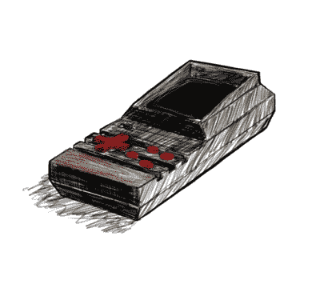

# 受 2600 启发的手持设备带来人造木纹

> 原文：<https://hackaday.com/2019/01/03/2600-inspired-handheld-brings-the-faux-woodgrain/>

Atari 2600 是一个非常不同时代的控制台，当时家用电器、家具甚至汽车都覆盖着假的乙烯基木纹贴面。不知何故，它流行了十年，然后一夜之间就变得俗气了。无论如何，如果你想唤起那个时代，那就是你要做的—[,而这正是【克里斯蒂安】用这个手持式复古建筑](https://www.thingiverse.com/thing:3317549)所做的。

一幅早期的概念草图展示了【克里斯蒂安】的艺术技巧。

在这些地区，技术层面的事情相当常规——Pi Zero 运行 RetroPie，这样你就可以玩 90 年代中期和更早的模拟游戏。这是我们特别喜欢的视觉展示。早期雅达利的外观是通过巧妙使用材料而被唤起的。机身是黑色塑料的，有块状的红色按钮用于控制。它在屏幕周围用乙烯基木纹贴花完成，我们认为这是一种美妙的美学。

你可以在 Thingiverse 上找到自己打印的文件,[Christian]提供了一个基本的指南来寻找类似的零件。这些都是常见的东西，在易贝或其他地方随处可见。

我们喜欢看到这样的复古——2017 年超级大会上的迷你 Macintosh Plus 是一个特别的亮点。