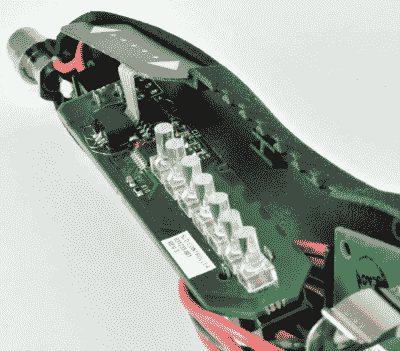

# Solderdoodle 开源铁骑再出发

> 原文：<https://hackaday.com/2019/01/03/the-solderdoodle-open-source-iron-rides-again/>

大约在去年，无线便携式烙铁风靡一时。事实上，在这一点上，相当多的黑客读者可能已经把他们的全尺寸 AC 熨斗换成了一个仅比一支笔稍大的 DC 熨斗。但是在便携式熨斗大繁荣之前，在 2014 年的旧时光，我们给你带来了由[Isaac Porras]创造的开源 Solderdoodle。基于 Weller BP645，采用 3D 打印外壳，DIY 熨斗设计为从标准 USB 端口充电。

 现在，[【艾萨克】带着他称之为焊嘟嘟加](https://www.instructables.com/id/Solderdoodle-Plus-USB-Rechargeable-Soldering-Iron-/)的更新版本回来了。它仍然基于 Weller BP645 的加热元件，但现在拥有两倍的功率，改进的 3D 打印外壳，直观的触摸用户界面，甚至还有一些 LED 闪光灯。与最初的 Solderdoodle 一样，该设备的硬件和软件都是开源的，你可以自己构建，尽管也可以通过已经完全资助的 Kickstarter 活动获得工具包。

[Isaac]说，传统有绳烙铁上的温度控制功能浪费能源，因为它们必须将大量热物质加热到一定温度。但他说，由于热质量更小，并且有一个可变占空比脉冲电源系统，Solderdoodle Plus 可以做与老式 60 瓦熨斗相同的工作，而只消耗 10 瓦。这使得熨斗可以在内置双松下 NCR18500A 锂离子电池的情况下保持恒定的 500°C 超过一个小时，这意味着你可以用微型 USB 电缆充电。

通过添加新的尖端及其可调功率水平，Solderdoodle Plus 还可以用于其他需要精确定向加热的任务。在休息后的视频中，[Isaac]展示了一个“铲子尖端”和熨斗上的低功率设置，专门用于清理 3D 打印零件上的细绳和瑕疵，而不会熔化零件本身。如果你涉足枯树，也有一个尖锐的提示可以用于你的烙画项目。

在内部，Solderdoodle Plus 具有基于 Maxim MAX8903G 的定制充电控制器，控制板由 ATtiny84A 微控制器供电。它还利用了 Interlink FSLP 34-00003，一个交钥匙触摸传感器模块，以及一些非常光滑的比瓦尔 VLP 350-F 光管，用于智能 LED“条形图”接口。总的来说，这不是你将从零件箱中得到的东西，但如果你不介意采购所有零件并制作电路板，所有信息都可用于你自己的 Solderdoodle Plus。

自从我们给你带来了最初的 Solderdoodle 的消息，便携式熨斗的世界已经取得了很大的进步。 [TS100 已经超过](https://hackaday.com/2017/07/24/review-ts100-soldering-iron/)成为全世界黑客的最爱，这[自然激发了一些令人印象深刻的 DIY 克隆](https://hackaday.com/2018/07/09/build-your-own-portable-arduino-soldering-iron/)，你甚至可以[以低至 5 美元](https://hackaday.com/2016/04/25/usb-soldering-iron-is-surprisingly-capable/)的价格获得 USB 供电的熨斗。Solderdoodle Plus 这次有一些激烈的竞争，但我们总是很高兴支持开源的失败者。从 Kickstarter 在不到 24 小时内获得全额资金的事实来看，似乎我们并不孤单。

 [https://www.youtube.com/embed/Y3QadVa9Z5w?version=3&rel=1&showsearch=0&showinfo=1&iv_load_policy=1&fs=1&hl=en-US&autohide=2&wmode=transparent](https://www.youtube.com/embed/Y3QadVa9Z5w?version=3&rel=1&showsearch=0&showinfo=1&iv_load_policy=1&fs=1&hl=en-US&autohide=2&wmode=transparent)

