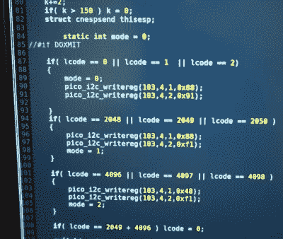

# ESP8266 的欠锁导致 WiFi 怪异

> 原文：<https://hackaday.com/2019/01/04/underclocking-the-esp8266-leads-to-wifi-weirdness/>

有时候最好的技巧来自最基本的问题。在这种情况下，[CNLohr]想知道如果他开始降低 ESP8266 基带 PLL (BBPLL)的时钟速度，同时仍然试图与之通信，会发生什么情况。你知道，就像一个人做的那样。结果相当令人惊讶，虽然目前还不清楚这种特殊的技巧是否有实际应用，但它肯定值得一些额外的研究。

Code for stepping through clock speeds

这里的想法是 BBPLL 是整个系统的参考时钟，包括所有外设。因此，欠锁不仅会如你所料的那样降低代码执行速度，还会降低芯片与外界的交互速度。[CNLohr]在下面的视频中演示了这一概念，展示了如何调整用于查看来自 ESP8266 的串行输出的波特率，以匹配芯片的频率，否则您只会在线路上看到垃圾。

但是 WiFi 会怎么样呢？正如[CNLohr]发现的那样，虽然中心频率本身不会改变，但随着时钟速率的降低，通道宽度会变窄。当在软件无线电(SDR)的瀑布式显示屏上观看时，可以看到随着时钟速率的降低，传输以步进模式“压缩”。正如所料，802.11 数据包对于运行在监控模式下的普通 WiFi 设备来说变得难以辨认。信号仍处于正确的频率，但设备之间不再相互理解。

现在是时候回答另一个基本问题了。如果你对一个*秒* ESP8266 做同样的事情会怎么样？令他惊讶的是，[CNLohr]发现只要 BBPLL 时钟速度相同，这两个器件仍然可以成功通信。从局外人的角度来看，这看起来像是胡言乱语，但是对于已经慢了相同量的两个 esp 来说，一切都像预期的那样工作，尽管 802.11 标准说它不应该这样。

那么你能用这个做什么呢？最明显的应用是 ESP8266s 之间的“隐形”WiFi 连接，这种连接不会显示在普通设备上，这是一种除了最精明的窃听者之外所有人都看不见的通信通道。[CNLohr]已经在 GitHub 上公开了实现这一技巧的所有源代码，看看黑客为这种破坏标准的行为找到了什么样的应用程序(如果有的话)应该会很有趣。

如果你的事情是设备被特别扭曲的黑客强行操作，看看我们最近对[Ted Yapo] 的 USB 串行适配器转换成 SDR 的报道。

 [https://www.youtube.com/embed/2eOsN096ZbE?version=3&rel=1&showsearch=0&showinfo=1&iv_load_policy=1&fs=1&hl=en-US&autohide=2&wmode=transparent](https://www.youtube.com/embed/2eOsN096ZbE?version=3&rel=1&showsearch=0&showinfo=1&iv_load_policy=1&fs=1&hl=en-US&autohide=2&wmode=transparent)

【感谢 BaldPower 的提示。]