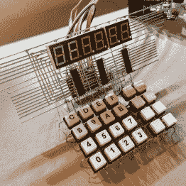
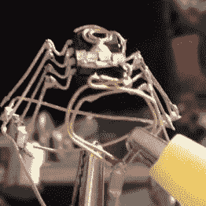
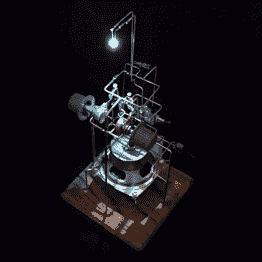

# 又一个周末来塑造你的电路！

> 原文：<https://hackaday.com/2019/01/05/one-more-weekend-to-sculpt-your-circuits/>

放下手头的工作，去你的工作室。这是 [Hackaday 电路雕塑大赛](https://hackaday.io/contest/162559-circuit-sculpture-contest)的最后一个周末，这是一个绝佳的机会，让你利用手头已有的材料建造一些艺术作品，来锻炼你的黑客创造力。

这个概念很简单:建造一个雕塑，其中电子电路 ***是雕塑的*** 。以一种展示布线的方式连接组件，并将其用作艺术品的结构。七名顶尖选手将赢得奖品，但我们真的希望看到每个人都尝试一下，因为结果太酷了！需要证明吗？[看看所有的参赛作品](https://hackaday.io/submissions/circuit-sculpture-contest/list)，然后对下面我们挑选出来的几个赞不绝口。你必须在太平洋时间周二中午[之前进入游戏](https://hackaday.io/contest/162559-circuit-sculpture-contest)。

  wirez80 by Matseng  555 Spider by Sunny  Freeform RGB Atari Punk Console by Emily Valesco

这只是我们在比赛中看到的三个不同风格的精彩例子。谁需要复古电脑的电路板？大多数人…但显然不是,【Matseng】因为这台 Z80 电脑是新设计的但仍然是交互式的。

真的没有比想到蜘蛛机器人更可怕的事情了，但不知何故[Sunny]带走了我们所有的恐惧。555 蜘蛛项目将“死虫”带到了一个全新的高度。我们喜欢腿部的角度，四个 SMD LEDs 作为蜘蛛眼真正完成了这个小动物的外观。

最后，【Emily Valesco 的】 [RGB 雅达利朋克控制台](https://hackaday.io/project/162958-freeform-rgb-atari-punk-console)的 3D 设计非常壮观。这是一个听起来很棒的构建，看起来似乎可以坚持常规使用。但是从视觉上来看，在这种俏皮的吸引力消退很久之后，它仍会在你的办公桌上占据一席之地。我们还喜欢她添加了一张[彩色编码的照片，以配合示意图](https://hackaday.io/project/162958/log/157827-color-key-for-reverse-engineers)的结构，非常酷！

你还在等什么，不管是乱七八糟的电线，还是精心构造的电子芭蕾，[我们想看你的电路雕塑](https://hackaday.io/contest/162559-circuit-sculpture-contest)！