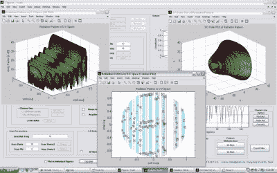

# 没有移动部件:相控阵天线静止时会移动

> 原文：<https://hackaday.com/2019/01/11/no-moving-parts-phased-array-antennas-move-while-standing-still/>

如果你看老科幻小说或军事电影，或者如果你生活在 20 世纪 60 年代，你可能知道雷达天线的陈词滥调是一个旋转的盘子。虽然最早的雷达天线是由金属线制成的，但随着雷达频率的提高，天线变得越来越小，旋转天线意味着你可以“看”不同的方向。当大多数人的电视都配有天线时，旋转天线也很常见。但是现在你看不到很多移动天线了。为什么？因为现在的天线是以电的方式移动，而不是以物理方式使用相控阵中的多个天线。这些电子扫描相控阵天线是亨特·斯科特在 2018 年 super co 上演讲的主题。没成功吗？没问题，可以看下面的视频。

虽然这看起来像是新技术，但实际上可以追溯到 1905 年。卡尔·布劳恩将发射机的输出馈入三角形排列的三个单极天线。一个天线有 90 度相移。两个同相天线在一个方向上产生更强的信号，而异相天线消除了大部分信号，产生的集合是单向波束。通过改变具有延迟的天线，波束可以以三个 120 度的步长旋转。

如今，从广播无线电发射机到 WiFi 路由器和 5G 手机，各种无线电设备中都有相控阵。这项技术甚至可以用于光学和声学。

相控阵有两大类:无源相控阵，一个发射器向一组天线和相移网络馈电；有源相控阵，每个天线产生自己的信号。有源天线通常性能更好，但更昂贵，亨特专注于无源天线。但在这两种情况下，方向性取决于一些信号抵消了其他信号，一些信号加强了其他信号。

我们一直觉得有趣的一件事是，从数学上讲，天线接收和天线发射没有区别。亨特用这个来解释相控阵如何接收信号，因为这在直觉上更容易一些。

解释包括一些合理简单的数学和一些有用的图表。然而，由于实际例子中数学的复杂性，Hunter 建议使用一个名为 [ArrayTool](https://zinka.wordpress.com/) 的 Python 工具，它可以很好地处理实际的数学问题，并向您展示一个漂亮的图形输出。

最后，亨特指出了一些让你的设计更便宜或更简单的方法，当然，不是同时。但事实总是如此。

亨特也有两个有趣的观察。首先，如果你在通常的频率上工作，你可以回收一个现有的天线设计，为自己省去一些麻烦。第二，在 5G 手机中使用电动可控天线意味着现在有芯片可以为你做大部分工作。今天它们很贵，但随着 5G 手机产量的增加，你可以预计价格会像其他大规模生产的手机组件一样暴跌。他观察到的另一个现象是，如果你进入了射频领域，你会整天盯着测试设备，想知道为什么没有东西工作。对我们来说听起来不错。

如果你错过了 Supercon，你就错过了很多。但是多亏了视频的魔力，你才能赶上。为什么不找出如何将 PCB 变成马达的方法呢？或者也许你更愿意[制造自己的真空管](https://hackaday.com/2018/12/31/the-art-of-vacuum-tube-fabrication/)。

 [https://www.youtube.com/embed/ytBmoL2wZLw?version=3&rel=1&showsearch=0&showinfo=1&iv_load_policy=1&fs=1&hl=en-US&autohide=2&wmode=transparent](https://www.youtube.com/embed/ytBmoL2wZLw?version=3&rel=1&showsearch=0&showinfo=1&iv_load_policy=1&fs=1&hl=en-US&autohide=2&wmode=transparent)

亨特演讲的幻灯片可以在他的网站上找到。