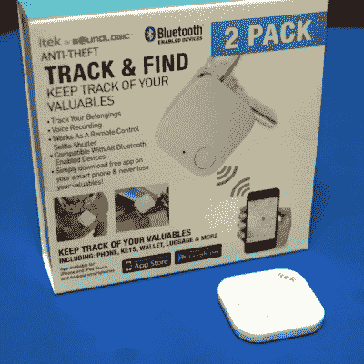
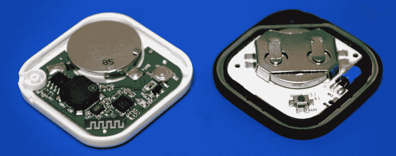
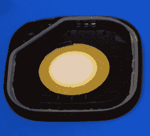
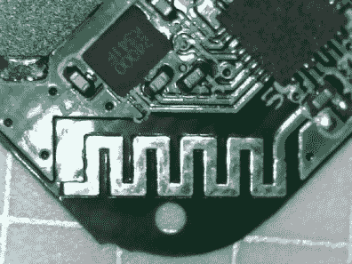
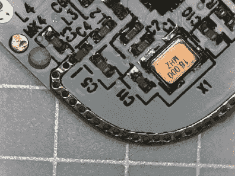
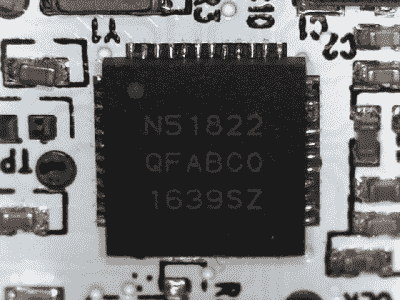
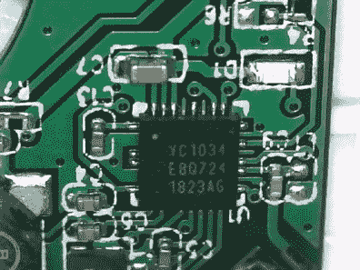
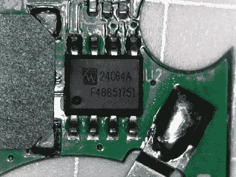

# 克隆的蓝牙追踪器见到了它的制造者

> 原文：<https://hackaday.com/2019/01/14/a-cloned-bluetooth-tracker-meets-its-maker/>

假期带给我们很多东西。家人和朋友是理所当然的，就像我们总是放纵自己的大餐一样。这是几十年的老歌和老电影设法浮出水面的机会，偶尔一点善意甚至会在这里或那里溜走。但也许最重要的是，假期是每个零售商囤积货物的时候。需要吗？不。他们想要吗？没有。但不管怎样，它就在那里陈列着，而且你几乎肯定会买下它。

 这正是我花 10 美元高价购买两包蓝牙低能耗(BLE)追踪器的原因。我对每台 5 美元的价格并不抱太大期望，但是对于实体店中的这种技术来说，这似乎是一个非常低的价格，我无法抗拒。此外，当我还在商店的时候，追踪器的外观有一些熟悉的的东西，我不太能说清楚。

这种模糊的回忆感让我一回到家就在我的零件箱里翻找，确信我在碎片中看到了一些东西，让我想起了我最近的奖品。果然，我发现了一个“立方体”蓝牙跟踪器，讽刺的是，这是几年前我收到的圣诞礼物。将它们放在一起，很明显，这些“itek”追踪器的设计从更知名(也是五倍昂贵)的产品中汲取了不少灵感。

立方体有点厚，但除此之外，形状、大小，甚至 itek 上的按钮位置都几乎相同。通读他们各自的手册，功能似乎也非常平等，甚至可以使用设备上的按钮作为智能手机的远程相机控制。这让我想到:这两款设备在内部会有多相似？很明显，它们的外观和功能是一样的，但是它们的构造也会一样吗？他们将不得不在某个地方削减成本。

我决心弄清楚一家公司如何能在以如此大的幅度降价的同时，推出一款看起来像竞争对手产品的镜像产品，于是我打开了两款追踪器，以便更熟悉它们的工作原理。我在仔细观察这两个相似的小玩意时发现，这句古老的警世格言或许能很好地概括我的发现:“不要根据封面来判断一本书。”

## 抄近路

从内部来看，这两款追踪器乍一看非常相似。这并不是说它们实际上共享一个 PCB 设计，而是说所有的“里程碑”几乎都是一样的。你有一个 SMD LED，一个小的触摸开关，一个 CR2032 电池，一个扬声器，当然还有蓝牙芯片组。蓝牙硬件本身有一些显而易见的差异，但我们一会儿就会谈到。

暂且忽略 PCB 布局，最明显的区别是外壳本身。立方体外壳很厚，很结实，有一层非常好的橡胶涂层，让我想起了 Thinkpad 的盖子。相比之下，itek 追踪器给人的感觉就像是由比那些塑料复活节彩蛋高一两步的材料制成的。PCB 牢固地卡在立方体的外壳中，而在 itek 上，它只是简单地坐在外壳中，除了盖子本身没有任何东西可以压住它。立方体上还有一个非常好的密封，可以防止灰尘和湿气进入，而唯一“保护”itek 的是，当第一个损坏时，它会有一个备份。

The Cube’s built-in Piezo speaker

很明显，在工程和原材料方面，仅仅在这个案例上就节省了很多钱。但是成本节约不止于此。立方体有一个更坚固的电池座，而 itek 只是有一对焊接到板上的标签。该立方体还使用了一个更大的压电扬声器，内置在设备的背面，使其发出啁啾声和哔哔声，并在 PCB 的背面有标签与之接口。相比之下，itek 跟踪器有一个小的 PCB 安装扬声器。

就材料成本而言，很难说哪一个实际上是更便宜的选择，尽管很明显，与立方体中使用的两件式设计相比，直接 PCB 安装扬声器的组装和工程成本更低。这种相同的工程“简单路线”也可以在更便宜的设备设计中的其他地方看到，例如 PCB 天线。

itek 使用标准类型的 2.4 GHz PCB 天线，我们在蓝牙和 WiFi 设备上都见过这种天线。嵌入电路板的小型镀锡“方波”。另一方面，立方体使用了一种相当独特的方法，一条薄带环绕布满孔洞的 PCB 大约 1/4 的距离。itek 上的天线本身没有任何问题，相反，我不太清楚为什么 Cube 决定在他们的板上安装如此复杂的天线，但显然前者会更容易和更便宜。

  Antenna in itek tracker  Antenna in Cube tracker

## 两个芯片的故事

很容易比较厚的防水外壳和薄的外壳，或者看看制造商如何通过跳过完全封闭的电池盒来节省几分钱。但是在显微镜下，我们发现变化甚至更深。虽然从最终用户的角度来看，这两款追踪器的蓝牙功能实际上是相同的，但用于提供这种体验的硬件却截然不同。

nRF51822 SoC inside the Cube tracker

立方体内部是众所周知的 Nordic Semiconductor nRF51822 蓝牙片上系统(SoC)，特别是 QFAB 变体，它具有 16 MHz 的 32 位 ARM Cortex 处理器、16 kB RAM 和集成的 128 kB 闪存。[我们已经在 Hackaday](https://hackaday.com/2018/07/07/this-smart-pill-uses-a-stomach-acid-battery/) 的几十个项目中看到了这种芯片，因为它功能强大，支持良好。在这样的商业产品中看到它一点也不奇怪。事实上，如果*没有*使用 nRF 芯片家族的某个成员，可能会更令人惊讶。

也就是说，nRF51822 并不便宜。对一些在线供应商的快速检查显示，即使数量达到数千个，每个芯片的价格也接近 2 美元。对于零售价为 25 美元的蓝牙追踪器来说，这不是问题，但如果你试图以 5 美元的价格出售这些东西并仍能获利，那就太贵了。

有点讽刺的是，itek 实际上使用了两个部分来降低成本:一个 YiCHiP YC1034 蓝牙芯片和一个 64 kB I2C EEPROM 来保存其固件。我在网上找不到太多关于 YC1034 的信息，但阿里巴巴上一个可能与之密切相关的 YC1033 的列表显示*单个单位*的成本仅为 1.5 美元，而 nRF51822 的批量价格为 2 美元。就数量而言，芯片的价格可能只有几分钱。即使有 EEPROM 的额外成本支持，它的最终成本也将远远低于 Nordic Semiconductor 的一体化解决方案。

  YiCHiP Bluetooth module  64 kB EEPROM

## 把钱用在有价值的地方

在设计 itek tracker 时，很明显许多设计决策都是基于成本和复杂性做出的。如果更容易或更便宜，那就是他们的选择。另一方面，立方体的可用性和可靠性往往是主要的激励因素。看看这两个非常相似的小工具的建造所用的材料和组件，我们可以非常自信地说，通过购买立方体而不是其极低价格的复制品，你不会“为名称付费”。这只是一个更好的齿轮。

也就是说，并不是所有的决定都那么容易被诋毁。一个没有密封的轻薄外壳在现实世界中有明显的缺点，但如果你可以用成本不到竞争对手一半的电子组件来复制用户体验，这真的是一件坏事吗？立方体*真的*需要如此强大的 SoC 来完成工作吗？这不是我们第一次在[看到看似功率过大的蓝牙信标](https://hackaday.com/2018/08/22/fcc-filing-reveals-tasty-hardware-mcsecrets/)。

对克隆产品和启发它的原始产品的仔细研究，不仅可以启发我们在制造过程中把钱花在最值得的地方，还可以启发我们在设计上进行一些优化。在这种情况下，一个带有立方体主体和 itek 电子设备的跟踪器似乎是一个理想的解决方案:将费用投入到最需要的设备的物理方面，并在不影响用户体验的情况下削减成本。