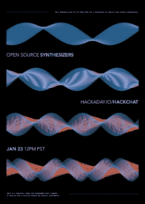

# 开源合成器黑客聊天

> 原文：<https://hackaday.com/2019/01/21/open-source-synthesizers-hack-chat/>

Matt Bradshaw 是一名音乐家、制造者和程序员，拥有物理学学位，热爱制作新乐器。你可能还记得[他的 PolyMod 模块化数字合成器](https://hackaday.io/project/160626-polymod-modular-digital-synthesizer)，来自 2018 年 Hackaday 奖，在那里它进入了乐器挑战赛的半决赛。PolyMod 是一个可定制的模块化合成器，使用数字电路而不是模拟电路。这种看似简单的变化产生了创建复音 patches 的强大能力，这是传统模拟模块合成器很难做到的。

 请[加入我们的黑客聊天](https://hackaday.io/event/163214-open-source-synthesizers-hack-chat)，我们将涉及:

*   PolyMod 背后的硬件，以及将 Matt 引向全数字合成器的设计决策
*   数字化制作音乐的利与弊
*   自从赢得乐器挑战赛半决赛后，PolyMod 去了哪里

当然，我们鼓励你在讨论中提出自己的问题。你可以在[开源合成器黑客聊天](https://hackaday.io/event/163214-open-source-synthesizers-hack-chat)上留下评论，我们会把它放在黑客聊天的队列中。

我们的 Hack Chat 是在 [Hackaday.io Hack Chat 群发消息](https://hackaday.io/messages/room/2369)上的实时社区活动。本周我们将在太平洋时间 1 月 23 日星期三中午坐下来。如果时区让你烦恼，[我们有一个方便的时区转换器](https://www.timeanddate.com/countdown/generic?iso=20190123T12&p0=224&msg=Open+Source+Synthesizers+Hack+Chat&font=cursive)。

点击右边的语音气泡，你会被直接带到 Hackaday.io 上的黑客聊天群。

你不必等到星期三；随时加入，你可以看到社区在谈论什么。不要忘记查看[模块化合成器讨论](https://hackaday.io/project/158206-modular-synth-discussion)，这是一个非常活跃的聊天，深入探讨各种模块化合成器的精髓。