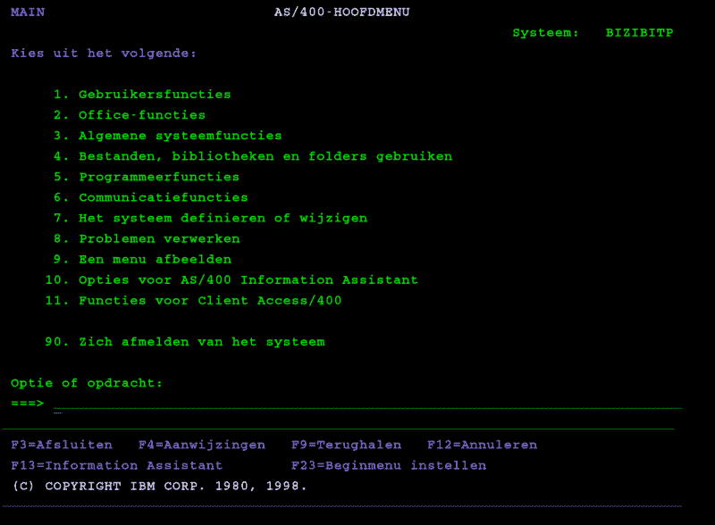

# 吹掉 IBM AS/400 服务器上的灰尘

> 原文：<https://hackaday.com/2019/01/13/blowing-the-dust-off-of-an-ibm-as-400-server/>

如果你从未见过 IBM AS/400 机器，也不要难过。大多数人都没有。它于 1988 年作为中档服务器系列推出，使用独特的基于对象的操作系统，专门面向商业和企业客户。除非你是 COBOL 的超级粉丝，否则你今天可能用不上它，但这并不意味着如果有机会，它们不值得一试。

因此，当一家本地 IT 公司破产并出售他们的旧硬件时，包括 90 年代后期的 IBM AS/400e 系列，[【Rik te Winkel】抓住机会将这一独特的计算历史带回家](https://justanotherelectronicsblog.com/?p=503)。他知道这有一定的风险，因为这些机器的维护和维修任务是由 IBM 认证的技术人员而不是 DIYer 来完成的，几乎没有留下任何文档，甚至没有更换部件。但最终它成功了，最棒的是，他记录了将这个 90 年代的庞然大物拖进 21 世纪的炫目光芒中让全世界都看到的成功过程。

 把机器拿回家并耐心等待 30 分钟的启动过程后，【里克】看到代码`01 B N`出现在服务器的显示屏上，松了一口气。这意味着系统通过了所有的内部检查，准备好了，他只需要想出如何与这个东西对话。这台机器是纯服务器，不提供任何视频输出，所以他必须通过网络登录。

[Rik]注意到在他的路由器中没有服务器的新 DHCP 条目，但是当然这并不奇怪，因为机器在使用时肯定有一个静态 IP。因此，他关闭了服务器，将其直接插入笔记本电脑的以太网端口，并观察 Wireshark 在艰难的启动过程中的输出。最终，他开始接收来自 IP 地址 10.10.10.9 的数据包，他有了目标。

有一些客户端可以让你远程登录到 AS/400，所以他下载了一个并指向服务器的 IP。他惊讶地看到操作系统显然是荷兰语的，但至少他是在。他尝试了几个常用的用户名和密码，得益于这个更天真的时代的操作系统会告诉你用户名是对还是错，并最终成功地用经典的管理/管理组合入侵了 Gibson。

所以他加入了，但是现在呢？[Rik]决定他不能*真正*称这台机器是最好的，直到他可以调出 [Hackaday 复古版](http://retro.hackaday.com/)，所以他开始编写一个程序，让他用 IBM 专有的报告程序生成器(RPG)编程语言直接在 AS/400 上下拉页面。你知道，就像一个人做的那样。他不太想写一个完整的 HTML 解析器，但是他已经生成了一个 HTTP GET 请求，下载了页面的源代码，并将其作为一个本地文件打开。这对我们来说足够了。

我们自己的[【Al Williams】记录了他在一台联网的 AS/400 机器](https://hackaday.com/2017/07/12/game-like-it-is-1983/)周围闲逛的冒险经历，如果你曾经在当地的回收中心发现一台这些令人愉快的古怪计算机，这可能是一个有用的入门读物。