# 视频:测试高速 PCB 设计

> 原文：<https://hackaday.com/2019/01/24/video-putting-high-speed-pcb-design-to-the-test/>

为高速应用设计电路板需要特殊考虑。这你已经知道了，但是你到底需要做什么不同于普通电路板布局？在我停止讨论两层印刷电路板(PCB)设计中的[阻抗](https://hackaday.com/2018/09/28/inductance-in-pcb-layout-the-good-the-bad-and-the-fugly/)的基础上，我想开始讨论与 PCB 相关的高速设计技术。这是多层 PCB 的世界，供电网络的阻抗(PDN)和信号本身的完整性(信号完整性或 SI)成为非常重要的因素。

我整理了一些电路板设计，以测试影响高速信号的不同情况。你可能听说过以直角布局的过孔和走线会产生影响。但是你有没有考虑过玻璃纤维织物本身对设计的影响？在这个视频中，我拿了一些我最喜欢的测试设备，[将这些设计假设用于测试](https://youtu.be/STCGzanAyR0)。请看一看，然后在休息后和我一起了解更多的细节！

 [https://www.youtube.com/embed/STCGzanAyR0?version=3&rel=1&showsearch=0&showinfo=1&iv_load_policy=1&fs=1&hl=en-US&autohide=2&wmode=transparent](https://www.youtube.com/embed/STCGzanAyR0?version=3&rel=1&showsearch=0&showinfo=1&iv_load_policy=1&fs=1&hl=en-US&autohide=2&wmode=transparent)

## 我所说的“高速”是什么意思

“高速设计”一词对不同的人来说可能有不同的含义，这取决于他们习惯使用什么，但对我来说，与信号本身的基频相比，信号上升沿和下降沿的能量才是决定性能的主要因素。换句话说，上升时间为 1ns 的 10Mhz 信号的带宽约为 350Mhz，如下式所示。最终，信号上升/下降时间的能量会对设计产生很大影响。

带宽和上升时间之间的关系可以近似为:

[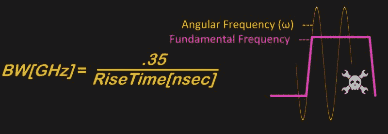](https://hackaday.com/wp-content/uploads/2019/01/bw-and-ang-freq.jpg)

关于高速设计规则，我的第一条经验法则是谨慎对待经验法则。我使用经验法则作为早期评估，帮助我了解我所有的设计规则和目标是如何一起发挥作用的。

作为一个从 20 世纪 70 年代就开始做设计的人，我看到了假设和设计指南的发展成熟，公平地说，在这个过程中，我们犯了一些错误，有些事情几乎是可笑的错误。例如，我听人们说，电子在高速转弯时会互相撞击，所以这是一件坏事，我们现在不这么想了。

## 高速设计假设

下面列出了一些高速设计的原则。我无法在这篇文章中回答所有的问题，但是我想依次回答所有的问题。

*   在高速下，一切都是关于电磁场的传播，而不是电子。
*   高速电流沿着电源或接地层上阻抗最小*的路径*，而不是最小*电阻*的路径。
*   由于 PCB 构造中使用的玻璃纤维织物的几何形状，信号走线的阻抗可能基于相对于织物的方向和位置而变化。
*   PCB 走线中的直角拐角可能不像通常认为的那样有害。
*   在设计合理的多层 PCB 中，去耦电容在负载附近的放置可能不像假设的那样重要。
*   与各种电压走线一致的铁氧体磁珠可能弊大于利。
*   差分对并不像我们通常描述的那样相互耦合，它们的返回电流是通过接地层，而不是通过走线对的另一半。
*   如果长度相同，紧密耦合差分对的噪声抑制性能可能不如两条随机路径。
*   由于电流在导体表面流动(称为趋肤效应)，高速 PCB 的内层可能会采用光滑或抛光的铜走线，使路径更平滑、更直。

## 电磁场

[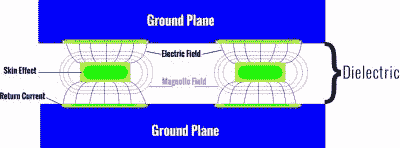](https://hackaday.com/wp-content/uploads/2019/01/dielectric-1.jpg)

EM field on multi-layer PCB as seen edge on.

在高速下，这与电子的流动没有太大关系，而是与电磁场中的能量以及这些场的传播方式有关。是的，在这个过程中会发生一些电子位移，但是一个简单的方式来看待这个陈述，就是所有这些都在真空中进行。

如果在同一个电介质空间中描绘多条走线，可以看到场会重叠，从而相互影响。这是串扰的主要原因之一。另一种说法是，串扰发生在导体之间的空白区域，也就是场重叠和相互作用的地方。

考虑信号及其电磁场的一个功能是，返回电流尽可能接近出站信号。上一次，我详细讨论了最小电感路径是在输出电流和返回电流之间形成最小环路的路径。因此，这意味着返回电流遵循最小电感路径，即最小阻抗路径( *Z* )。阻抗是电阻(R)、感抗(X [L] 和容抗(X [C] )的组合，都以欧姆(ω)为单位测量

 [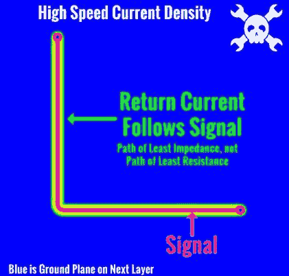](https://hackaday.com/2019/01/24/video-putting-high-speed-pcb-design-to-the-test/impedance-path-2/)  [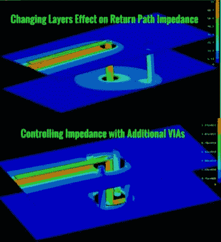](https://hackaday.com/2019/01/24/video-putting-high-speed-pcb-design-to-the-test/multilayer-impedance/) 

左上图显示了返回电流密度跟随单层上的信号。在现实生活中，信号经常会跨层，为了让返回电流继续紧跟信号(从而控制阻抗)，我们必须在附近放置连接内部参考层(接地层或电源层)的过孔。这显示在右边。

## 阻抗测试

为了继续测试开头列出的一些设计规则，我制作了一个 PCB 来测试不同 PCB 走线的阻抗。

 [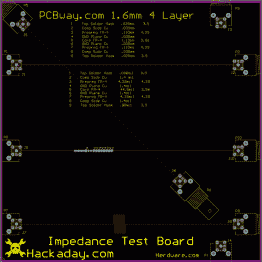](https://hackaday.com/2019/01/24/video-putting-high-speed-pcb-design-to-the-test/pcb-2d/)  [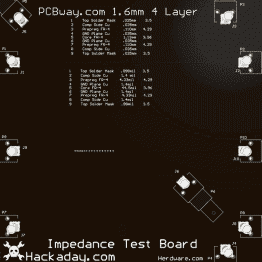](https://hackaday.com/2019/01/24/video-putting-high-speed-pcb-design-to-the-test/pcb-3d-2/)  [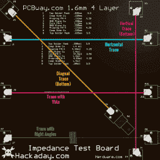](https://hackaday.com/2019/01/24/video-putting-high-speed-pcb-design-to-the-test/pcb-colot/) 

PCB 由多层导体(通常为铜)和电介质(通常为环氧涂层玻璃纤维)构成。随着速度的提高，这些材料变得越来越专业化。由于玻璃纤维或*织物*是不均匀的，它们会根据导体与纤维织物的相互作用产生影响，如下图所示。

[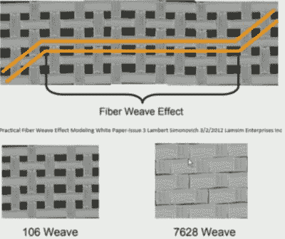](https://hackaday.com/wp-content/uploads/2019/01/weave-selection.jpg) 简而言之，与玻璃纤维行直接对齐的走线将具有与经历交替纤维束的走线不同的阻抗。

同样，由于不同方向上的编织密度不同，垂直方向上的迹线与水平迹线相比，其下方的玻璃量不同。一个答案是在 PCB 制造过程中展开光纤，但正如你所料，成品 PCB 的价格开始上涨。

测试 PCB 走线阻抗并查看路径变化的一种方法是高速时域反射计(TDR)。TDR 通常用于较慢的速度，如电缆测试，[[w2 aw]【T1]有一个非常翔实的视频，介绍其背后的整个理论。](https://www.youtube.com/watch?v=9cP6w2odGUc)

## 高速时域反射计

这项技术的背后是一个快速上升时间脉冲。实际上，在阅读了 Jenny List 关于脉冲边沿的[文章后，我已经开始写这篇文章，指导如何使用各种技术制作快速上升时间发生器。在我的研究中，我买了一个脉冲发生器，它的上升时间为 32 皮秒(](https://hackaday.com/2016/10/03/the-fastest-rise-time-in-the-west-making-a-truly-quick-pulse-edge/)[以 40ps 或更快的](http://www.leobodnar.com/shop/index.php?main_page=product_info&cPath=124&products_id=295)出售)，由一位名叫利奥·博德纳尔的工程师设计。当我收到脉冲发生器时，我发现 Leo 使用了一种古老的设备，称为 Tek CSA803/SD24 通信信号分析仪(CSA ),它具有 20Ghz 带宽和 17.5 ps 上升时间脉冲来表征我的模块。我自己也有一个这样的 CSA，看《易贝》让我有了一个好发现，尽管我还没有告诉我的妻子。有了这个新的设备，我开始测试玻璃纤维方向对阻抗的影响有多容易。

## 水平与垂直 PCB 走线

如下图所示，基于 PCB 走线的方向，基线阻抗存在明显差异。观看视频，了解设置这些图片的所有乐趣。

[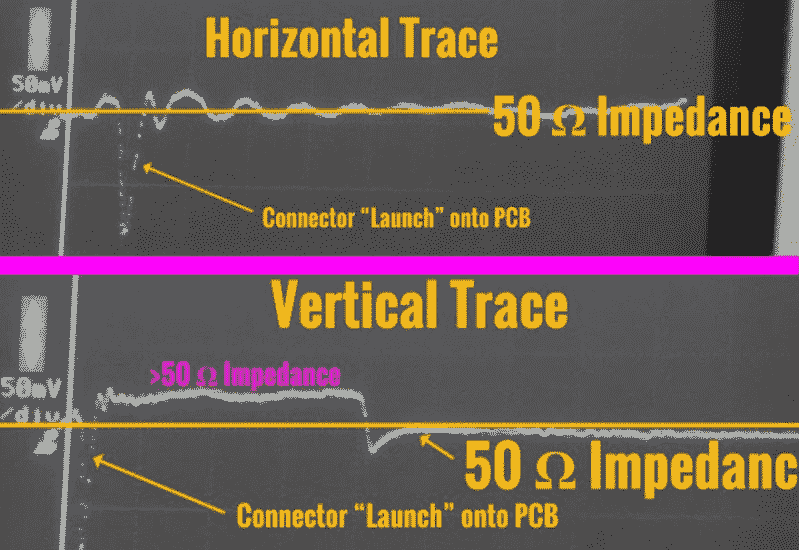](https://hackaday.com/wp-content/uploads/2019/01/hv-display.jpg)

根据电路板上走线的方向，您可以看到走线阻抗存在明显且可测量的差异，在这种情况下，垂直走线大约偏离 5%。

有两种技术可以帮助处理这种效应，而不需要使用更昂贵的玻璃编织更紧密的 PCB。我的 CAD 软件支持下面显示的两种主要技术，以帮助自动化过程，但也可以手动完成。第一种技术需要以不那么正交的方式曲折前进，以努力在统计上减少影响。如果可以选择将 PCB 布置在更大的面板中，那么可以将其翘向一侧(我听说是 10-11 度，但它也会受到其他变量的影响)，这样最差情况路径下的信号总和也是最小的

[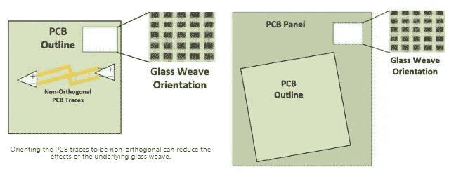](https://hackaday.com/wp-content/uploads/2019/01/both-gw-techniques.jpg)

Two techniques for reducing the effect of PCB glass weave influence on traces.

## 令人震惊的发现:方角可能无关紧要

困扰业界的一个问题是，PCB 走线上使用的直角拐角可能会对这些走线的阻抗产生什么影响。其他抱怨是直角处的 RFI 发射较高，并且在制造过程中酸会在拐角处积聚。我会把这个板放在频谱分析仪上，在下一个视频帖子中检查“EMI 喷雾”,如果你的 PCB 工厂抱怨角落里有酸，那么我会谦恭地建议你找一个不同的制造商。

[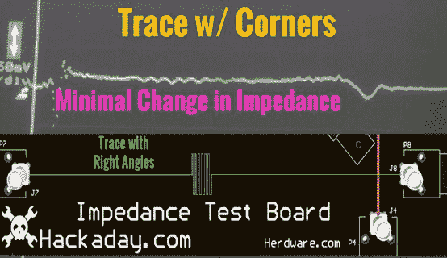](https://hackaday.com/wp-content/uploads/2019/01/corners-trace-and-display.jpg)

Traces with Right Angled Corners Have Minimal Impact at moderately High Speeds

我开始尝试用我新的 20Ghz 能力来检测拐角的影响。如上所述，在 20 GHz(. 35/17.5 PS = 20 GHz)、走线宽度为 5.27mil(针对 50ω阻抗计算)时，直角拐角对[特性阻抗](https://www.signalintegrityjournal.com/blogs/12-si-pi-fundamentals/post/904-impedance-the-most-confusing-term-in-signal-integrity)的影响极小。

## 方形角意味着更多的电容，但并不多

方形拐角与角形拐角之争的核心是，方形拐角所代表的走线宽度变化会导致电容发生微小变化。

[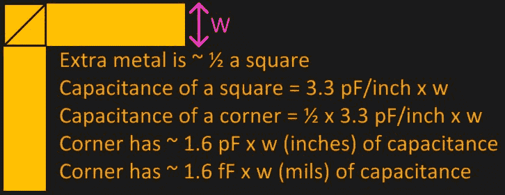](https://hackaday.com/wp-content/uploads/2019/01/corner-calculations.jpg)

我们知道金属面积的电容，因为我们通常谈论 50ω阻抗。根据上述等式，6 密耳走线将具有 9.6fF(毫微微法拉)的额外电容，即 0.0000000096 μF，这非常小。另一个最小化拐角影响的因素是，它以我们所说的速度运动的速度，这是光速的一个相当大的分数。假设信号[在标准 FR4 PCB 上 1ns](https://www.edn.com/electronics-blogs/all-aboard-/4426188/Rule-of-Thumb--3-Signal-speed-on-an-interconnect) 内传输 6 英寸，信号将在 30ps 内通过拐角。(这就是为什么我必须使用上升时间为 17.5 秒的设备来检查它)

关于这一点的更多信息可以在 Eric Bogatin 在 EDN 上的文章中看到，他提出了一个很好的经验法则:

*   如果你的上升时间是 10ps，不要担心拐角，除非你的 50O 线宽度比 50 密耳宽。

如果您担心设计中的拐点，请确定您的带宽(10ps 上升时间为 35Ghz)和走线特性，因为 50 毫秒对于信号走线来说实在太大了，所以在大多数设计中，它更像是电源走线。

## 只是为了好玩。

只是为了好玩，我做了同样的测试，只是在拐角处有“悬挂过孔”，这种情况更糟，因为它们就像悬挂在走线外的小电容和天线。我想确保有一些东西，会显示为一个例子，更糟糕的情况下相比，直角角落，这个例子没有令人失望。

[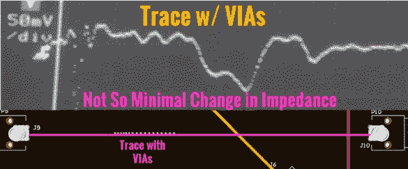](https://hackaday.com/wp-content/uploads/2019/01/vias-and-display.jpg)

Effect of VIAs on Trace Impedance

## 结论

我真正想表达的一点是，在考虑*经验法则*类型的建议时要谨慎。质疑信息的来源，如果有疑问，不要害怕自己去衡量。最重要的是问这个问题，“你怎么知道？”。

由于这些结果都是在“时域”中展示的，因此在下一期文章中，我将展示“频域”中与高速设计相关的一些方面。