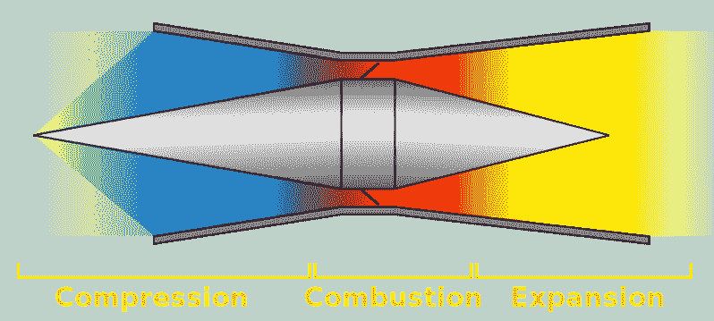
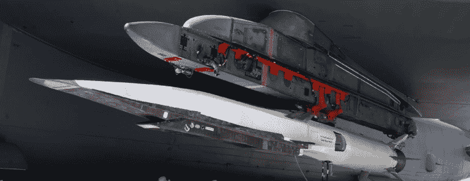
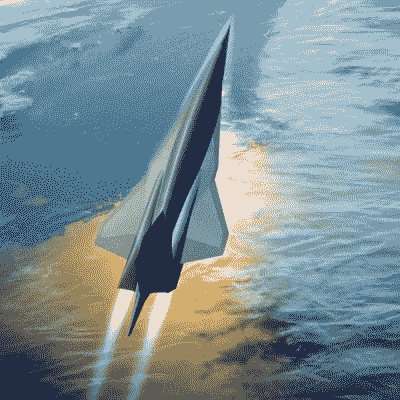

# 超音速燃烧冲压喷气发动机在通往马赫数 5 的漫长道路上

> 原文：<https://hackaday.com/2019/01/16/scramjet-engines-on-the-long-road-to-mach-5/>

当查尔斯“查克”耶格尔在 1947 年驾驶贝尔 X-1 *迷人的格伦尼斯*达到 1.06 马赫的速度时，他成为第一个在可控水平飞行中飞行速度超过音速的人。指定他“在受控水平飞行中”达到超音速似乎是多余的，但这实际上是一个非常重要的区别。有几个未经证实的说法称，在第二次世界大战期间，飞机达到甚至超过了 1 马赫，但这一直是在急剧俯冲期间，通常导致飞机和飞行员的损失。耶格尔的成就不仅仅是比音速更快的 T2，而且是在可控的持续飞行中完成的，最终安全着陆。

Chuck Yeager and his Bell X-1

这样，高超音速飞行的现状与 1947 年前的超音速飞行并不完全不同。我们有速度达到或超过 5 马赫的导弹，这是高超音速状态的开始，从轨道返回的航天器，如航天飞机，在大气层中潜水时速度可高达 25 马赫。但是这两个例子都不符合耶格尔 72 年前实现的“可控水平飞行”的要求。直到飞行器可以加速到 5 马赫，在一段有用的时间内保持这个速度，然后完好无损地着陆(不管有没有人)，我们都不能说我们已经真正掌握了高超音速飞行。

那么，为什么在我们突破音障近一个世纪后，我们仍然没有实用的高超音速飞机？历史上最大的问题之一是制造汽车的材料。洛克希德 SR-71“黑鸟”在以 3 马赫的速度飞行时产生的高热中挣扎，最终要求它由昂贵且不稳定的钛和聚合物复合材料制成。以 5 马赫或更高速度飞行的飞行器要经受更恶劣的条件，材料科学花了几十年时间来应对这一挑战。

借助现代复合材料和先进的计算机模拟技术，我们即将解决持续高超音速飞行中的物理问题。随着俄罗斯最近宣布他们的 Avangard 高超音速滑翔机已经投入生产，[小型飞行器在高马赫数下长时间飞行现在已经成为现实](http://hackaday.com/2019/01/07/the-age-of-hypersonic-weapons-has-begun/)。说是*解决了*的问题不太准确；美国高超音速滑翔计划一直受到飞行器在 20 马赫飞行压力下解体相关问题的困扰，这种压力将飞行器表面加热到超过 1900 摄氏度(约 3500 华氏度)。但是我们越来越接近了，这不再是几十年前看起来无法克服的问题。

今天，剩下的最大挑战是推动高超音速飞行器在一段有用的时间内水平飞行。最有希望的解决方案是超燃冲压发动机，这种发动机依靠车辆本身的速度来压缩进入的空气进行燃烧。它们在机械上非常简单，其背后的物理原理从耶格尔爬进 X-1 的驾驶舱时就已经为人所知。不幸的是，建造一架全尺寸高超音速超燃冲压发动机飞机的道路是漫长而艰难的，更不用说测试了。

## 紧紧的挤压

在传统的涡轮喷气发动机中，轴流式压缩机用于在环境空气进入发动机时增加其压力和温度。这种热的压缩空气然后与雾化的燃料结合，在燃烧室中点燃，这导致它膨胀并变得更热。这些热气体作为高速射流通过发动机的排气喷嘴排出，但不是在通过涡轮之前，涡轮产生运行压缩机的动力。涡轮喷气发动机的运转需要一种微妙的平衡，组成压气机和涡轮级的大量转子和定子必须按照严格的规格和最高强度的材料制造。涡轮喷气发动机的最大速度也被限制在 3 马赫左右；速度再快，发动机就跟不上进入进气口的空气压力。

相比之下，最基本形式的超燃冲压发动机根本不需要任何运动部件。流经发动机的空气仍然要经历同样的三个阶段:压缩、燃烧和膨胀；但不同的是，进入发动机的空气流动如此之快，以至于进气口的几何形状足以将其压缩到为燃烧阶段做好准备的程度。由于没有压缩机提供动力，发动机也不需要涡轮级，因此膨胀的气体可以立即自由离开喷嘴。由于空气在通过超燃冲压发动机时不需要减速，这种发动机理论上能够以高达 24 马赫的速度运行。

Derivative of CC BY-SA 3.0 artwork by GreyTrafalgar

像超音速冲压发动机一样，超燃冲压发动机有时也被称为“飞行烟囱”，因为它们实际上是空心管，空气和燃料在其中混合产生推力。这是一个非常简单的设计，至少在理论上是如此，以至于好得令人难以置信。那么为什么我们还在努力开发一个实用的版本呢？

## 跟上速度

问题是，超燃冲压发动机实际上并不工作，直到它以接近高超音速的速度实际移动。任何低于 4 马赫左右的速度，进入的空气移动的速度都不足以在发动机的进气口内被压缩。因此，到目前为止，超燃冲压发动机的测试在很大程度上仅限于将它们安装在传统火箭的前端，进行一次性测试，最终导致发动机被摧毁。这是一种开发发动机的缓慢而昂贵的方式，并且在阻碍实际的超燃冲压发动机开发方面发挥了很大的作用。

NASA X-43

因此，虽然早在 20 世纪 50 年代就开始研究超燃冲压发动机技术，但直到 1991 年，苏联才成功试验了一种技术。即使在那时，这也是一个相当有限的概念证明。十多年后的 2004 年，美国国家航空航天局通过 X-43 在实用的超燃冲压发动机驱动飞行器方面取得了重大进展。

这种无人驾驶飞机与改良版的飞马火箭配对，从 B-52 轰炸机的底部发射，[很像商业空中发射轨道飞行器](https://hackaday.com/2018/08/14/virgin-orbit-readies-first-launch/)。在与助推火箭分离后，X-43 启动自己的超燃冲压发动机 10 秒钟，加速到 9.6 马赫。该计划取得了圆满成功， X-43 仍然保持着有史以来最快飞机的记录。

## 技术发展水平

尽管距离 X-43 最后一次飞行已经过去了 15 年，但高超音速超燃冲压发动机的尖端发展确实没有太大进展。2008 年，美国计划建造一种飞机，将涡轮喷气发动机的低速性能与冲压喷气发动机和超燃冲压喷气发动机的马赫数 3+能力结合起来，但该计划被取消；这意味着测试仍然依赖于复杂而昂贵的空中发射计划。

在美国，X-43 计划的直接继承者是波音公司的 X-51 乘波飞机。X-51 的开发始于 2005 年，就在 X-43 创下 9.6 马赫飞行纪录一年后。事实上，X-51 使用的发动机最初是为后来的 X-43 型号设计的，后来为了开发一种更新的车辆而被取消了。

Boeing X-51 Waverider mounted to the wing of a B-52

X-51 于 2010 年首飞，但由于随后的多次失败，它直到 2013 年才进行了一次完全成功的测试。在那次飞行中，它能够保持 5.1 马赫的速度，直到发动机的燃料耗尽(大约 210 秒)，之后 飞行器溅落到太平洋中。它可能不会比它的前身飞得更快，但 X-51 证明了它可以飞得更久。

据报道，中国还在研究几种超燃冲压发动机驱动的飞行器，甚至可能是一种使用混合火箭-超燃冲压发动机推进系统的航天器。不幸的是，除了中国媒体报道的少数几次试飞之外，几乎没有关于这些项目的公开信息。[最近，中国媒体报道了 2018 年 8 月“星空-2”](https://www.scmp.com/news/china/diplomacy-defence/article/2158524/chinas-hypersonic-aircraft-starry-sky-2-could-be-used)的成功飞行，通常被认为在设计上类似于 X-51。官员声称该飞行器达到了 6 马赫的最大速度，并在动力下飞行了 400 多秒。如果这些说法是准确的，它将会以相当大的优势击败美国对手。

## 未来

Lockheed Martin concept art for the SR-72

对于真正实用的高超音速飞机，它需要能够依靠自己的动力起飞，并在空中平稳过渡到高超音速发动机。洛克希德·马丁公司已经为他们的下一代 SR-72 侦察机提出了这样一个系统，他们称之为基于涡轮的联合循环(TBCC)。由涡轮喷气发动机和冲压喷气发动机组成，共用一个进气和排气喷嘴，它是 SR-71 发动机概念的演变。

虽然设想中的 SR-72 是否真的会建造还存在争议，但洛克希德·马丁公司已经准备好作为一个独立项目推进 TBCC 发动机技术。甚至有传言说他们已经[制造并驾驶了一架小型无人驾驶飞机进行飞行测试](https://www.popularmechanics.com/military/aviation/news/a28420/hypersonic-sr-72-demonstrator-reportedly-spotted-at-skunk-works/)。但即使在最乐观的时间表中，这项研究也不会在 2020 年之前生产出可行的车辆。

除了一些公众不知道的军事黑色项目，一架能够在 2030 年依靠自身动力达到 5 马赫以上的实用飞机似乎是可行的。从莱特飞行器(T1)到迷人的 T2 格伦尼斯(T3)花了 44 年，从那时起到实用的高超音速飞机上天至少需要 80 年。考虑到[我们仍在解决实用超音速飞机的细节](https://hackaday.com/2018/11/26/nasas-supersonic-x-plane-to-take-flight-in-2021/)和成就的相对复杂性，历史可能会把这看作是合理和必要的进展。