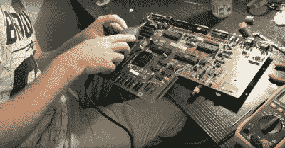

# 复活一个 Amiga 500+

> 原文：<https://hackaday.com/2019/01/25/resurrecting-an-amiga-500/>

最近，我很幸运地从一个正在清空车库的朋友那里收到了一大堆复古电脑设备。更好的是，这次运输的几乎全是旧的 Amiga 设备——我一直以来最喜欢的计算平台。回家后，我兴高采烈地整理箱子，一件一件地给东西通电。令人惊讶的是，一切正常…除了一个孤独的 Amiga 500+。迎接我的是一个暗淡的灰色屏幕。这不行，所以很自然地，我开始工作。

打开这台机器似乎是一种耻辱，因为在使用了近 30 年后，这台机器的保修封条仍然完好无损。不管怎样，不入虎穴，焉得虎子 Torx 钻头就在眼前，螺丝就要出来了。

在里面，我发现了我所期望的。电解电容器都很干净，保持良好，但有明显的腐蚀造成的时钟电池。令人欣慰的是，它被局限于 Gary 芯片附近的一小簇迹线，Gary 芯片提供胶合逻辑和软盘驱动器功能。走近一看，我还注意到加里本人看上去有些憔悴。Commodore 好心地在所有 Amiga 板上插入定制芯片，所以我把它拔出来——却发现插座中的几个触点已经损坏或腐蚀掉了。

Some traces were damaged by corrosion; these were carefully patched.

这份工作看起来令人沮丧，但还是可以完成的。我切断了电池，然后开始修补痕迹。我一个接一个地找出它们应该去的地方，然后刮掉少量的阻焊膜，以便有铜可以焊接。然后，在用万用表验证之前，在适当的位置钉上一根细的接线以恢复连接。

解决加里的问题会更加困难。整个插座将不得不被移除。我一针一针地把插座切开，这样我就可以单独处理每一个插座了。耐心是这个游戏的名字，因为过于粗糙的移除会导致过孔或迹线损坏。我用一个装有弹簧的吸锡器从每个引脚上尽可能多地移除焊料，然后再次加热过孔，同时用牙签将引脚的剩余部分推出。我发现这种技术是相对成功的，远远超过以前使用金属线作为推动器的尝试。最硬的引脚总是那些与接地层连接的引脚，因为没有散热装置，所以吸锡器在那里工作不太好。凭着坚持不懈的努力，我把所有的旧插头都拔了下来，并为加里插上了一个新插座。此时，我觉得很有成就感。我解决了棋盘上的明显问题，因此显然会得到一台可以工作的机器。

唉，事情很少这么简单。开机后，屏幕呈波浪形，没有任何视频同步，除了偶尔闪现纯色。蓝色、红色、绿色–这些都是 Amiga 可以显示的各种错误代码。我似乎不太可能忍受所有的痛苦，但我不确定下一步该做什么。

经过进一步研究，我听说另一个 Amiga 粉丝对 Amiga 500+上的扩展 RAM 有问题。使用跳线设置，他们能够禁用额外的内存，并让机器启动。因为这看起来很容易，而且对我来说不需要认真工作，所以我尝试了一下，但没有成功。我很生气，因为我在黑暗中的盲目尝试没有成功，我把机器放在一边一个星期，同时思考我的下一步行动。

## 器官捐赠者

然后，一个朋友建议，鉴于我有一个工作的 Amiga 500，交换定制芯片，以确定是否有任何特定的缺陷。在用平头螺丝刀小心翼翼地工作了一段时间，并花了 15 美元买了一个工具，将阿古纳斯 PLCC 从插座上拆下来后，我最终发现 500+的所有定制芯片都很好，除了阿古纳斯，它在两台机器之间有一个版本不兼容。

此时，我不知所措。我对这台机器失去了信心，并且不愿花几个小时盲目地四处寻找更多的破损痕迹，而棋盘看起来，无论从哪方面来说，都很好。就在那时，一份礼物奇迹般地出现在我面前——[Amiga 500 故障检修员](https://ia601207.us.archive.org/33/items/Amiga5002000TroubleShooter/Amiga%20500-2000%20Trouble-shooter.pdf)，由同胞 Ian Perry 提供。这是一个表格，显示了对于给定的症状应该调查机器的哪些区域。我注意到我的波状屏幕没有同步可能是由阿古纳斯芯片故障或视频输出电路(U41)中的 74HCT245 故障引起的。

U41 was removed with extreme prejudice, and, realistically, the only tool I had that could get in there.

我有一种预感，阿古纳斯会很好，所以我决定以每台 90 美分的价格购买几台 74HCT245s，外加 10 美元的运费。U41 没有插在主板上，所以在再次用牙签和烙铁将剩余部分推出之前，需要小心地一针一针地切掉芯片。按照惯例，我在放入新芯片之前安装了一个插座，以防万一。

屏住呼吸，我打开了机器，连接到经典的 Commodore 1084S 显示器。屏幕清晰且同步，但在变成蓝色之前是灰色的。它以有规律的周期继续这样做。虽然这台机器仍然不起作用，但我的信心却增强了。Amiga 现在表现一致，只显示一条错误信息——蓝屏表示定制芯片之一——阿古纳斯、加里或丹尼斯出现问题。

就在这时，我的运气来了。当我坐在那里，静静地为我越来越接近解决方案而自豪时，我在搜索栏中键入“Amiga 500 Plus blue screen”。第一个结果是一个八分钟的视频，我不太想看，所以我决定检查一下描述。它提到了一条肉眼很难发现的断裂痕迹，将 Gary 的第 4 号插脚与 U12 的第 1 号插脚连接起来。用万用表快速检查了一下，显示我的工作机器和坏掉的机器都没有连接，但是我的兴趣被激起了，所以我决定查一个原理图。

[找到 archive.org](https://archive.org/details/A500_Plus_Service_Manual_1991-10_Commodore/page/n37)上的维修手册，很明显 Gary 的第 4 号针脚连接到电阻 R113，然后连接到 U12 的第 1 号针脚，一个 74LS244。再次检查我的机器，工作的 Amiga 500 有连接，而 500+没有。突然，我发现自己相当兴奋，赶紧把 Gary 的一根接线焊接到问题中的电阻上。

当我插上电源，打开电源时，紧张的气氛显而易见。出现了一个灰色的屏幕，接着是一种新的声音——软驱发出的几声点击，然后出现了 2.0 ROM 插入磁盘屏幕的壮丽景象。我终于做到了！

我欣喜若狂，因为这些年来我尝试修理了许多复古机器，这是第一台既完全成功又没有对机器造成任何重大附带损害的机器。此外，我现在有一个 hotrod Amiga 500+作为我的小收藏的一部分。

如果我不是那么沉默寡言地去做硬码和检查 PCB 上的更多连接，这个过程肯定会更快，但最大的帮助肯定是故障排除矩阵。这是一个非常有用的工具，它将多年的经验总结成一个快速参考指南。

总的来说，修复是一个胜利，我期待着点燃一些旅鼠之前，挂钩了一对夫妇机器串行为一个多人游戏的特技赛车。最过瘾！

 [https://www.youtube.com/embed/_hWi_WLth54?version=3&rel=1&showsearch=0&showinfo=1&iv_load_policy=1&fs=1&hl=en-US&autohide=2&wmode=transparent](https://www.youtube.com/embed/_hWi_WLth54?version=3&rel=1&showsearch=0&showinfo=1&iv_load_policy=1&fs=1&hl=en-US&autohide=2&wmode=transparent)

