# 如何为挤压成型的钢轨 T 型螺母制作自己的弹簧

> 原文：<https://hackaday.com/2019/01/30/how-to-make-your-own-springs-for-extruded-rail-t-nuts/>

目前，开源挤压型材系统是一个成熟的品种。有了 Openbuilds、Makerslide 和 Openbeam，我们有很多系统可供选择；亚马逊和阿里巴巴凭借大量通用可互换零件强势进入。这些开源框架系统借鉴了一些有几十年历史的行业参与者，如力士乐和 80/20。但是从他们收集到的所有信息来看，还有一个技巧他们还没有抓住:负担得起的弹簧 T 型螺母。

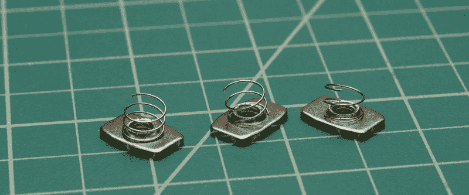

我之前已经讨论过使用这些系统的一些技巧，郑健国提出了使用 T 型螺母的 3D 打印技术。但今天我将采取另一个步骤，向您展示如何为 VSlot 导轨螺母制作我们自己的弹簧。

## 为什么首先选择 Springload？

对于任何一个在多人游戏中玩挤压热土豆的人来说，弹簧加载的 T 型螺母是一个很好的便利。当弹簧加载时，这些正常的 T 型螺母会固定在原位，而不是滑下插槽，从而使构建过程更易于管理，同时跟踪的零件更少。我们只是设置和忘记！

不要误解我。弹簧加载的 T 型螺母[已经存在](https://openbuildspartstore.com/spring-loaded-tee-nuts/)给美国爱好者使用制造者风格的挤压。但是它们很贵，超过一美元一瓶的价格。或者，我们有更受欢迎的“[事后坚果](https://www.amazon.com/STAND-Carbon-T-Nuts-Aluminum-Profiles/dp/B07BNG2F7Q/ref=asc_df_B07BNG2F7Q/?tag=hyprod-20&linkCode=df0&hvadid=242010153523&hvpos=1o1&hvnetw=g&hvrand=1705631879538651361&hvpone=&hvptwo=&hvqmt=&hvdev=c&hvdvcmdl=&hvlocint=&hvlocphy=9033309&hvtargid=pla-465377611579&psc=1)，通常被称为“插入式”T 型螺母。我们可以方便地添加这些螺母，即使我们已经用其他螺母封闭了对幻灯片的访问。但是任何做过几次的人都知道两件事。首先，定位一个装满这些螺母的面板可能很麻烦，其次:插入式 T 型螺母在拧紧时并不总是正确就位，使它们什么也抓不住，完全无用。

简而言之，如果你可以牺牲一个小时来制作弹簧，那么用我们自己的弹簧来弹簧加载普通的 T 型螺母是可靠装配的最便宜的选择，它可以保证我们的螺母在装配过程中保持固定。

ok；闲聊到此为止。让我们开始做弹簧吧！

## 制作泉水的原料:

对于这个版本，您需要:

*   1x 1 毫米螺距的 M6 螺杆*或*任何类型的 30+毫米 M6 螺丝
*   1 个手钻
*   1 套尖嘴钳(普通尖嘴钳也可以。)
*   1 套*硬*钢丝钳(如麦克马斯特-卡尔 PN: [59445A45](https://www.mcmaster.com/59445a45)
*   1 个 0.016 英寸的线轴。不锈钢丝(麦克马斯特-卡尔 PN: [949K59](https://www.mcmaster.com/9495k59)
*   每对眼球配 1 副安全眼镜

我要提出两个预先警告。

首先，这种不锈钢丝相当细。我相信你可以用其他类型的线代替，但是如果你用更粗的线，你必须戴上手套。我选择的金属线刚好足够细，所以它很容易成型，没有抽血的危险。

第二，这种不锈钢线也比铜连接线硬得多。事实上，如果你让它们彼此靠得太近，它会很乐意给你的电子断线钳命名。我知道这很诱人，但是确保你使用的钢丝钳可以处理硬电线，而且，看在上帝的份上，不要把这东西放在你牙齿附近的任何地方！

## 制弹簧

注意:在现实生活中遵循这些指示之前，请戴上护目镜！

### 电线准备

为了防止金属丝从钻夹头中弹出，我们需要把尖端加粗。用钳子将末端卷成一个小块，如图所示。

 [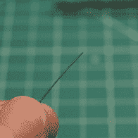](https://hackaday.com/2019/01/30/how-to-make-your-own-springs-for-extruded-rail-t-nuts/31866955837_da0b662b56_z/)  [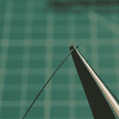](https://hackaday.com/2019/01/30/how-to-make-your-own-springs-for-extruded-rail-t-nuts/31866955217_7ce4f20e19_z/)  [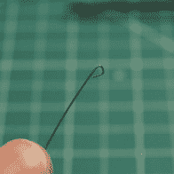](https://hackaday.com/2019/01/30/how-to-make-your-own-springs-for-extruded-rail-t-nuts/45893312195_103d29e131_z/)  [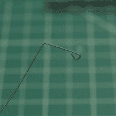](https://hackaday.com/2019/01/30/how-to-make-your-own-springs-for-extruded-rail-t-nuts/45893310615_775fc7100c_z/) 

从这里开始，沿着长度方向弯大约 16 毫米(0.629 英寸)的直角。这个弯曲的部分将作为我们装载到卡盘的“钥匙”。现在，解开约 450 毫米(1.5 英尺)的电线，用硬钢丝钳将其切断。

### 发条

现在，让我们准备工具。将一小部分 M6 螺纹杆(或真正长的螺丝)装入手钻的卡盘。在这里，我使用一个 40 毫米，M6 固定螺丝与 5 个螺纹-值得插入卡盘。

如果您的钻机有低速模式，现在就设置它。接下来的部分是反直觉的:将你的钻头设置到*旋松*位置(又名:逆时针)，这将使金属丝爬上螺纹。从那里，将金属丝的弯曲尖端装入钻夹头齿之间的自由空间，如图所示。

 [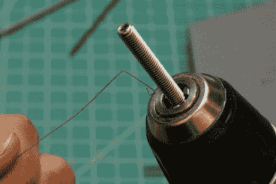](https://hackaday.com/2019/01/30/how-to-make-your-own-springs-for-extruded-rail-t-nuts/31866951457_728835be75_z/)  [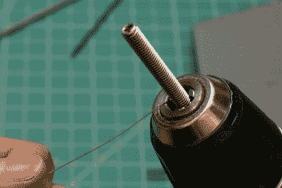](https://hackaday.com/2019/01/30/how-to-make-your-own-springs-for-extruded-rail-t-nuts/45893308965_830e5df171_z/) 

慢慢接合钻触发器，让金属丝聚集在螺钉上。将你的左手食指放在金属丝上，使其停留在一个螺旋槽上，然后用钻触发器慢慢卷起金属丝。

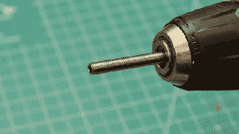

绕线时，不要将拇指直接放在电线上。我们很容易将拇指放在电线上，靠近螺丝，但这是一个夹点。

当你继续缠绕时，不要缠绕整个焊线长度。很容易失控，让它鞭打你的手指。较大的电线肯定会割伤你的手，但这一条仍然会留下令人讨厌的刺痛。

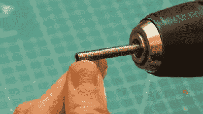

相反，在剩余约 30 毫米(1.2 英寸)松线时停止缠绕。从那里，移开你缠绕的手，线会自己展开，对那些珍贵的手指没有痛苦。哒哒！你的第一个春天来了。

### 春季美容:

注意:注意到我们的弹簧在完成缠绕后是如何扩张的吗？我尝试了几种不同的螺丝类型，最终选择了 M6，这使得弹簧膨胀到刚好*完全*适合一个[经典 VSlot T 型螺母](https://openbuildspartstore.com/tee-nuts-m5-10-pack/)的底部。

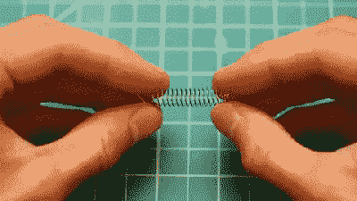

在这一点上，我们的弹簧有点压扁，所以给它一个拉伸，给我们的弹簧大约 2mm 的间距。我不情愿地在这一步上加了一个数字，因为我是凭感觉做这一部分的，我鼓励你也这样做。不锈钢具有如此弱的弹簧常数，以至于该步骤的公差是非常宽容的。

最后，给那个春天理发。用你的硬钢丝钳，剪下每个有 3 圈的小弹簧。同样，这一步中的公差也是宽容的。如果你的弹簧圈数在 2.5 到 3.5 圈之间，就可以了。记住:这些作品背后的整个想法是为了以后节省时间，而不是现在花时间，对吗？

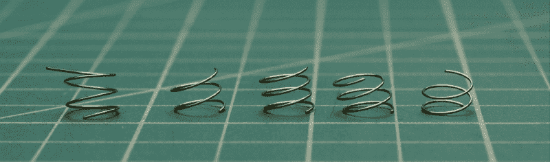

All of these lengths work, so don’t sweat the tolerances!

## 安装:

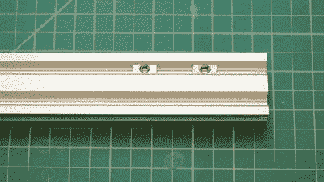

终于，我们到达了那个辉煌的时刻！在 T 型螺母的背面装上一个弹簧，成功地滑动到位，然后欣喜若狂地微笑。或许还会发布到互联网上。适当标记。打电话给妈妈。

## 结论

这个过程可能有点耗时，但我发现当我应该写研究论文的时候，它相当有帮助。对于我垂直安装挤压件的所有时间，这些弹簧是一个巨大的胜利。