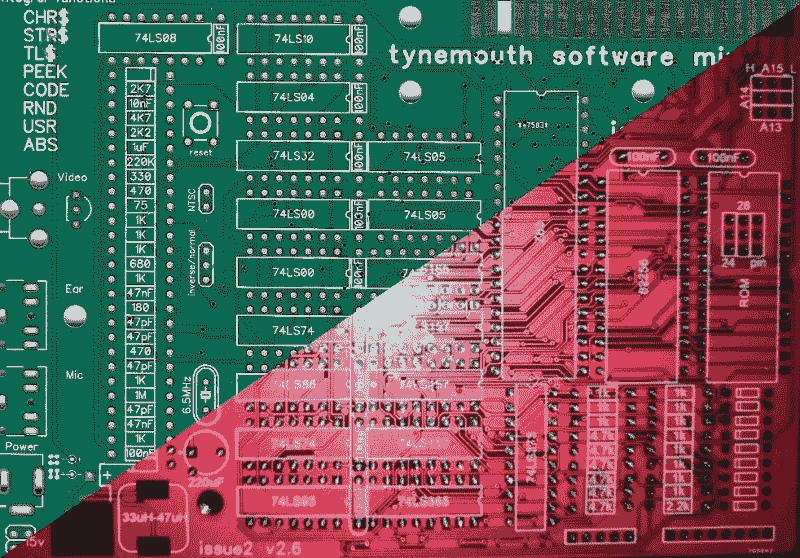
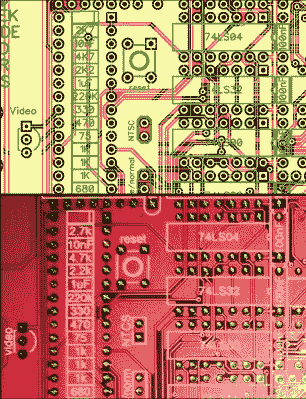

# 硬件克隆的剖析

> 原文：<https://hackaday.com/2019/01/21/anatomy-of-a-cloned-piece-of-hardware/>

如果你看到你设计、制造和销售的产品盗版出现在易贝，你会怎么想？对于我们这些不以此为生的人来说，我们可能会暗暗希望我们的 blinkenlight 项目最终会如此棒，以至于全球速卖通或淘宝上的克隆产品最终能卖出数千个。当然，任何以销售电子产品为业的人都会感到不安，并想知道这是怎么发生的？很容易陷入自动分配责任的陷阱；如果正版主板是在中国制造的，你会认为这就是盗版设计被窃取的地方吗？有一种关于假设的说法适用于这个故事。

泰恩茅斯软件公司的戴夫·柯伦克隆了他的一个产品，因为他已经很好地与我们分享了所有的细节，我们可以看看证据。戴夫的侦探工作是一流的。他的发现令人惊讶，他的海外制造商是清白的，盗版板来自一个完全不同的来源。

## 克隆体的克隆体！我们听到你在呻吟。

[Original Minstrel ZX80 (Green)](https://hackaday.com/wp-content/uploads/2019/01/scan-1000px.jpg) versus [bootleg Minstrel ZX80 (Red)](https://hackaday.com/wp-content/uploads/2019/01/russian-1000px.jpg)

有问题的产品是 Minstrel ZX80，它是 Sinclair ZX80 家用电脑在 PCB 上的翻版，与后来的 ZX81 外形相同。这是一个我们在 2017 年发布时报道过的项目[，似乎戴夫从那以后就一直在](https://hackaday.com/2017/01/05/a-thoroughly-modern-sinclair-zx80/)[悄悄地销售套件](https://www.tindie.com/products/tynemouthsw/minstrel-zx80-clone/)。一台特别不起眼的 20 世纪 80 年代家用电脑的复制品很难成为大批量生产的产品，所以他最近相当惊讶地发现[一个易贝的列表，其中的文字摘自他的 Tindie 页面](https://www.ebay.co.uk/itm/Minstrel-Zx80-Issue-2-6-Pcb-x1/183572958314)提供了一个不存在的“2.6 版本”，他自己从未发布过。深圳板房公司是否多生产了一批，以满足巨大的盗版 80 年代电脑复制品的世界市场？似乎不是，因为尽管电路板完全相同，几乎所有元件都可以覆盖在一起，但从微小的布线差异和一对表面贴装调节器来看，代替原始通孔部分的盗版项目是重新创建的，而不是简单地作为同一 Gerbers 的另一次运行来生产。

## 都在小小的差异中。

The CAD view of part of the genuine board (top, yellow) versus the same part of the bootleg (bottom, red).

仔细研究这些图像揭示了一些有趣的细节。在我们放在这一页上的一小部分的对比图像中，可以很容易地看到它们。丝网层揭示了两块电路板之间完全不同的一组尺寸，例如去耦电容和复位按钮。还有文本差异，不仅仅是缺少基本命令和文本相对于组件的方向，还有文本本身。例如，跳线旁边的“NTSC”对“NTCS”。

在大多数情况下，除了已经提到的电压调节器之外，元件放置完全相同，走线遵循非常相似的路径。在电路板的某些部分，盗版版本上有一些额外的轨道，这些轨道不会出现在原始版本上，但从原始 ZX80 派生的电路经过一些小的修改后仍然保持不变。然而，自动填充铜线具有显著的差异，这在整个电路板上可以容易地看到，很明显，不同的自动填充算法正被采用，以其自己的公差工作。

看起来很有可能盗版是在 CAD 软件包中手工制作的，原版是作为某种模板的。仍然有一种可能性，即 Gerbers 可能已经被截获并装入一个包裹中，但在 Dave 和其他人的一些侦查工作之后，一个不同的故事出现了。

## 通向私酒贩子的道路

去年四月，一位购买了泰恩茅斯吟游诗人 ZX80 [的顾客在俄语版的 ZX-PK 辛克莱爱好者论坛上发布了关于它的信息](https://zx-pk.ru/threads/29396-minstrel-zx-80.html) ( [谷歌翻译](https://translate.google.com/translate?hl=&sl=auto&tl=en&u=https%3A%2F%2Fzx-pk.ru%2Fthreads%2F29396-minstrel-zx-80.html))。他们放了一个链接，链接到他们对电路板进行的高分辨率扫描，正是这个扫描被另一个论坛成员使用，[决定制作他们自己的版本](https://zx-pk.com/forum/viewtopic.php?f=7&t=10797) ( [谷歌翻译](https://translate.google.com/translate?hl=&sl=auto&tl=en&u=https%3A%2F%2Fzx-pk.com%2Fforum%2Fviewtopic.php%3Ff%3D7%26t%3D10797))。翻译并不准确，但看起来他确实在生产第一批电路板之前在 CAD 包中手工创建了它。

从这个故事中可以清楚地看出，这份拷贝与[戴夫]的任何供应链都没有关系，所以流行的理论，即格柏送往国外肯定是走私的，在这种情况下是站不住脚的。我们不是说它没有发生，只是说它没有在这里发生。一个着眼于快速赚钱的爱好者竟然会直接从零开始克隆吟游诗人，这有点令人惊讶，因为这项任务需要大量的天赋和专业知识才能完成。我们希望有能力做这项工作的人能够毫无问题地创造出自己的产品，也许在这个领域更明显的目标是直接克隆 ZX80 本身，并为薄膜键盘提供 PCB 支持。无论哪种方式，这都是一个有趣的案例，如果你想要一个自己的 ZX80 克隆，我们建议你看看真正的东西而不是盗版。