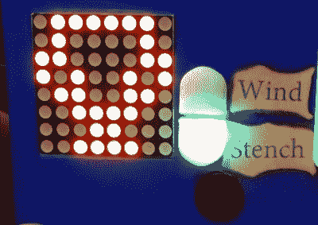

# Arduino 狩猎(并看到)Wumpus

> 原文：<https://hackaday.com/2019/01/15/arduino-hunts-and-sees-the-wumpus/>

对于任何从 VGA 出现之前就开始摆弄电脑的人来说，“寻找 Wumpus”可能会勾起美好的回忆。开发于 1973 年，这款文字游戏让你在一个洞穴系统中寻找恶臭的 Wumpus，这是一种邪恶的生物，你必须用你可靠的弓和箭将其消灭。一些人认为这是有史以来最早开发的生存恐怖游戏之一，是*生化危机*系列以及视频游戏版*汉娜·蒙塔娜:电影的前身。*

如果你对“猎巫”这个概念很感兴趣，但你就是不能忘记整个文本冒险的事情，你可能很幸运。Benjamin Faure 开发了经典恐怖片《T1》的半图形化版本，可能更符合你 21 世纪的口味。运行在 Arduino Mega 2560 上，图形显示在 8 x 8 的 LED 矩阵上，这并不完全是*的厄运；但是至少你不用把所有的东西都打出来。*

You are winner!

[Benjamin] 3D 为他的手持版本*“Hunt the Wumpus”*打印了一个漂亮的外壳，并用看起来像小卷轴的标签和说明装饰它，这对于一个如此古老的当代玩家会称 *Zork* 为“次世代”游戏的游戏来说是一个整洁的触摸。在玩的时候，你可以通过 MAX7219 显示屏上的发光点看到你去过的地方和你现在的位置，还有 led 警告你接近无底洞和 Wumpus 本身。甚至还有一个压电扬声器，当蝙蝠在附近时，它会发出啁啾声，这很重要，因为它们会把你带到洞穴中的一个随机位置，从而破坏你的一天。

游戏的大部分看起来像是蛇的高级版本，但是[本杰明]确实费了很大的劲添加了一些基本的动画和音效，在游戏的特定部分播放。当你射箭或被蝙蝠带走时，你会在 LED 显示屏上看到各种“过场动画”。这是一个相当简单的效果，但有助于打破相当斯巴达式的图形，可能足以吸引年轻人的注意力。

如果你减去一个维度，这个项目会让人想起我们去年报道的 1D 地牢爬虫。但是如果一个维度太多了，你可以在你信任的 Arduino 上运行[文本版的*“猎巫人**。*](https://hackaday.com/2012/04/27/text-adventures-for-arduino-starting-with-hunt-the-wumpus/)

 *[https://www.youtube.com/embed/3CSKgaS69yw?version=3&rel=1&showsearch=0&showinfo=1&iv_load_policy=1&fs=1&hl=en-US&autohide=2&wmode=transparent](https://www.youtube.com/embed/3CSKgaS69yw?version=3&rel=1&showsearch=0&showinfo=1&iv_load_policy=1&fs=1&hl=en-US&autohide=2&wmode=transparent)

*