# 十二个我们无法停止观看的电路雕塑

> 原文：<https://hackaday.com/2019/01/15/twelve-circuit-sculptures-we-cant-stop-looking-at/>

电路以其自身的方式是美丽的，一个电路雕塑将这种抽象的美转化为一种有目的的艺术形式。你能把电路本身的电线作为一个雕塑的结构，用每一个元件的使用和放置来讲述一个故事吗？任何人都可以使用这种媒介来锻炼他们内在的艺术家气质，我们很高兴看到这么多人尝试这种方式。今天，我们宣布了最高获奖者，并庆祝 Hackaday Circuit 雕塑大赛的 40 个参赛作品。

让我们来看看 12 个吸引我们眼球的杰出项目:

## 气隙计算机的新意义

 [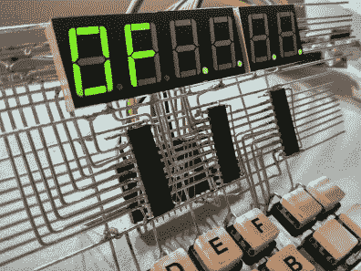](https://hackaday.com/2019/01/15/twelve-circuit-sculptures-we-cant-stop-looking-at/wirez80-circuit-sculpture-detail/) Closeup of the user interface [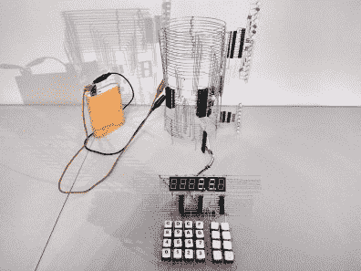](https://hackaday.com/2019/01/15/twelve-circuit-sculptures-we-cant-stop-looking-at/wirez80-circuit-sculpture/) z80 computer as a sculpture.

我们已经看到了建立在试验板上的逆向计算机，但远没有这么整洁！ [Matseng 将 wirez80 作为 z80 计算机](https://hackaday.io/project/162910-wirez80)制造，配有一个用于输入的六边形键盘和一组 7 段显示器。后面的圆柱形塔承载 CPU，并使用这些环来分配地址总线和数据总线。它引人注目，布局干净、简单、复杂。这不是简单的电路，它实际上起着计算机的作用！作为前三名获奖者之一，该项目将获得 200 美元的现金奖励。

## 筑巢本能

 [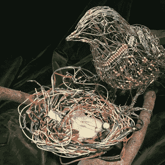](https://hackaday.com/2019/01/15/twelve-circuit-sculptures-we-cant-stop-looking-at/electronic-sculpture-bird-finished/) Bird and nest has tweeting chicks controlled by light sensor [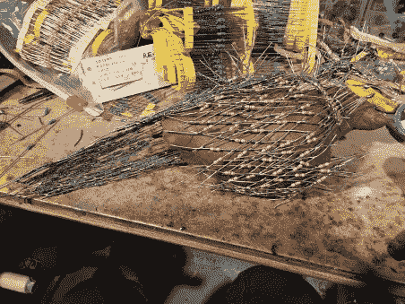](https://hackaday.com/2019/01/15/twelve-circuit-sculptures-we-cant-stop-looking-at/electronic-sculpture-bird-assembly/) Fabricating the bird sculpture on a clay form

当你看到凯利·希顿的电子雕塑作品时，你会被作品的美所打动。它有一幅油画的回声，那里的地层和地形结合在一起创造了美，留下了一个无法回答的问题“如何？”。电路本身是用 7400 系列逻辑构建的光激活啁啾电路，安装在鸟的中空部分。传感器在鸟巢里，听起来像小鸟在召唤它们的父母给它们喂食。凯利通过展示她用来建造鸟雕塑的粘土模型来展示这是如何建造的。尽管如此，最终的雕塑仍然令人难以置信。作为前三名获奖者之一，该项目将获得 200 美元的现金奖励。

## (音频)人的创造

 [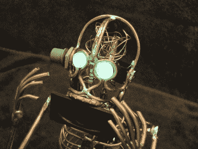](https://hackaday.com/2019/01/15/twelve-circuit-sculptures-we-cant-stop-looking-at/audio-man-circuit-sculpture-skull-detail/) Speaker for mouth, trimpot and audio jack for ears [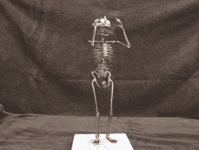](https://hackaday.com/2019/01/15/twelve-circuit-sculptures-we-cant-stop-looking-at/audio-man-circuit-sculpture/) Anthropomorphizing audio

Dean Segovis 的音频人电路雕塑中，死虫制作遇到了电线雕塑。一个人类骨骼已经精心制作完成，对每根金属丝的轮廓和尖端楔形切割的细节都十分关注。电路的内脏在 Audio Man 的内脏中找到了归宿，腰部电池组为 LM386 音频放大器供电。头部的细节令人愉快，因为扬声器使他成为一个大嘴巴，发光的眼睛增加了生活的幻觉，一个 trimpot 和音频插孔充当耳朵，一堆杂乱的电线填充了他的头部。作为前三名获奖者之一，该项目将获得 200 美元的现金奖励。

## 亚军:

 [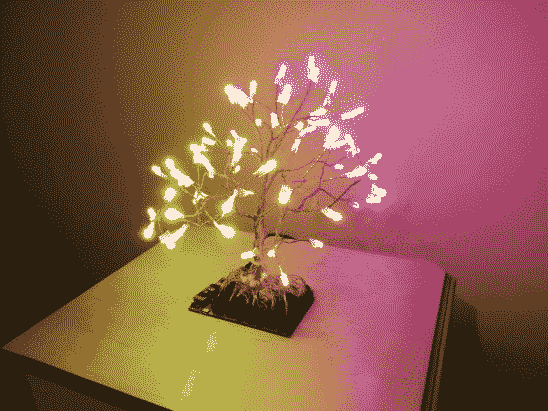](https://hackaday.com/2019/01/15/twelve-circuit-sculptures-we-cant-stop-looking-at/cof-3/) RGB Tree [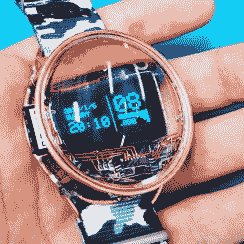](https://hackaday.com/2019/01/15/twelve-circuit-sculptures-we-cant-stop-looking-at/nor-2/) The Skeleton Watch by Mile is a great example of superb photography. Excellent framing, focus, and color make it great. [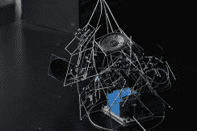](https://hackaday.com/2019/01/15/twelve-circuit-sculptures-we-cant-stop-looking-at/treed/) treed [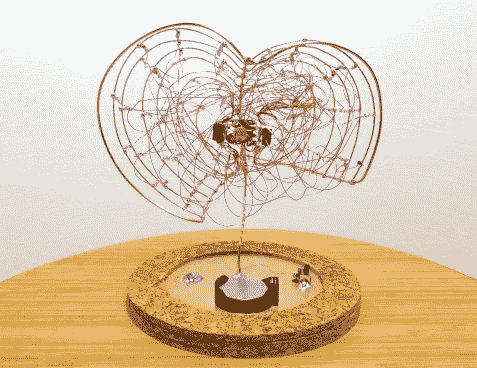](https://hackaday.com/2019/01/15/twelve-circuit-sculptures-we-cant-stop-looking-at/pollen8/) Pollen8 [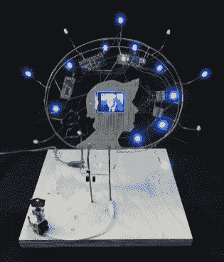](https://hackaday.com/2019/01/15/twelve-circuit-sculptures-we-cant-stop-looking-at/parts-bin-self-portrait/) Parts Bin Self Portrait [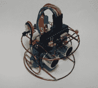](https://hackaday.com/2019/01/15/twelve-circuit-sculptures-we-cant-stop-looking-at/freeform-robot/) Freeform robot [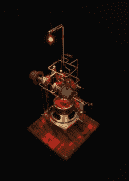](https://hackaday.com/2019/01/15/twelve-circuit-sculptures-we-cant-stop-looking-at/freeform-rgb-atari-punk-console/) Freeform RGB Atari Punk Console [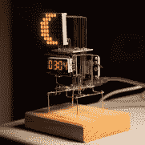](https://hackaday.com/2019/01/15/twelve-circuit-sculptures-we-cant-stop-looking-at/freeform-astronomic-clock/) Freeform Astronomical Clock [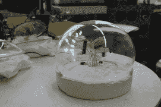](https://hackaday.com/2019/01/15/twelve-circuit-sculptures-we-cant-stop-looking-at/anemone-gallery/) Anemone

竞赛中的创意范围非常广泛。我们挑选了比原计划更多的亚军，你可以从每一个中看到，他们都可笑地有资格被命名为获胜者。之所以选择这些作品，是因为它们展示了不同而有趣的电路雕塑方式。这九个项目中的每一个都赢得了一个价值 100 美元的礼物代码给 Tindie，在那里你可以找到由设计师自己出售的独特的硬件。

*   [银莲花](http://hackaday.io/project/163022)
*   [自由形式天文钟](http://hackaday.io/project/163103)
*   [自由形态 RGB 雅达利朋克控制台](http://hackaday.io/project/162958)
*   [自由形态机器人](http://hackaday.io/project/162893)
*   [零件箱自拍](http://hackaday.io/project/163183)
*   [民意测验 8](http://hackaday.io/project/162969)
*   [RGB 树](http://hackaday.io/project/162840)
*   [骷髅手表](http://hackaday.io/project/163179)
*   [treed](http://hackaday.io/project/162834)

我们可以轻松地将这个列表增加两到三倍。确保你跳过并[浏览所有条目](https://hackaday.io/submissions/circuit-sculpture-contest/list)——它们值得你花时间！

## 下一场比赛和一些荣誉奖

这场比赛已经结束，但下一场比赛明天开始。掸掉那些 3D 打印机的灰尘，预热 CAD 软件，我们的下一个挑战是 3D 打印齿轮、滑轮和凸轮竞赛。请关注 Hackaday 了解全部细节。

 [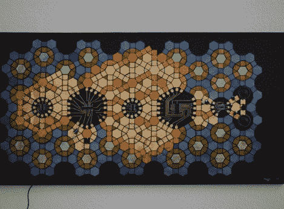](https://hackaday.com/2019/01/15/twelve-circuit-sculptures-we-cant-stop-looking-at/tessellated-circuits-made-of-colored-metals/) Heat oxidized copper [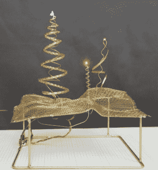](https://hackaday.com/2019/01/15/twelve-circuit-sculptures-we-cant-stop-looking-at/wonderlandscape/) Metalwork mixed with circuits

我们给你留下了两个荣誉奖。由有色金属制成的镶嵌电路项目被命名为“最佳氧化法”,因为它使用热氧化法来制作铜垫，铜垫是镶嵌图案非常有趣的颜色。 [Wonderlandscape](https://hackaday.io/project/163209-wonderlandscape) 因远远超越焊丝而被评为“最佳金属制品”。