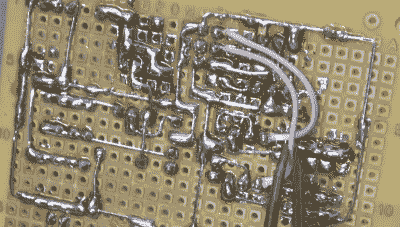

# 本·赫克能给最小的微控制器编程

> 原文：<https://hackaday.com/2019/01/18/ben-heck-can-program-the-smallest-microcontroller/>

微控制器很小，没有人会否认这一点。在米粒大小的硅片上，你可以将 GPS 追踪器连接到互联网上。把它放进一个包里，你就可以把物联网放进一张邮票大小的东西里。有一个微控制器比其他的都小。它是 ATtiny10，它的兄弟是 ATtiny4，5 和 9。它采用 SOT-23-6 封装，这种尺寸在单晶体管封装中更常见。能力不是很强，但是很小。它也很奇怪，有一个在 Atmel/Microchip motherbrain 的其他芯片中找不到的编程方案。现在，终于，我们有了一个很棒的使用 ATtiny10 的教程，[，它来自别人，正是【Ben Heck】](https://www.youtube.com/watch?v=ra7bT74EGUs)。

attiny10 与其他 AVR 的关键区别在于，tiny 10 不使用标准的 AVR ISP 协议进行编程。这不是用于电源、接地、MISO、MOSI、SCK 和 RST 的六个引脚，而是需要 12 伏的高电压编程方案。普通的 AVR 程序员可以做到这一点，但你需要建立一个适配器。这正是[Ben]所做的，使用单面 perf 板、大量焊料和一些接头。看起来很多，但是这个程序员板真的不多。有一个晶体管和一个光耦合器。唯一能让这个程序员变得更好的是一个 SOT-23 ZIF 插座。这将允许裸锡 10 被编程，而无需首先将它们焊接到分线板上，但是 ZIF 插座一开始就很贵，而且 SOT-23 插座的价格也高得离谱。

给这个设备编程只需加载 Atmel Studio 并通过通常的 AVR 繁琐程序，但 Ben 最终能够将一个光传感器连接到 tiny10，并让它通过串行输出一个值。这些都是在只有 32 字节内存的设备上完成的。这令人印象深刻，也是你能买到的最小的微控制器最酷的事情之一。

 [https://www.youtube.com/embed/ra7bT74EGUs?version=3&rel=1&showsearch=0&showinfo=1&iv_load_policy=1&fs=1&hl=en-US&autohide=2&wmode=transparent](https://www.youtube.com/embed/ra7bT74EGUs?version=3&rel=1&showsearch=0&showinfo=1&iv_load_policy=1&fs=1&hl=en-US&autohide=2&wmode=transparent)

