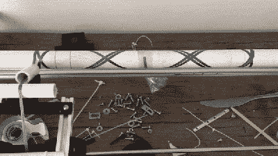

# Arduino 碳纤维包装机

> 原文：<https://hackaday.com/2019/01/18/an-arduino-carbon-fiber-wrapping-machine/>

我们在 Hackaday 上展示的许多项目纯粹是出于贪婪。请注意，这不是黑客的问题；而是公司对大规模生产的产品收取如此离谱的价格，以至于有人决定他们可以以更低的价格做一次性项目。这就是为什么[【布莱恩·凯旺】最终建造了自己的碳纤维管包装机](https://bryanmkevan.bike/2018/12/16/carbon-framebuilding-das-faserwickelmaschine/)。成品电子管不仅看起来棒极了，而且它们的价格只是“廉价”商业电子管价格的一小部分。

生产这种管子的原理非常简单:碳纤维带(官方说法是“丝束”)缠绕在旋转的心轴上，最好是有趣的图案，然后加入环氧树脂将它们粘合在一起。当它变硬后，你把新的碳纤维管从心轴上滑下来，然后你就可以做一个自行车架或者任何你需要的又轻又结实的管子。如果你有足够的耐心，你甚至可以用手来做。

【Bryan】以前也曾手工制作过，但他一直在寻找一种方法，不仅能自动完成这一过程，还能让最终产品看起来更加统一。他的想法是旋转一根水平的 PVC 管作为他的心轴，并沿着它的长度来回移动一辆载有碳纤维带的“汽车”。PVC 管只需要沿着它的轴旋转，所以他认为这很容易；使用 GT2 带和一些滑轮，让铺碳车来回移动似乎也不是什么挑战。

绕线机的框架是由黑客的最爱:20/20 铝挤压而成。除此之外，还有一个 Arduino Uno，两个步进电机及其相应的驱动器，以及常见的 3D 打印零碎物品。[Bryan]说，找到生成有趣的包装模式的数学方法有点棘手，需要大量的试验和错误，但这并不是一个决定性的因素。尽管我们建议效仿他的做法，在测试中使用派对丝带，而不是碳材料，因为在开始时生产一些鸟巢似乎几乎是一种保证。

该项目的最棘手的部分之一是在完成后从 PVC 心轴上移除碳纤维管。[Bryan]最终选定了一种工艺，包括用 WD-40 喷涂 PVC，用羊皮纸包裹，然后用一条 3M 的蓝色油漆工胶带防止羊皮纸移动。如果你能在包装后将整个心轴放入冰箱，使其收缩一点，那就更好了。

那么，所有这些工作最终都值得吗？[Bryan]说，他原本打算以每英尺 70 美元的价格购买他自行车车架所需的碳纤维管，但通过购买原材料并自己缠绕，他最终以每英尺近 3 美元的价格生产了他的碳纤维管。有些人可能会质疑这些 DIY 管的强度和一致性，但如果价格降低约 95%，我们愿意尝试一下。

几年前[我们报道了 Kickstarter 上一款非常相似的碳纤维绕线轮](https://hackaday.com/2013/10/01/x-winder-carbon-fiber-wrapping/)的活动。可能由于这种小工具的用途相对有限，绕线机没有达到融资目标。但是就像目前令人印象深刻的自制激光切割机一样，[最好的结果可能来自于你自己制作的东西](https://hackaday.com/2018/11/20/scratch-building-a-supersized-laser-cutter/)。