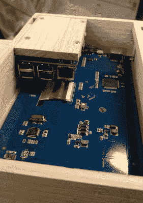

# 树莓派点唱机点击所有正确的音符

> 原文：<https://hackaday.com/2019/01/22/raspberry-pi-jukebox-hits-all-the-right-notes/>

我们(推而广之，你)已经看到树莓派被塞进了几乎每一件你能想到的装备里。把它放在游戏控制台中是如此受欢迎，以至于接近一个迷因，把它们放在旧音响和其他消费电子产品中也不远了。看到黑客如何将现代的树莓 Pi 移植到原始硬件中总是很有趣，但我们承认它可能会有一点重复。那么，有人为他们的点唱机项目临时搭建一个围栏如何？

【ComfortablyNumb】走了一条人迹罕至的路[他以八分音符](https://imgur.com/gallery/KZBKJLG)的形状创造了这个非常好的木制树莓皮围栏。染色和涂漆，中间有一个漂亮的大触摸屏来控制，这是一个有吸引力的功能性家用音频设备，我们想象大多数人会很乐意挂在他们的墙上。

这个过程首先是在一张纸上打印出想要的形状作为指导，然后将木条粘在一起形成粗略的轮廓。然后对表面进行彻底打磨，使所有木条达到相同的高度，并切割出最终的设计。在便条的背面，[ComfortablyNumb]划出了一个区域来放置 Waveshare 七英寸触摸屏面板和树莓 Pi 本身。

看到这么多项目中 Pi 被毫不客气地硬塞进另一个设备，看到专门构建的外壳的结果令人耳目一新。由于[ComfortablyNumb]能够按照他的精确尺寸建造电子隔间，最终结果看起来格外干净和专业。看不到一滴热胶水。这也有助于这个构建只需要 Pi 和显示；由于该设备是要插入现有的音频设置，没有板载放大器。音响发烧友可能会害怕，但如果 Pi 上的股票音频对你来说不够好，添加专用的数模转换器(DAC)将很容易添加。

这个项目是通过着色和涂几层清漆来达到那种深沉而丰富的颜色。我们并不经常发现自己在这些地方使用枯树，但是我们不得不承认最终的产品看起来确实很漂亮。当然比我们很多 Pi 项目中的乐高盒子要好。

如果你正在寻找更多木制包装的 Pi 点唱机，你可能会喜欢这个[有点抽象的磁条概念](https://hackaday.com/2019/01/06/the-jookbox-is-a-post-modern-jukebox/)。当然，我们也看到[我们的公平份额*实际*点唱机收到树莓输液这些年](https://hackaday.com/2017/09/22/arduino-and-pi-breathe-new-life-into-jukebox/)。

[via [/r/raspberry_pi](https://www.reddit.com/comments/a3wt9u/a_pi_jukebox_with_touchscreen/)