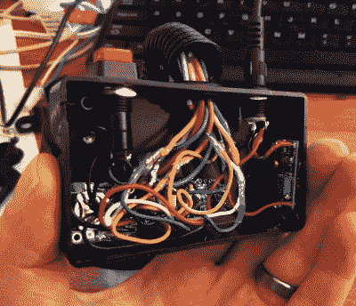

# Arduino 转速表时钟在所有气缸上触发

> 原文：<https://hackaday.com/2019/01/18/arduino-tachometer-clock-fires-on-all-cylinders/>

我们对这些地方的独特时计并不陌生。不管出于什么原因，黑客们热衷于寻找新的有趣的显示时间的方式。当然，我们不是在抱怨。我们看到这些东西和建造它们一样兴奋。假设你和我们一样迷恋这些古怪的计时器，我们向你展示由[mrbigbusiness] 创造的这款[神奇的数字转速表时钟。](https://github.com/mrbigbusiness/tachometer-clock)

 多功能数字仪表本身是一个配件市场单位，[mrbigbusiness]说你可以从一些网站上以低至 20 美元的价格在线购买。他所需要做的就是找出如何让他的 Arduino 与它对话，并想出一些有趣的方法来以合适的视角持有它。从计量器后面出来的大量电线可能看起来令人生畏，但由于他有记录良好的代码，如果你愿意，跟随他的脚步应该不会太难。

小时由仪表的模拟部分表示，分钟以数字形式显示，这是通常显示速度的地方。这使得模拟时钟的经典外观与数字时钟的精确度完美融合。他甚至把它设置好了，这样燃料指示器就会随着当前时间的推移而充满。代码还解释了如何使用像齿轮和远光灯指示器这样的东西，所以有很多定制和有趣的数据可视化的空间。例如，通过对[mrbigbusiness]提供的代码进行一些修改，很容易放弃整个时钟的想法，而将这个计量器用作系统监视器。

测量仪安装在一个小的项目盒上，有一些 3D 打印的支架和一些金属杆，还有一小段柔性织机来覆盖所有的电线。总的来说，它看起来非常光滑和未来没有放弃其明显的汽车根源。在底座内，[mrbigbusiness]有一个 Arduino Nano，一个通过 I2C 连接的 DS1307 RTC，一个电压调节器和一个设置时间的按钮。这是一个非常合理的布局，尽管我们想知道是否可以通过使用 ESP8266 和使用 NTP 缩短时间来简化它。

在此之前，我们已经看到仪表变成了计时器，但我们不得不承认，这可能是我们见过的最实际的想法。当然，如果你想用更真实的东西装饰车库，[你可以随时改变保时捷制动转子的用途。](https://hackaday.com/2015/09/19/porsche-themed-mancave-clock-there-is-no-substitute/)