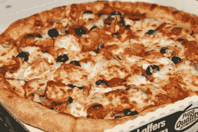

# 这就是我所说的加密:比特币的 10 年精华

> 原文：<https://hackaday.com/2019/01/29/now-thats-what-i-call-crypto-10-years-of-the-best-of-bitcoin/>

2009 年 1 月 3 日，创世纪板块创建。这是比特币区块链的第一个条目。因为比特币的性质，所有的交易都会回到这个区块。这是比特币开始的地方，差不多正好是十年前。

创世纪板块是由 Satoshi 创造的，一个或几个我们一无所知的人。在此后的十年里，我们目睹了比特币的惊人崛起和迅速衰落，然后在泡沫再次膨胀后再次发生。

由于比特币、区块链和总账的性质，比特币的整个历史都被记录了下来。花掉的每一个硬币和每一个 satoshi 顾忌都被记录下来，让所有人看到。是回顾的时候了，不仅仅是因为我想看一些基于现在我称之为音乐专辑的封面的艺术。不，十年有很多故事要讲。

## 创世装置

区块链的整个概念就是记录每一笔交易。这几乎是区块链解决的唯一解决方案，而且是直接来自国家标准与技术研究所。正因为如此，我们可以把比特币追溯到最开始。[这里是](https://www.blockchain.com/btc/block/000000000019d6689c085ae165831e934ff763ae46a2a6c172b3f1b60a8ce26f)，0 号街区，或者 1 号街区，在早期有一个一个的错误。

除了作为整个比特币区块链的基础，创世纪区块中还有更多数据。文本“泰晤士报 03/1/2009 财政大臣处于第二次银行救助的边缘”嵌入在原始块数据中。对于这些数据存在的原因有不同的解释。可能 Satoshi 只是拿起一份《伦敦时报》,写下标题，就像你拿起一张报纸的照片来给照片加时间戳一样。这可能是对部分准备金银行体系的评论。无论如何，如果你找到一份 2009 年 1 月 3 日的《纽约时报》,你就找到了 50 万美元。这就是比特币收藏家向索要一份本报的原因。

## 一百五十万美元的披萨

At one point, this Papa John’s pizza was worth $750,000\. Image credit [Laszlo](http://eclipse.heliacal.net/~solar/bitcoin/pizza/).

这是一个同义反复，但比特币只有在有价值的情况下才有价值。如果是交换媒介的话。在比特币的早期，回到 2010 年初，围绕比特币的社区很像 2014 年的 Dogecoin 社区。你的比特币程序只是生成了这些‘硬币’。不，你不能在任何地方花掉它们。人们收集比特币，因为这是一件可以做的事情。这很新奇。人们免费赠送比特币，只是为了看着它们在区块链流动。

然后，在 2010 年 5 月，事情发生了变化。在 bitcointalk 论坛上，Laszlo 与另一名成员达成了一致。拉兹洛会给另一个论坛成员 10，000 BTC 买两个棒约翰披萨。据报道，这些比萨饼是一个大的“作品”和一个大的“花园新鲜”，价格在 30 到 40 美元之间。以前，人们会以几分钱的价格互相赠送比特币，但 Laszlo 的披萨是第一次比特币可以被赋予真实货币的价值。在这次交易中，一个比特币等于 0.3 美分。在比特币泡沫的顶峰时期，这些披萨价值 150 万美元。

拉兹洛在比特币社区很出名，不仅仅是因为他花了一百万美元买了两个披萨。他是第一批发布 GPU miner 的人之一，只是作为学习 OpenCL 时的一个有趣项目。他在 nVidia 9800 GTX+ / hackintosh 钻机上开采了所有的硬币，后来又转移到 2x 镭龙 5970 钻机上。你的 GPU 矿工，尤其是那些在 OS X 上运行的(不管多么罕见)，可以追溯到那个买了一个百万美元披萨的家伙。给他送披萨的那个人？他用他的披萨比特币买了一栋房子。

## 用神奇的互联网钱买毒品！

虽然比特币的支持者说这是一项经济学实验，但拜占庭将军问题的解决方案是一项创新的新技术；这不是 2011 年大多数人的想法。比特币的第一次流行使用，是在基于 Neckbeardistan 的怪异论坛之外，是作为购买毒品的一种方式。

比特币的支持者会说这是由一些非常聪明的人创造的有趣的技术，在波多黎各兑现之前，*也许*一些企业家参与了这个游戏。这是一个错误的叙述。2011 年和 2012 年的文化时代精神是，比特币是在互联网上购买毒品的一种方式。比特币就是你在网上买毒品的方式，仅此而已。你可以在丝绸之路上用比特币购买毒品。这是比特币的目的(除了买披萨)。

丝绸之路是一个在 Tor 网络上运作的在线市场。任何人访问丝绸之路最简单的方法是下载 Tor 浏览器，复制并粘贴丝绸之路地址，并查看丝绸之路上各种各样的产品。你可以买大麻，有人从他们祖母那里偷的芬太尼，桑给巴尔，海洛因——真正的海洛因，上面有一张美丽的红色和黑色的花的图片——以及你的多巴胺受体想要的任何东西。氯仿？当然，伙计，但事情并不像你想的那样。可卡因？好吧。快克？没问题。不过，你真的应该买可可糊，因为这是最有效的运输方式。你怎么支付这些东西？神奇的互联网货币！这一段完全准确地再现了 2012 年公众对比特币的看法。

丝绸之路是由恐怖海盗罗伯茨发起的，罗伯茨是罗斯·乌布里希特的笔名，目的是“让人们亲身体验生活在一个没有系统使用武力的世界里会是什么样子。”这是秘密无政府主义的核心原则。如果你想知道什么是秘密无政府主义，这是字典上的定义——它使用加密技术生活在一个没有政府和使用武力的专属权利的世界里。

不幸的是，在我们生活的世界里，政府拥有使用武力的专有权。他目前正在服无期徒刑，外加 40 年，没有假释的可能性，罪名是洗钱、电脑黑客和阴谋贩运毒品。说乌布里切特因为教唆雇凶杀人而入狱是不正确的；这些都没有包括在他的起诉书中，首席检察官说，这些雇凶杀人的指控都没有发生。

## 做了一些好事

比特币泡沫不仅仅是通过互联网购买毒品。一些人赚了大钱，一些人买了游艇，其他人做了一些有成效的事情。最大的头条是松树，菠萝基金表现不错。

菠萝基金是由一个自称是世界上 250 个最大的比特币持有者之一的人发起的。该基金捐赠了 5104 BTC，将其转化为 5500 万美元，用于慈善机构，包括 EFF(100 万美元)、互联网档案馆(200 万美元)、水项目(为撒哈拉以南非洲提供清洁水的项目)(100 万美元)、美国公民自由联盟(ACLU)(200 万美元)和 OpenBSD 基金会(5 万美元)。

比特币的支付“与 2017 年的加密泡沫同步”，这绝对是摆脱比特币的最佳时机。如果你有时间机器，去 2010 年，用一些披萨换比特币，然后去 2017 年 12 月，把你的比特币捐给有价值的事业。这是你能做的最好的事了。

## 我的 GPU 矿工是凉爽的跑步

虽然与比特币没有直接关系，但 Dogecoin 最初是一种加密货币，就像价值百万美元的披萨一样有趣。唯一的区别？乐趣从未停止。Dogecoin 几乎是在五年前由比利·马库斯和杰克逊·帕尔默在加密热潮的顶峰时期创立的。这是一个笑话硬币，是的，但它也是一个这样的硬币。哇哦。

就在 Dogecoin 诞生几个月后，这些硬币在 reddit 和其他论坛上被分发出去。和比特币的早期一样，Dogecoin 几乎是一个笑话，但也不尽然。这些硬币在市场上交易，但是价值很小，一枚硬币基本上没有价值。Dogecoin 相当于 Twitter 上的赞；这并不意味着什么，没有人会因此而发财，但是给别人几百个金币是值得赞赏的。

然后笑话继续。Dogecoin 社区决定派牙买加雪橇队去 T2 参加奥运会。是的，*酷跑*T5 s，1993 年由约翰·坎迪主演的电影，再次被拍成了现实。这是作为一个笑话。一个笑话加密货币让一部相对冷门的电影(本来可以用更多忍者的)重新流行起来，还派了一个队去奥运会。后来，Dogecoin 社区[赞助了一场纳斯卡](https://www.cnn.com/2014/04/24/tech/web/nascar-dogecoin-talladega/index.html)。

尽管 Dogecoin 不再受到太多关注，但其他加密货币也是如此。这很遗憾，因为通过重新设计，Dogecoin 的供应量是无限的。永远只会有 2100 万个比特币，但会有无限个 Dogecoin。没有人知道当最后一个比特币被开采出来时会发生什么，或者未来几年任何通货紧缩的比特币会发生什么。另一方面，Dogecoin 是一种通货膨胀硬币，而且是目前最受欢迎的通货膨胀硬币。

比特币和其他加密货币的历史反映了货币的历史。我们已经从人们收集他们在溪流中发现的黄金或者他们希望存在于他们的 CPU 中的比特。建造大型矿井是为了从地下开采黄金，留下一个浸满水银的超级基金场地供后代清理，GPU 矿井向大气中排放₂。康曼利用郁金香和 ICO 创业公司。最后，整个系统崩溃了。多亏了比特币，经济学和货币的整个历史被浓缩到了一个十年，多年后，一位诺贝尔经济学奖得主将接受这一奖励，因为他们知道自己是在 2012 年从神奇的互联网货币开始的。