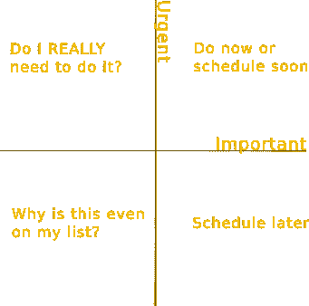

# 腾出时间来解决你的时间债务

> 原文：<https://hackaday.com/2019/02/06/make-the-time-to-fix-your-time-debt/>

你太忙了，没时间看更多的介绍。我们都是。你的兴趣可能会被激起到可以略读的程度，但是你不能阅读全文。我们的生活都像那只小白兔，总是为下一件事迟到，从不享受当前的事情。你觉得自己同时超有效率，但又从未有足够的效率来满足自己。您渴望有一个 Jarvis，它可以自动化您的项目的普通方面，然而构建 Jarvis 的前景会导致没有足够的时间进行另一个项目的焦虑。你看到另一个 YouTuber 不仅展示了一个伟大的构建，还展示了令人印象深刻的视频制作和编辑技能。你正遭受时间债务的困扰，解决方案需要像逃离金融债务一样的纪律和坚韧。

## 给问题起个名字

时间债务被定义为没有足够的时间在截止日期前完成你所有的承诺。你的承诺不仅仅是你正在做的项目，还包括你觉得应该做的事情，或者你想做的事情；任何给你带来压力的事情。多年来我一直在处理这个问题，但大多都不成功。在财务上，我稳定、精明，并能做出正确的决定。从技术上来说，我在我的领域是有能力的，并且通常选择可扩展和可重复的解决方案。然而，我如何处理时间一直是个挑战。我很难对新项目说不，我低估了一个项目需要的时间。症状包括:

*   持续的压力和焦虑
*   总是从你更想做的事情中抽出时间来处理紧迫的需求、项目或家务
*   永远没有足够的时间做你想做的事情
*   试图优化一切以适应
*   从不享受当下，总是想着接下来会发生什么

## 它是如何发生的

“你知道什么是整洁吗？…”，“我打赌你可以…”，“我应该把这东西修好。”在我的房子周围有一个“没有新项目”的咒语，因为我知道如果我不说，我会承担远远超过我处理能力的事情。当考虑时间债务时，想想它在金融中的等价物。你因花费或承诺超过你所拥有的而负债，你可以通过减少支出或增加收入来解决这个问题。当你致力于一个项目，或者低估了它需要多长时间，你就在开一张可能没有足够时间兑现的大额支票，而你的乐观或自信会欺骗你认为它仍然可以完成。本质上，当谈到时间债务时，你是你自己最大的敌人。

## 修复它

奇怪的是，尽管很少有人谈论时间债务，但解决方案与解决金融债务完全一样，所有的工具都完全一样。有些甚至是反过来的(例如，你通过自己做事情来摆脱财务债务，通过付钱让别人做你没有时间做的事情来摆脱时间债务)。

第一步是确定你的问题有多严重。列出你所有的承诺及其价值；你预计在这上面花多少时间。不是你花了多少钱，而是多少钱才是正确的数额。这个清单必须包括所有的事情，从睡觉到准备晚餐，到每天一小时的无聊浏览。这可能需要几天时间来编译，因为会弹出一些东西。你想做的每一个项目，你想学习的技能，如果它让你担心它没有完成，那么它就在列表上。如果你每天有超过 24 小时的承诺，你就负债了。

接下来，确定你的价值观。你的目标是让你的时间与你的价值观相匹配，并消除其余的。这是像睡眠、稳定的收入、朋友、家庭、爱好这样的东西。还有开销。在金融界，这种开销就是税收。在时间债务中，是像打扫房间和用牙线剔牙这样的事情。

现在是优先排序。所有事情都被分为重要/不重要、紧急/不紧急。重要和紧急的事情很快就能完成。不重要的事情；为什么他们会让你悲伤？如果它符合你的价值观，那就保留它，如果不符合，那就放手。

宣布你自己时间破产。这比财务破产容易得多，因为没有人会试图收回你的时间债务。如果你参加的活动或项目花费的时间比你想要的多，或者没有带给你想要的快乐，那就改变你参加的条件。如果这意味着项目夭折，这是一件坏事吗？时间破产的另一个方面是不要承担新的债务，当人们问你要东西时，你可以坦然地说不，因为你没有能力说是。

## 前进的道路是预算，而不是待办事项

每天我们都被广告和向我们要钱的人淹没，我们通常设法说不并忽视它。当人们询问我们的时间时也是如此。在选择如何度过自己的时间时，成为一名极简主义者是一项有用的技能，并且对不符合你的目标和价值观的项目说不。我们经常意识不到我们可以安排多少事情，我们把时间表排得太满了，以至于我们没有空间利用最让我们兴奋的机会。这就是时间预算的用武之地。

它被称为日历或日程表。待办事项清单不够好，因为它没有考虑时间。我过去常做待办事项清单。然后我试着在每一项旁边写上时间估计，结果发现即使我把每件事都做得很完美，我的清单也会把我带到凌晨 2 点。你需要把你所有的承诺安排在不同的时间段，不要害怕加倍你的估计。你安排的时间比实际需要的时间少，只会让问题变得更糟。为你想做的事情创建日历事件，并优先考虑符合你的价值观和目标的事情。一切都记录在日历上；吃早餐，去上班，下班后休息半小时。创建一个缓冲槽作为应急基金，以便您可以处理意想不到的重要和紧急任务。你现在有时间预算。虽然这听起来很乏味，但你的朋友和家人可能会发现，他们比以前更经常看到你，因为你对他们进行了优先排序，你将能够更容易地确定和消除时间支出，这些时间支出是昂贵而低收益的。

请注意，为了保持健康，你不能成为一台每天连续工作 18 个小时的机器。你必须及时学会照顾自己。你以前也这样做过，但是你对此感到内疚，这种内疚只会让你浪费更多的时间。不。给自己安排足够的时间在 reddit、YouTube 和 Hackaday 上赶上进度，并坚持下去。如果没有预定，可能会比你花的少。

## 远离时间债务

你知道如何避免花钱；练习一些有助于避免浪费时间的事情。你通过付清账单来摆脱债务。这意味着完成项目或退出正在进行的事情。你也可以通过增加收入来摆脱债务。没有人一天的工作时间超过 24 小时，但是我们可以委派任务，寻求帮助，支付他人的劳动，或者购买节省时间的工具。我必须提醒自己，我可以做一个小时的合同工作来支付几个小时的清洁工的工资，这样可以节省时间和金钱。最后，你可以通过明智的消费和良好习惯的投资来摆脱债务，而不是浪费在廉价和暂时的娱乐上，最终无法实现。

## 结论

严格一段时间后，这就会成为习惯，你就不需要那么严格了。你并不孤单。每个人都有这个问题。我们都看到我们的同龄人做的所有工作，并担心我们做得不够，但我们没有意识到我们的同龄人对我们有同样的想法。对我来说，将我的成果与数百万其他人的共同努力相比较是不公平的，这些人做的项目最终会出现在 Hackaday、YouTube 和其他地方。我们都应该放松一点，不要担心工作太快和太多，而是优先考虑和致力于对我们来说重要的事情。祝你好运！