# 八年零件制作:零件的爱情故事

> 原文：<https://hackaday.com/2019/02/08/eight-years-of-partmaking-a-love-story-for-parts/>

在我多年的兼职项目中，获得机械零件一直是一种创造性的意外。当然，我会为他们购物。但是我也会把它们从垃圾桶里翻出来，从铝里翻出来，用激光切割，或者从塑料里渗出来。当我跳进大学的时候，我制作零件的冒险第一次扎根。以前，我想学习如何制造机器人。我很快了解到“机器人制造”意味着学习如何制造它们的组成部分。

今天，我想带你们踏上我自己的机械“制造”之旅这是一个发生在学校、机械商店和车库的故事，讲述了一个年轻的成年人制造零件的故事。这是一个通过在电子垃圾堆中爬行来学习如何跑步的故事。在我的旅程中，我的场地会改变，手头的工具也会改变。但是，这种制造项目，进而制造零件的渴望一直存在。

亲爱的零件制造商，这是我给你的情书。

## 学习基本的语言

你有没有从一堆坏掉的电子产品中取出一个看起来很奇怪的螺丝，然后想:“这正是我需要的*—*——但是这个叫的*到底是什么东西？”早在大学时代，那就是我:部分囤积者。我会去电子垃圾堆里，找出螺丝、马达、轴——只要是你能想到的。有时候，我甚至可以得到完全正常工作的设备，比如功能齐全的 RC 发射器。(谢谢，多兹教授！)但大部分时候只是部分。“别介意乱七八糟的，乡亲们。我在囤积这些零件，因为有一天它们可能会有用。”*

但我也在囤积它们，因为我不知道这些部件实际上是如何工作的。由于在上大学之前没有机械方面的背景，这些对我来说是新奇的东西。没有名字，它们是珍贵的，是某种我不会说的语言的人工制品。

但是到了晚上，我会翻阅 Hackaday 的页面，看到人们用和我一样的部件来制作项目！我记得当时想:那可能是我！要是我能搞清楚所有这些无名零件的用途就好了！

所以我做了任何一个有电脑和网络连接的好奇的人都会做的事情:我跳到网上寻找答案。[用一个骷髅杰克“这是什么；这是什么，](https://www.youtube.com/watch?v=v2K4wJ8EmZ0)“我专注于学习这些零件和材料的名称，这样我就可以开始制作东西了。我对人们的遥控飞机模型垂涎三尺；我像研读经文一样研读他们的建造日志。我一弄清楚哪些学校的电脑有 CAD 许可证，就开始设计了。当我准备好几幅画后，我就准备好去商店了。

## 欢迎来到机械商店

当我第一次偶然走进我们学院的机械车间时，我发现了让我大吃一惊的工具。可以毫不费力地咬碎金属的铣床？能以极小的精度旋转大块原料的车床？帮我报名！一旦我接受了必要的课程和安全培训，我就把机械车间当成了我的第二个家。

当我开始的时候，我从零开始做所有的东西。在我们店里，如果我友好地提出要求，大块的铝片是免费的。从废料到成品需要时间，但我完全赞成。我只是喜欢那种把立铣刀在一块原料上磨出碎片的感觉。天气好的时候，商店会让我的手充满切削液的味道，但我不介意。这是进步的气息。

[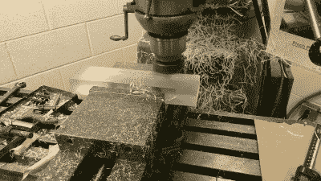](https://hackaday.com/2019/02/08/eight-years-of-partmaking-a-love-story-for-parts/imag0195/)

Flycutting Acrylic.

[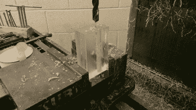](https://hackaday.com/?attachment_id=341806)

a scratch-built xy-gantry crossbar

[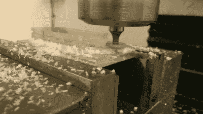](https://hackaday.com/?attachment_id=341803)

Woodruff cutter gets groovy

This watertight box is buttery smooth.

从头开始是浪费时间吗？在早期，没有。参与机械加工的仪式；我正在学习工具词汇。

幸运的是，店里的人比我更了解项目制作。获取知识就是勇敢地趴在别人的肩膀上问:“那是什么工具？你在做什么？”让人们心烦是滥用工具的问题，但真正的好奇心是可以的。事实上，大多数人都很乐意讨论他们的工件。

我对紧固件和现成零件的最佳介绍来自商店里的同事，他们很乐意告诉我他们常用零件的名称。一旦我不再依赖这些零碎的东西，我的项目就迈上了一个台阶。零件不仅仅是要制造的东西。它们也是可以买的东西！

为什么我没有事先使用这些库存零件？老实说，我不知道他们中许多人的名字，我甚至不知道有这么多其他人存在！即使那样，一旦我做了，我也不明白它们的用途，它们适合在哪里。是店里的同事向我展示了库存零件在项目中的作用。通过观察其他人如何在他们的项目中使用它们，我看到了它们的效用。我加工一个零件，而他们有两个或三个用紧固件连接的组件。对他们来说，这些零件的心理词汇是一种设计资源。这是一种快速增加项目复杂性的方法。

受此启发，我想:我必须自己去探索。我做到了。我陷入了神奇的在线目录的深处，那就是[麦克马斯特-卡尔](https://www.mcmaster.com/)(我甚至给[写了一本他们传奇目录的指南](https://hackaday.com/2017/09/13/noobs-guide-to-mcmaster-carr/))。我发现了 [Misumi](https://us.misumi-ec.com/) ， [SDP/SI](http://www.sdp-si.com/) ， [Hobbyking](https://hobbyking.com/) ， [Pololu](https://www.pololu.com/) ， [ServoCity](https://www.servocity.com/) ， [OnlineMetals](https://www.onlinemetals.com/) ，以及后来的 [Banggood](https://www.banggood.com/) ， [DealeXtreme](https://www.dx.com/) ，[全球速卖通](https://www.aliexpress.com/)。突然间，我藏在宿舍里的所有零件都有了名字。它们是轴承、衬套、带肩螺钉。更好的是:大多数都不特别。事实上，很多都非常便宜。有了这些新词汇，我开始尝试。

[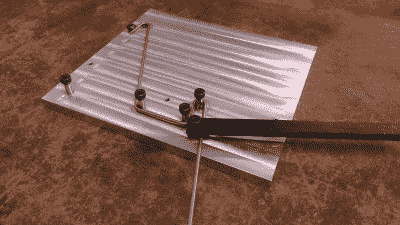](https://hackaday.com/2019/02/08/eight-years-of-partmaking-a-love-story-for-parts/11476334034_62ca19001e_k/)

shoulder screws and jigs

[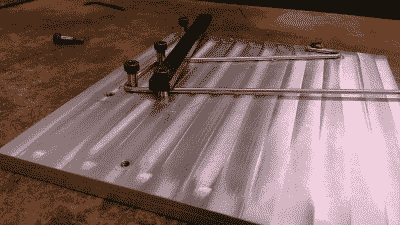](https://hackaday.com/2019/02/08/eight-years-of-partmaking-a-love-story-for-parts/11476427756_33442b35d9_k/)

mixing machined and stock parts

[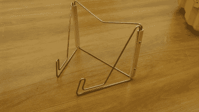](https://hackaday.com/2019/02/08/eight-years-of-partmaking-a-love-story-for-parts/imag1004/)

to form a bookholder

that was very glorious

探索就是找到一个项目，然后找到合适的机械零件和库存零件的组合来完成工作。随着时间的推移，我找到了越来越多的借口来制作“东西”，从小型遥控四轴飞行器到班级项目，再到给我大学暗恋对象的礼物(我不建议*这样做，除非你准备好像接受坏掉的工具一样容易心碎)。*

[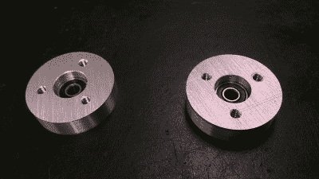](https://hackaday.com/2019/02/08/eight-years-of-partmaking-a-love-story-for-parts/imag1311/)

Homebrew wheel hubs!

[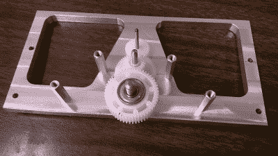](https://hackaday.com/2019/02/08/eight-years-of-partmaking-a-love-story-for-parts/imag1230/)

Homebrew chassis parts

[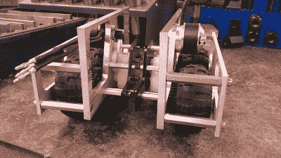](https://hackaday.com/2019/02/08/eight-years-of-partmaking-a-love-story-for-parts/imag1359/)

The birth of the Gamecube Robot

我想在我高三的时候，当我组装我的 RC Gamecube 机器人时，我在大学机械商店的日子达到了高潮。当我的第一个(也是唯一一个)项目 [Hackaday 通过 tips line 展示了](https://hackaday.com/2014/01/21/gamecube-robot-is-more-than-meets-the-eye/)时，我简直乐坏了。这是将丰富的螺母和螺栓语法与一些复杂的机械零件混合在一起的证明。最后，我可以把这部分语法拼凑起来造句——说一些原创的东西。

## 新的法术和组合

在这个项目之后，我的心态开始改变。手工加工零件需要几个小时的集中精力，一个错误可能意味着几个小时的集中精力。当我可以利用库存零件花更多时间做项目时，为什么要花那么多时间做芯片呢？我换挡寻找能帮助我花尽可能少的时间实际操作机器的零件。

几乎在同一时间，我发现了激光切割机。用一个简单的咒语(几乎和 CTRL-P 一样简单)，我就可以像施巫术一样在各种扁平的木头和塑料上雕刻出 2D 轮廓。虽然同样的平面零件在编程后可能需要一两个小时才能完成，但激光可以在几分钟内完成。答对了。我需要使用这台机器。

这个拼图的最后一块是一种叫做 Delrin 的神奇材料。多年来，我已经为它想出了许多好的配方，而且我还在发现利用它的材料特性的新方法。Delrin 很特别，因为它可以用激光切割，具有像丙烯酸树脂一样光滑的表面。然而，与丙烯酸树脂不同，Delrin 的脆性要小得多，这使得它更适合于像四轴飞行器框架这样的功能性垃圾，也适合于像活动铰链这样的灵活部件。对于 Delrin，我用机械加工铝的刚性和精度来换取激光切割塑料的速度。

[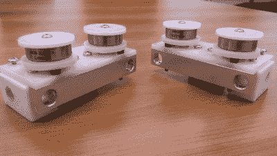](https://hackaday.com/?attachment_id=341805)

a hybrid of machined and laser-cut parts

[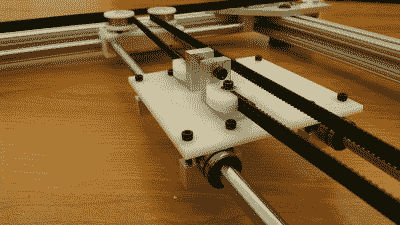](https://hackaday.com/2019/02/08/eight-years-of-partmaking-a-love-story-for-parts/imag0834/)

a hybrid belt-tensioner for an H-Bot

通过结合我的新零件词汇和 Delrin 激光切割零件，我的零件制作风格完全改变了。突然间，我可以在几个周末内完成一个完整的项目，而不是几个月。在慢慢离开机械加工领域的过程中，我进入了快速成型的世界——一点也不早。我的下一个任务不会有太多的工具，但我已经准备好处理它了。

## 梅菲尔德车库

毕业时，我在一家机器人初创公司找到了第一份工作，制作移动传感器平台。我开始准备制造零件，但是他们没有我全盛时期的磨坊和车床。不过，不要害怕。我挑战自己，用他们所拥有的来凑合。在这种情况下，我们的工具是激光切割机、钻床、剁锯、Dremel 工具和手扳压机。恰当地说，我们称之为:“车库。”这听起来可能不多，但在机械零件领域，这项任务的要求并不算过分。在这里，我们只需要各种各样的轮式平台，最终将自动拖动小型电脑。

在这种情况下，我需要足够的精度来移动轮子和齿轮，但不是更多。是时候重新组合我过去的一些旧“组合”了。通过将激光切割机与手扳压机和钻床结合起来，我有了一个解决方案。首先，激光切割是我的“粗加工”过程。我的大部分特征都是用激光从 Delrin 上切割下来的，除了一些需要严格几何间隙的尺寸。对于这些严格的公差，我会缩小激光切割孔的尺寸，并用钻床上的钻头完成它们。(如果这些是金属，我会用铰刀，但 Delrin 是一种相当宽容的塑料。)用手扳压机，我可以轻松地将衬套和轴承等零件挤压到位——不需要胶水！激光切割机也因只能加工平面零件而臭名昭著。再说一次，不要害怕！为了让东西进入三维空间，我想出了一个新的食谱，我称之为*对峙多层三明治*。在这里，激光切割板形成基础形状，其他部分可以连接。

[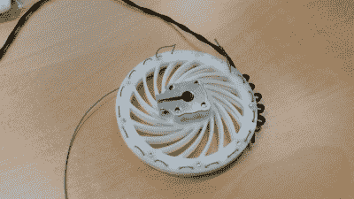](https://hackaday.com/2019/02/08/eight-years-of-partmaking-a-love-story-for-parts/20150324_133712/)

I reinvented the wheel once.

[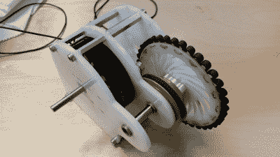](https://hackaday.com/2019/02/08/eight-years-of-partmaking-a-love-story-for-parts/20150324_232533/)

Behold–the Delrin Multi-Sandwich!

对于其他所有的东西，我求助于现成的配料。在过去的几年里，我们在商用机器人零部件方面取得了长足的进步。在这里，Pololu 和 ServoCity 符合要求，给了我最后几个精密零件，如轮毂，这些零件是我以前在大学自己加工的。最后，Hobbyking 成为我的 BLDC 汽车，电机控制器，和脂电池的来源。

 [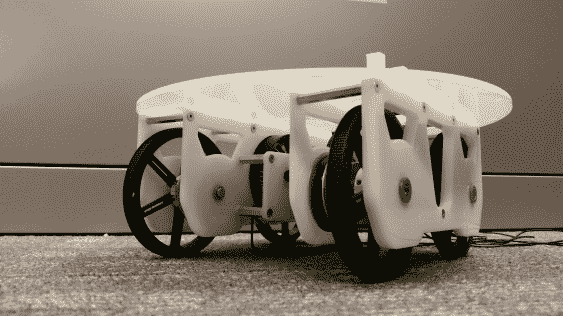](https://hackaday.com/2019/02/08/eight-years-of-partmaking-a-love-story-for-parts/20150610_192056/) scooching around an office near you! [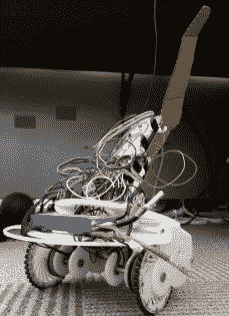](https://hackaday.com/2019/02/08/eight-years-of-partmaking-a-love-story-for-parts/20150408_152834/) cardboard fin for added aerodynamics

多夹层支架成为我[至今仍在使用的脚手架功能平台的强大配方。事实上，如果你想亲自尝试这种技术，可以试试用这种技术制作我的](https://twitter.com/Poofjunior/status/1078481966574399488)[RC game cube Instructable](https://www.instructables.com/id/RC-Nintendo-GameCube-Robot/)。

## 启动车库工厂

仅仅用一台激光器和一些库存零件推出功能平台让我想到:对于一个制造基本机器人的有能力的业余爱好者车间来说，我不需要那么多花哨的工具。

在离开梅菲尔德开始下一份工作后，我决定是时候创建自己的商店了。当然，我也许可以溜进我的下一个办公室进行下班后的投影，但是我不能依靠他们来存放我最喜欢的工具。出于个人喜好，我需要自己的餐具。当我和几个朋友在海湾地区合租房子时，我开始了我的车库历险。当然，我不打算*购买*我实验室里的所有工具。我不得不*制造*我买不起的机器！在这里，这意味着自制激光切割机，一个我在之前轻轻碰过的[故事。](https://hackaday.com/2016/03/15/the-wonderful-sent-of-etching-pi-on-pie-for-pi-day/)

与业余爱好者的遥控机器人不同，机器制造是一种完全不同的机制，在不同的地方有不同的精度要求。我知道我无法从沙地上启动这台机器，所以我做了我最擅长的事情:套餐。我将现成的和加工过的零件混合搭配，让事情开始。在这里，我的库存部分是开放式的，有一些铝通道和管道，我的加工将来自 Taig 微型轧机。

[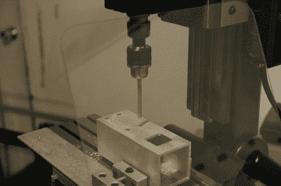](https://hackaday.com/2019/02/08/eight-years-of-partmaking-a-love-story-for-parts/24623710259_1dc915b696_z/)

Square tubing touch-ups

[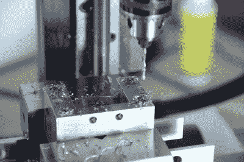](https://hackaday.com/2019/02/08/eight-years-of-partmaking-a-love-story-for-parts/25658880824_fff3cb569f_k/)

Pulley-block “doctoring”

[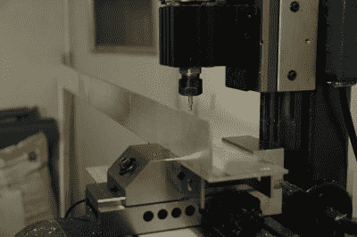](https://hackaday.com/2019/02/08/eight-years-of-partmaking-a-love-story-for-parts/27066532530_dba98fcb29_k/)

L-channel touch-ups

Isn’t it adorable?

Taig 微型磨成为我削减挤压尺寸和戳出几个洞和槽的方法。Taig Mill 的价格非常精确，但可笑又可爱的尺寸意味着与全尺寸产品相比，零件的制作时间更长。(事实上，大多数挤压型材都比机器长得多！)不过，就像我过去学到的那样，我选择通过最大化我可以购买的形状的效用来最小化我的机器时间。在这种情况下，Openbuilds 挤压成型了我的大部分框架，方形铝管支撑着我的大部分滑轮。我也不是唯一一个在机械制造中严重依赖方管的人。马克·雷霍斯特实际上也很依赖这种技术。值得注意的是，我真的找到了一个卖[滑轮的小贩，这种滑轮预先安装在](https://www.lightobject.com/Y-axis-pulley-for-DIY-CO2-laser-back-P769.aspx)滑轮上，节省了我更多的时间。最后，我确实在 [CNCMadness](http://www.cncmadness.com/carbon-fiber.html) 从 Nick 那里得到了一些外部加工的平板零件，但这种便利节省了我几个小时的加工时间，价格也就 100 多美元。

下班后的几个月里，激光切割机成了我热爱的工作。在摆弄了我的 Taig 六个月之后，我有了一个移动台架和一个发射光束。大约两年的调整和重新加工后，我有了一个与 60 瓦通用激光器相当的激光切割机。对于任何想进入机器制造领域的人，我只有一些鼓励的话。出去吧！使某物移动。打破它。翻拍。并且留下一张图片的纸迹来记录你的不幸遭遇——甚至可能是一份成分表！付出的努力是巨大的，但依靠自己亲手制造的机器的感觉是独一无二的。

有时，我认为创造自己的冒险是我生存的唯一方式。我组装这台机器的时候，我白天的工作时间都被工厂的维修和日常维护占据了。我的激光切割机是一种告诉我自己的方式，在我的车库里，我是更神奇的东西:一个金属厨师，一个巫师。机器设计师。

[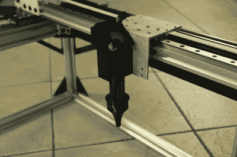](https://hackaday.com/2019/02/08/eight-years-of-partmaking-a-love-story-for-parts/30592596361_bf43f292c4_k/)

A stock laser head mates with machined L channel

Carbon fiber plates brought to you by CNCMadness

[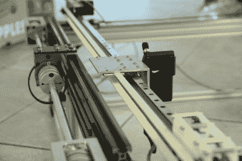](https://hackaday.com/2019/02/08/eight-years-of-partmaking-a-love-story-for-parts/30380377500_6022a993df_k/)

Openbuilds, Hiwin Rails, and square tubing

Wear safety glasses! (But also: plasma.)

## 你手中的感觉

在我制作零件的八年里，我注意到自己身上的一些东西，一些关于我对自制零件的感觉。如果我忘记了骄傲、学习和努力，我还剩下什么？对我来说，是亲情。就是这种不相信的感觉(“那是我做的？”)再加上亲昵(“为什么，它那么可爱，那么小，而且它正好固定在这里*！”).我想知道新的宠物主人和父母第一次看到他们的新家庭成员时是否会有同样的感觉。也许他们看到了自己的影子，看到了他们可以带回家并与之分享生活的美丽。当我看着从我的激光切割机、打印机、磨坊里出来的零件时，我看到了几个小时的孤独追求这种对精确的奇怪迷恋。但我也看到了合适的部分。我看到黄油般光滑的表面。我看到了自己。我想，嘿，我很好。我们没事。我们只是零件制造商。*

 *我想我最喜欢我的故事是因为它不是独一无二的。当我在黑客聚会上分享它时，我意识到其他人也有和我一样的故事。也许你有一个装满麦克马斯特-卡尔袋的抽屉，或者一盒将要堆肥的解放军印刷品？我们可能相距甚远，但我们都参与了一个故事:兼职工程师黑客的故事。我们在网上分享的这些文件、图片和对话是分享我们的故事的时刻，这个故事讲述了我们是谁，通过我们制造了什么。所以继续生产这些零件；继续让我们的故事变得精彩。*