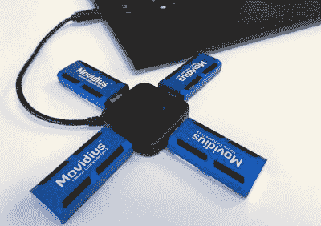
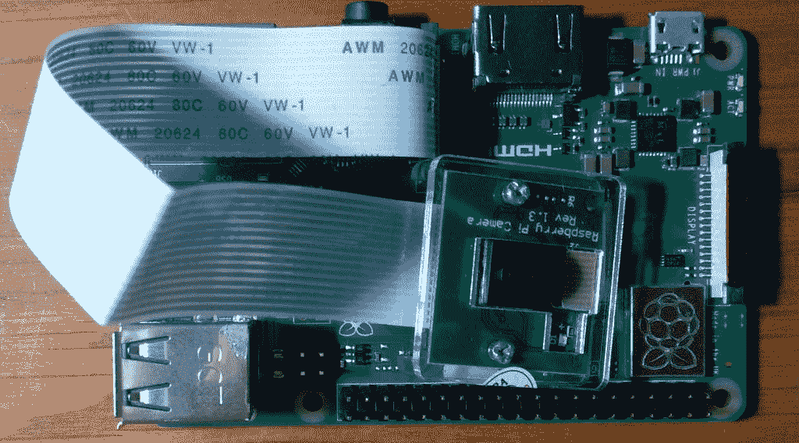
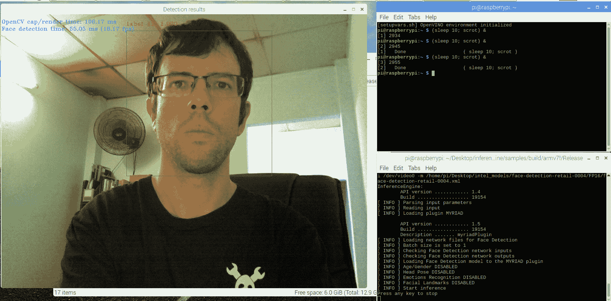

# 用英特尔神经计算棒在 Raspberry Pi 上实现人工智能

> 原文：<https://hackaday.com/2019/01/31/ai-on-raspberry-pi-with-the-intel-neural-compute-stick/>

我一直对 AI 和机器学习很着迷。Google TensorFlow [提供教程](http://hackaday.com/2018/05/22/machine-learning-crash-course-from-google)，自从它首次发布以来就一直在我的“学习”列表上，尽管我似乎总是因为喜欢最闪亮的新嵌入式平台而忽略它。

去年 7 月，当英特尔发布神经计算棒时，我注意到了这一点。它看起来像一个超大的 u 盘，并作为本地人工智能应用程序的加速器，特别是机器视觉。我认为这是一个非常好的想法:它允许我以大约 1W 的功耗在嵌入式系统上测试人工智能应用程序。它需要预先训练的模型，但是现在有足够多的模型可以做一些有趣的事情。



You can add a few of them in a hub for parallel tasks. Image credit Intel Corporation.

我不相信我会从中获得很好的性能，直到去年 11 月他们发布了一个改进的版本。毫不含糊地命名为“神经计算棒 2”(NCS 2)，它的价格合理，并承诺比上一个型号的性能提高 6-8 倍，所以我决定尝试一下，看看它的工作效果如何。

圣诞节前后，我请了几天假，在我的笔记本电脑上安装了英特尔的 OpenVino 工具包。英特尔提供的安装脚本不是特别用户友好，但它工作得足够好，并包括几个我可以用来测试性能的示例应用程序。我发现我的网络摄像头可以近乎实时地检测人脸(大约 19 FPS)，姿势检测大约 3 FPS。所以按照节日精神，它知道我什么时候睡觉，什么时候醒着。

这很有希望，但 NCS2 被宣传为允许在边缘计算设备上进行人工智能处理。我开始在 Raspberry Pi 3 Model B+上安装它，并编译应用程序示例，看看它是否比以前的方法更好。这比我想象的要难，这篇文章的主要目的是分享我遵循的过程，让你们中的一些人少受点挫折。

首先，英特尔为 Raspberry Pi 提供了一个单独的安装过程。普通安装程序不行(我试过了)。一般来说，让 NCS2 运行一些应用程序示例需要 3 个步骤:对 Raspberry Pi 进行初始配置，安装 OpenVino，最后编译一些应用程序示例。最后一步需要 3 个多小时，有些步骤会失败，请相应调整自己的速度。如果您现在没有安装它，仍然值得您花时间通读下面的其他示例部分，感受一下什么是可能的。

## 准备树莓酱

首先，[下载 Noobs](http://www.raspberrypi.org/downloads/noobs) ，解压到 microSD 卡(我用的是 16GB)，从上面启动树莓 Pi。安装默认图形环境，连接到互联网，并更新设备上的所有软件。完成后，打开终端并运行`sudo raspi-config`。选择接口→启用摄像头。关机，切断电源，插入你的相机，然后开机。



When installed, the camera will look something like this. The included FFC cable is relatively short.

再次打开终端，运行`sudo modprobe bcm2835-v4l2`(注意是小写的 L，不是 1)，然后通过导航到/dev 并运行`ls`来确认/dev/video0 现在存在。每次您希望以这种方式访问摄像机时，您都需要运行这个 modprobe 命令，所以考虑将它添加到启动中。

现在，我们将要编译的一些应用程序将耗尽内存，因为默认的交换分区大小是 100 兆字节。运行`sudo nano /etc/dphys-swapfile`并增加它——我把它从 100 改成了 1024，这已经足够了。保存、重启并运行`free -h`以确认交换区大小增加。最后，用`sudo apt-get install cmake`安装 cmake，因为我们以后编译时会用到它。

在这个阶段，您已经准备好开始英特尔的 OpenVino 安装过程。

## 安装 OpenVino 工具包

在这一部分，我们将大致遵循英特尔的[指令。为了简单起见，我假设您正在安装到桌面上的一个文件夹中。](http://software.intel.com/en-us/articles/OpenVINO-Install-RaspberryPI)[下载树莓派](http://download.01.org/openvinotoolkit/2018_R5/packages/l_openvino_toolkit_ie_p_2018.5.445.tgz)的 OpenVino。tgz 文件)，然后复制到/home/pi/Desktop 并用`tar xvf filename.tgz`解压。

安装脚本需要明确知道它们的位置，所以在 OpenVino 文件夹中，进入/bin 目录，在任何文本编辑器中打开 setupvars.sh。替换为 OpenVino 文件夹的完整路径，例如/home/pi/Desktop/inference _ engine _ vpu _ arm/并保存。

后面的脚本需要加载这个脚本，所以输入`sudo nano /home/pi/.bashrc`并在文件末尾添加‘source/home/pi/Desktop/inference _ engine _ vpu _ arm/bin/setup vars . sh’。这将在您每次打开终端时加载 setupvars.sh。关闭您的终端窗口，然后再次打开以应用此更改。

接下来，我们将设置允许 NCS2 工作的 USB 规则。先用`sudo usermod -a -G users "$(whoami)"`把自己加入硬件需要的用户组。注销，然后重新登录。

进入 OpenVino 安装的 install_dependencies 文件夹。运行`sh install_NCS_udev_rules.sh`。现在，如果您插入 NCS2 并运行`dmesg`，您应该会在输出结束时看到它被正确检测到。

英特尔的文档现在向我们展示了如何编译单个示例应用程序。稍后我们将编译更多内容。现在，输入/deployment _ tools/inference _ engine/samples 并运行:

```

$run mkdir build && cd build
$cmake .. -DCMAKE_BUILD_TYPE=Release -DCMAKE_CXX_FLAGS="-march=armv7-a"
$make -j2 object_detection_sample_ssd

```

## 汇编其他示例

编译其他的例子就不那么简单了，但是由于我们的初始设置，我们可以期待一些成功。我的目标是让面部识别和姿势估计工作，所以我就此打住。对象检测、分类和某些类型的语音识别似乎也编译正确。

在我们尝试编译这些示例之前，需要注意的是，这些示例的预训练 AI 模型没有包含在 Raspberry Pi OpenVino 安装程序中。在普通的安装程序中，有一个脚本会自动为你下载所有的文件——但是树莓 Pi 版本就没有这么幸运了。幸运的是，您可以[下载应用程序示例](http://download.01.org/openvinotoolkit/2018_R3/open_model_zoo)的相关模型。万一有一天链接中断了，我所做的就是在笔记本电脑/台式机版本的 OpenVino 安装程序的 model_downloader 文件夹中查找所有脚本的 URL。或者，如果您在另一台计算机上安装了 OpenVino，您可以复制这些模型。我将它们安装到桌面上一个名为 intel_models 的文件夹中，下面的命令假设您已经完成了同样的操作。

这样，输入/home/pi/Desktop/inference _ engine _ vpu _ arm/deployment _ tools/inference _ engine/samples 并在任何文本编辑器中打开 build_samples.sh。将最后一个 if 块之后(最后一个“fi”之后)的所有内容替换为:

```

build_dir=/home/pi/Desktop/
mkdir -p $build_dir
cd $build_dir
cmake .. -DCMAKE_BUILD_TYPE=Release -DCMAKE_CXX_FLAGS="-march=armv7-a"
make -j8
printf "\nBuild completed.\n\n”

```

现在运行`./build_samples.sh`，对我来说，在完成 54%时失败之前，它运行了大约 3 个小时。然而，几个示例应用程序已经正确编译了。此时，您应该能够进入目录:deployment _ tools/inference _ engine/samples/build/arm V7 l/Release 并运行:

`./interactive_face_detection_demo -d MYRIAD -i /dev/video0 -m /home/pi/Desktop/intel_models/face-detection-retail-0004/FP16/face-detection-retail-0004.xml`



It supports emotion detection, but I always look this serious.

或者对于姿态估计:

`./human_pose_estimation_demo -d MYRIAD -i /dev/video0 -m /home/pi/Desktop/intel_models/human-pose-estimation-0001/FP16/human-pose-estimation-0001.xml`


This can track multiple people at the same time without performance loss, but I didn’t have any volunteers at the time.

至于我似乎一直在犯的愚蠢错误，记得使用前面描述的 modprobe 来使 Raspberry Pi 相机作为/dev/video0 可访问，记得实际插入 NCS2。

总体而言，面部识别的性能约为 18FPS，姿势检测为 2.5FPS，与我的笔记本电脑非常相似。这足以打开我脑海中的一些应用程序。

除此之外，我还知道，虽然人工智能接管世界主要是为了制造非常有趣的故事，只需几个下午的精心协助，它目前就能接管我桌子的相当大一部分。