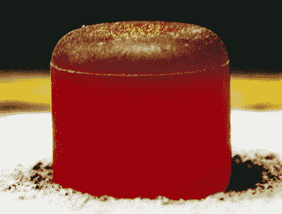
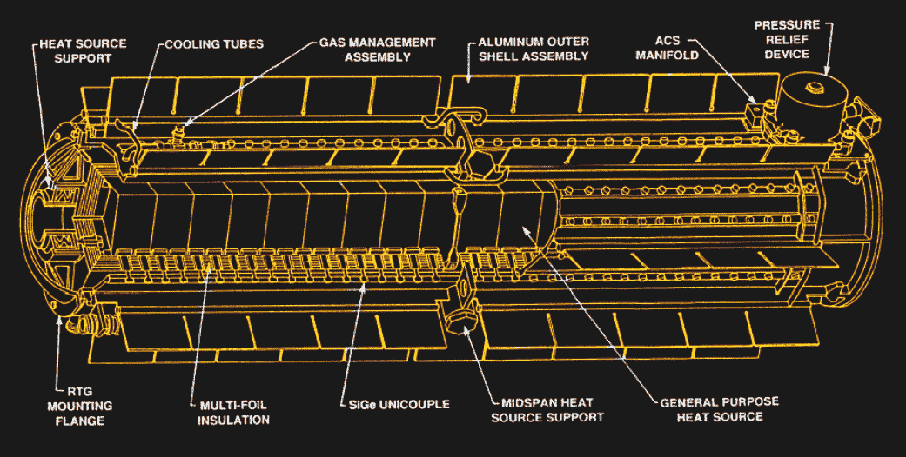

# 深空能源危机可能很快就会结束

> 原文：<https://hackaday.com/2019/02/08/the-deep-space-energy-crisis-could-soon-be-over/>

从表面上看，为大多数航天器提供动力似乎是一个简单的工程问题。毕竟，由于没有云层遮挡太阳，给卫星配备足够的太阳能电池板来满足其电力需求似乎是显而易见的。找到一种方法来支持适当大小的光伏阵列，并确保它们正确定向以最大限度地获取电能可能是一件棘手的事情，但从太阳流出的基本上无限的能量大大简化了整个问题。

不幸的是，这只适用于相对靠近太阳运行的航天器。平方反比定律的暴政无法逃脱，在火星轨道之外很远的地方，光伏阵列捕获有用的太阳能所需的大小开始使它们望而却步。这就是放射性同位素热电发电机(RTG)开始有意义的地方。

RTG 使用衰变的放射性同位素的热量通过热电偶发电，几十年来一直为执行深空任务的航天器提供动力。钚-238 长期以来一直是 RTG 的首选燃料，但在 20 世纪 90 年代初，冷战时期的燃料储备消耗速度超过了补充速度。Pu-238 的缺乏严重限制了美国宇航局能够支持的深空和行星任务的数量。令人欣慰的是，橡树岭国家实验室(ORNL)最近的发展似乎打破了限制钚 238 生产的瓶颈。如果有回报，深空能源危机可能最终会结束，远在太阳系和更远的黑暗角落的科学可能会回到桌面上。

## 准备好了吗

Hot out of the oven – not. Pu-238 oxide RTG fuel slug glows red hot due to its radioactivity after removal from a graphite insulating blanket. Each slug can produce 62 watts of heat. Source: [Los Alamos National Lab](https://www.lanl.gov/)

RTG 在空间任务中的发展和使用与上世纪中期空间计划的建立密切相关。第一台 RTG 于 1954 年发明，当时正值“原子能和平利用”时代，人们努力寻找利用原子能的非破坏性方法。承诺是伟大的；基本上是无限的电力，没有移动部件，可以放大或缩小以适应广泛的应用，从为灯塔和远程气象站等远程地面应用供电到运行植入式起搏器，其电源将比患者寿命长。

直到 1961 年，第一艘 RTG 号才登上海军导航卫星进入太空。第一次展示 RTG 力量的深空任务是 20 世纪 70 年代初的先锋任务，为 RTG 的最终测试铺平了道路:*旅行者 1 号*和*旅行者 2 号*。这些航天器中的每一个都使用三个装有 4.5 公斤钚-238 的 RTG，在发射时每辆车产生 480 瓦的总功率。四十多年后，RTG 仍在工作，由于燃料芯块 87.7 年半衰期中的相当一部分已经过去，以及电气系统的普遍退化，其输出大大减少。但它们仍然有效，而且可能至少还会持续一两年。

Cutaway of a General-Purpose Heat Source Radioisotope Thermoelectric Generator (GPHS-RTG). The Pu-238 fuel pellets are encased in the stack of GPHS blocks in the center. Source: [NASA Radioisotope Power Systems](https://rps.nasa.gov/)

空间 RTGs 的设计相当简单。放射性燃料被压成覆盖着防护材料的小球。燃料被安置在一个叫做热源的容器里，它唯一的工作就是变热。热源被放入另一个装有热电偶的容器中。与衰变燃料的热罐直接接触的内表面具有热电偶的热接点，而冷接点面向太空的真空。温差是通过[塞贝克效应](https://en.wikipedia.org/wiki/Thermoelectric_effect)产生电能的关键，这与珀尔帖芯片背后的想法相同。

旅行者任务的 RTG 是“数百瓦 RTG”(MHW-RTG)，使用硅锗热电偶，每 RTG 312 个。后来的任务如卡西尼号和 T2 号使用了不同的设计，GPHS-RTG，或“通用热源 RTG”这些 RTG 与 MHW-RTG 非常相似，具有相似的电气设计，但有更好、更高效的燃料包。最新的 RTG 是“多任务 RTG”(MMR TGS)，它有先进的热电偶，使用碲化铅和一种叫做 TAGS 的合金(碲、银、锗和锑)。火星*好奇号*火星车有 MMRTGs，火星 2020 火星车也有。

## 机器人来救援了

用于生产钚 238 和其他放射性同位素的核炼金术非常复杂，操作起来极其危险。钚 238 最初是通过在反应堆中用氘原子核轰击铀 238 来生产的，但后来人们发现，生产用于核弹核心的钚 239 会产生更容易转化为钚 238 的副产品。从 20 世纪 60 年代中期开始，美国民用和军用的所有钚-238 都是通过对镎-237 进行中子辐照，然后进行化学分离来生产的。

1988 年，南卡罗来纳州萨凡纳河核电站的核反应堆被关闭，美国的钚 238 水龙头干涸。即使在反应堆运行时，生产也是一个缓慢而危险的过程，每年只能生产几公斤。自 1993 年以来，美国宇航局一直从俄罗斯采购钚 238，但在他们也停止生产之前，他们只供应了 16.5 公斤。

2015 年 12 月，田纳西州橡树岭国家实验室生产了美国近 30 年来的第一个钚 238——50 克重。生产过程是艰苦的，大部分工作是制造镎-237 小球。通过添加 Np-237 和铝粉并将其挤压成适于中子轰击的丸粒，手工制成丸粒。

实验室手工处理的最好结果是一周大约 80 个镎粒子，远低于一周 275 个粒子的目标。为了达到这一生产水平，并从每年 50 克钚 238 增加到 400 克，ORNL 最近引进了一种生产镎球的自动化方法。细节很难获得——出于国家安全原因，钚的生产方法往往受到严密保护——但如果镎颗粒在反应堆中表现良好，ORNL 很可能正在重建钚 238 储备。

 [https://www.youtube.com/embed/gl8vESVnRBc?version=3&rel=1&showsearch=0&showinfo=1&iv_load_policy=1&fs=1&hl=en-US&autohide=2&wmode=transparent](https://www.youtube.com/embed/gl8vESVnRBc?version=3&rel=1&showsearch=0&showinfo=1&iv_load_policy=1&fs=1&hl=en-US&autohide=2&wmode=transparent)

诚然，即使这种自动化进步证明了自己，美国 Pu-238 的总生产能力仍将低于每年半公斤。但如果这项技术可行，它可以在洛斯阿拉莫斯国家实验室和爱达荷国家实验室复制，使全国产量增加两倍，并接近美国宇航局到 2025 年每年 1.5 公斤钚-238 的目标。

由于这项新技术，美国宇航局似乎乐观地认为深空能源危机即将结束，但离结束还有很长的路要走。几乎所有 2015 年可用的 35 公斤钚-238 库存要么已被指定用于未来的任务，要么不适合用于深空 RTGs。