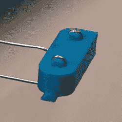

# 3D 打印您 3DS 的充电底座

> 原文：<https://hackaday.com/2019/01/31/3d-print-that-charging-dock-for-your-3ds/>

Switch 是新的热点，每个人都希望任天堂的新便携式游戏设备位于电视旁边的坞站中，但任天堂的其他便携式游戏系统呢？是的，新的任天堂 3DS 可以得到一个充电底座，你可以用可更换的盘子 3D 打印它，使它看起来像是直接从任天堂商店出来的东西。

[Hobby 囤积者] [为新的任天堂 3DS](https://hackaday.io/project/163630-charging-dock-for-3ds-with-swappable-plates) 创造了这个充电基座，作为一个 3D 打印项目，目标是让一切都可以在没有支撑的情况下打印，并且能够在没有任何特殊工具的情况下建造。打印一个盒子很容易，但真正的技巧是如何在没有任何特殊工具的情况下为 3DS 充电。为此，[爱好囤积者]求助于主机侧面的小充电触点。你所要做的就是将电源和地线连接到这些触点上，3DS 就会充电。

 通常，添加触点需要弹簧针或昂贵的连接器，但【Hobby Hoarder】有一个有趣的解决方案:只需添加一些由 LED 引线或回形针构成的金属触点，并将其安装在弹簧滑块上。一根普通的 USB 线被清理掉，电线被剥掉，红色和黑色的线被连接到弹簧滑块上。

在这个设置中，充电电压有一个小问题；3DS 充电 4.6 伏，USB 提供 5 伏。如果你想保持一切都在严格的规格内，你可以添加一个 LDO 线性调节器，但可能会有散热问题。您可以使用降压转换器，但在 0.4 伏电压下，您可能更适合“aaay yolo”工程理论。

[Hobby 囤积者]制作了几个很棒的视频，详细介绍了这个构建，还有一个很棒的视频详细介绍了如何为这个充电底座打印彩色面板。这是一个很好的项目，也是一个很好的例子，说明 3D 打印和简单的工具可以做什么。

 [https://www.youtube.com/embed/3dQFI1BClfM?version=3&rel=1&showsearch=0&showinfo=1&iv_load_policy=1&fs=1&hl=en-US&autohide=2&wmode=transparent](https://www.youtube.com/embed/3dQFI1BClfM?version=3&rel=1&showsearch=0&showinfo=1&iv_load_policy=1&fs=1&hl=en-US&autohide=2&wmode=transparent)

 [https://www.youtube.com/embed/KsbE2vEzS7U?version=3&rel=1&showsearch=0&showinfo=1&iv_load_policy=1&fs=1&hl=en-US&autohide=2&wmode=transparent](https://www.youtube.com/embed/KsbE2vEzS7U?version=3&rel=1&showsearch=0&showinfo=1&iv_load_policy=1&fs=1&hl=en-US&autohide=2&wmode=transparent)

