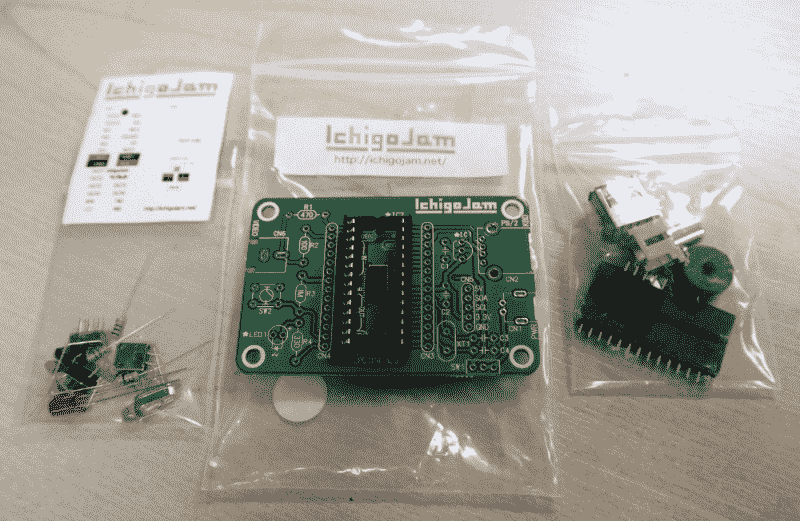
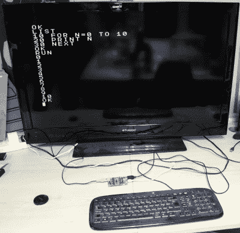
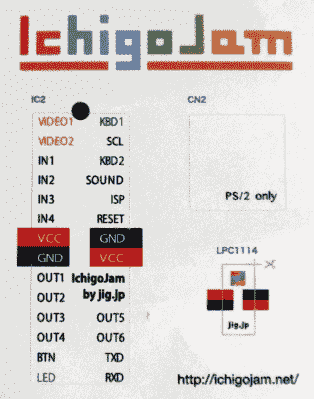
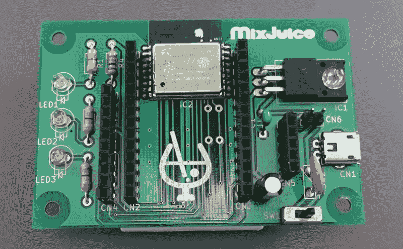

# 复习:IchigoJam 单板电脑

> 原文：<https://hackaday.com/2019/02/11/review-ichigojam-single-board-computer/>

它不会取代你心爱的 Rasbperry Pi，但值得向这种直接来自日本的“草莓酱”问好。这是让人们对编码基础感兴趣的一种同样美味的方式。

我在黑客空间的朋友吉姆是个幸运的家伙，因为去年他得以在一连串的东亚国家度长假。我们在网上看到了美丽的风景和海滩、城市灯光，当然还有令人兴奋的科技目的地，如硬件市场和黑客空间。回来时，他把一个包裹扔在我面前的桌子上，说:“珍妮，你可能想看看那个，这些在日本很流行！”里面是一个电子工具箱和几份日文文档。

## 让孩子们编码的不同方式

The contents of the IchigoJam kit.

他给我的是 IchigoJam(我得到的最好的翻译是“草莓酱”)，一款面向年轻人的小型单板电脑。在 20 世纪 80 年代 8 位机器的风格中，它运行一个全面的 BASIC 解释器并插入电视机，尽管它用 USB-A 插座作为键盘来更新自己。它的核心是恩智浦 LPC1114F102 ARM Cortex-M0 微控制器，具有 32KB 闪存和 4KB SRAM，尽管 Jim 递给我的电路板有一个表贴示例，但很明显它也是为现已过时的 DIP 芯片版本设计的。如果你认为这是一个基本邮票、树莓皮和一个较小的 MBED 板的奇怪混合体，你可能不会太离谱。以下是我根据手头资料对它的印象。可悲的是，IchigoJam 网站和论坛似乎只对日本观众开放，并从我的欧洲视角返回了一个错误代码。

## 构建套件计算机

除了预装的 SMD 微控制器，IchigoJam 的所有组件都是通孔的。插座是电源的微型 USB，键盘的 USB-A，视频的唱机，除了几个无源器件外，还有一个晶体，一个调节器，一个 LED 和一个电源开关。还有一个小型的压电扬声器，虽然这是打算直接插入设备的 I/O 线。出乎意料的是，该处理器还包括一个 DIP 插座，这无疑是 DIP 处理器时代的遗留物( [ARM DIP 封装不再是](https://hackaday.com/2018/04/15/rip-dip-arm/))。表面上看，这是用在标准建设作为一个载体的贴纸轴承引脚分配。Jim 从工具包中获得的英语组装说明非常少，但幸运的是，这绝不是一个具有挑战性的组装工具包。电阻值清楚地标记在电路板上，电容很容易识别，其他每个元件都有明显的电路板轮廓。我从容不迫地花了一刻钟来构建，获得了一个整洁的结果。我的微型便携式 CRT 电视是英国市场上的 625 行型号，所以当我打开电源时，它不会与 IchigoJam 的单色 525 行视频同步，但我尝试过的每台平板电视都没有问题。迎接我的是一条版权信息和一个基本的解释器提示，这个小板子正在工作。

Some simple BASIC to get things started.

眼尖的人可能已经注意到 LPC1114 没有 USB 功能，这导致我第一次用 USB 手机充电器给 IchigoJam 充电时被发现了。该板只能与具有 PS/2 向后兼容性的 USB 键盘一起工作，一方面，这是一个聪明的黑客，但从键盘上看并不总是显而易见的。在我的 makerspace 的一堆备用主板中翻来翻去后，我找到了一个能用的，并开始使用我年轻时记得的一点经典 BASIC。`10 PRINT "Hello World", 20 GOTO 10`

一个刚从 Sinclair Spectrum 出来的十几岁的我会直接选择 IchigoJam 的图形和声音功能，但 2019 年对 Hackaday 更有用的是文档建议作为硬件测试的 LED 关键字。很快，我就可以闪烁板载 LED，我的 IchigoJam 硬件之旅开始了。

## 想象一下你的 8 位微处理器配有现代的 GPIOs

所以 IchigoJam 可以做我在 1983 年的 8 位家用电脑上能做的大部分事情。问题是，它能做什么，而 Spectrum、Commodore 64 和他们的同类*做不到*？最明显的起点是主板的接口插座，但在我们走这条路之前，有必要改变一下思路。许多人会记得 8 位计算的一部分是使用盒式录音带存储软件。IchigoJam 避开了这一点，但并不缺乏存储空间，相反，它可以将代码存储在内部闪存中。它可以在板上存储多达四个程序，并且有一个外部 EEPROM 板，可能使用 LPC1114 的 I C 接口。无法看到网站意味着我不能进一步追求 EEPROM 板，但猜测是它提供了用户之间交换代码的设施。

The IchigoJam’s supplied sticker has all the I/O pin assignments.

到那些接口。IchigoJam 有三个单列 0.1 英寸间距插座，其中两个直接复制 LPC1114 的引脚，另一个提供 I C 以及 5V 和 3.3V 供电轨。板载有一个按钮和一个 LED，每个都连接到自己的 GPIO 线。其余四条 GPIO 线路配置为输入，六条配置为输出，还有一对线路配置为串行端口。所有引脚配置都清楚地标记在板上，或者如果制造商选择使用引脚分配标签，则标记在标签上。

对这些硬件功能进行编程非常简单，只需为每个功能输入基本的关键字。对于那些在 8 位时代必须使用 PEEK 和 POKE 来访问映射到内存位置的硬件的人来说，这提供了前所未有的便利。LED 和 BTN 是 IchigoJam 硬件的“Hello World ”,因为它们不需要额外的布线，但其余的线路不会留下 IN 和 OUT 关键字。模拟功能也不会被遗忘，ANA 关键字读取输入引脚上的电压，而 PWM 顾名思义提供 PWM 输出功能。一些发光二极管和电线的乐趣证实了这些功能的潜力。

此外还有 I C 接口，我认为它与一些更成熟的电路板不相上下。突然间，我们已经从拥有一台有趣的复古计算机或一个带几个 GPIOs 的儿童板，这个接口通过最简单的编程向大量设备和分线板开放了 IchigoJam。I2CR 和 I2CW 命令都允许从 BASIC 中读取和命令任何器件。

## 如果你能找到一个，就买一个

IchigoJam 是一个非常简单但功能惊人的日本板，它显然提供了让日本孩子体验编码的意图。它永远不会取代你习惯的主板，但它应该会吸引任何欣赏旧的 8 位基本机器的人。它也将有助于任何人谁想要一个简单的，但多功能的易于编程的微控制器板。模拟视频和支持 PS/2 的 USB 键盘的使用表明，它也许可以在这些接口上使用某种更新，但这些都不是不可克服的问题。我相当喜欢它，并且在将评审模型交还给它的所有者时会感到遗憾。

Can it read the Hackaday Retro Edition? The [MixJuice WiFi card](https://pcn-en.stores.jp/items/57b504c400d3319ed6005219), one of several add-ons for the board.

在评论的这一点上，我通常会建议你买一个，然后给你一个价格和当地供应商，但遗憾的是，IchigoJam 似乎在日本以外的地方没有。不过令人高兴的是，你可以从 PCN (相当于日本的 Code Club)订购一台，价格为 1890 日元，共计 17.38 美元，不含任何邮费或进口关税，合 13.25 英镑。[他们还携带一些附加板](https://pcn.club/products/kamenoko/index.en.html)，包括多媒体和网络外设。进一步的搜索揭示了[生态系统](http://dakeigai.shizentai.jp/index.en.html)诱人的一瞥，有一个 Javascript 变体，一个极简无头版本，以及一个旨在采用物联网模块的版本。对于那些不想等待日本包裹的人来说，这里有一个在线模拟器，你可以在里面输入基本的清单。

在这篇文章的研究过程中，我碰巧在 Twitter 上提到了 IchigoJam，它的创始人 Taisuke Fukuno 联系了我。他给我看了他写的 2017 年在 Maker Faire Bay Area 展出的产品，但目前这些仍然是只在日本市场销售的产品。你所期待的 Adafruit 或 Pimoroni 等美国或欧洲商店似乎没有出现它们的前景，对我来说这是一个巨大的耻辱，因为尽管它可能缺乏树莓 Pi 的功能或 Arduino 的多功能性，但它仍然是一个非常酷的板。我非常理解在全球范围内提供套件的支持责任对于一家小公司来说是一个沉重的负担，所以我们可能永远也不会在地球上正式看到它。不过，如果你去日本旅行，试着买一个。你不会失望的。