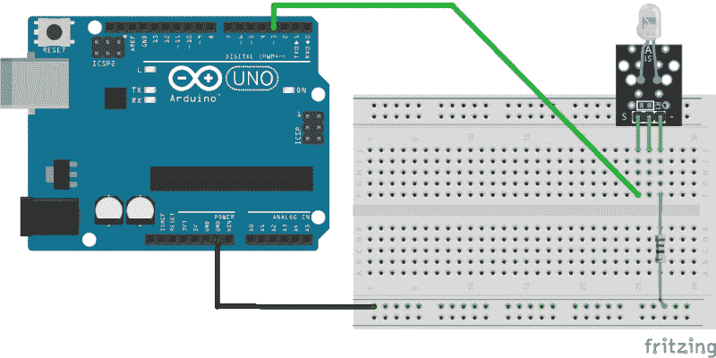

# 红外暴力攻击解锁 TiVo

> 原文：<https://hackaday.com/2019/01/30/infrared-brute-force-attack-unlocks-tivo/>

虽然 TiVo(坦白地说，录制电视广播的想法)的时代已经基本结束，但仍有一些忠实的用户不太愿意放弃世界上最著名的数字录像机。[Gavan McGregor]就是这样一个 TiVo 狂热者，他最近试图将一台 TiVo Series 3 录像机投入使用，却发现该设备卡在了适合家庭使用的“儿童区”模式。

由于没有摆脱这种模式的代码，而且 TiVo 几年前就停止了对这种特殊录像机的支持，[他不得不自己黑进这台心爱的录像机](https://github.com/gavanm/TivoBruteForce)。密码系统的简单本质使这一过程变得更加容易，它只使用四位数字，显然不会对不正确的输入进行任何形式的惩罚。密码只有 10，000 种可能的组合，没有什么能阻止他按顺序尝试每一种组合，[Gavan]只需要一种方法来敲出它们。

 在对 TiVo 远程控制协议做了一些研究后，他使用 IRLib2 库为 Arduino 编写了一些代码，这些代码将通过为每个数字发送适当的红外代码来暴力破解 KidZone 密码。他摆弄着发送每个数字的时间和延迟，发现最可靠的速度可以让他的设备在大约 12 小时内运行所有 10，000 个组合。

这里要记住的关键是，[Gavan]并不关心密码是什么，他只需要正确输入密码就可以让 TiVo 退出 KidZone 模式。所以他选择了 TiVo 菜单上的“退出 KidZone”选项，把他的 Arduino 放在离 DVR 几英寸远的地方，然后走开了。当他第二天回来时，TiVo 又回到了正常模式。如果你真的想*恢复*密码，最简单的方法(讽刺的是)是在这个小工具通过所有可能的数字时录制电视。

早在 2004 年，[有如此多的 TiVo 黑客登上了 Hackaday 的首页](https://hackaday.com/2006/10/18/tivo-external-sata-bypass/),以至于我们实际上给了他们一个专用的子域。但是在 2007 年底，[我们问黑客们会如何处理越来越多被丢弃的 Linux 驱动设备](https://hackaday.com/2007/11/04/presenting-hackit-got-a-better-idea/)。十多年后，人们仍然在使用这些小玩意，这确实证明了 TiVo 的粉丝群是多么的专注。

【感谢克里斯的提示。]