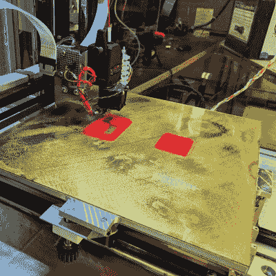

# 3D 打印机底座的运动支架展示了实用的设计

> 原文：<https://hackaday.com/2019/02/09/kinematic-mount-for-3d-printer-bed-shows-practical-design/>

Aluminum bed with new kinematic mount and base on printer *Son of Megamax*, at the Milwaukee Makerspace

[马克·雷霍斯特]一直忙于设计和制造 3D 打印机，他的早期作品之一 Megamax 的儿子*需要更换一个床加热器。他借此机会[也增加了一个开尔文型运动学支架](https://drmrehorst.blogspot.com/2019/01/son-of-megamax-gets-new-y-axis.html)。运动学安装和基座以受控的方式有效地约束床，同时允许热膨胀，提供稳定的平台，还允许移除和可重复的重新定位。*

在简短地讨论了加热器的更换后，[Mark]解释了他的运动支架的设计和制造。特别值得注意的是设计的实际考虑；[Mark]的目标是尽可能多地使用方形铝管，利用他现有的设备可以轻松完成加工要求。毕竟，时间是一种资源，帮助人们快速工作的设计决策本身就有价值。

如果你仍然对运动坐骑和它们的工作原理有些模糊，你并不孤单。查看我们对这个 3D 打印的运动相机支架的报道，这会让这个概念更加清晰。