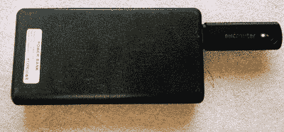

# 这个微型路由器可能是下一个大东西

> 原文：<https://hackaday.com/2019/02/01/this-tiny-router-could-be-the-next-big-thing/>

Linksys WRT54G 和它的各种开源固件替代品是家用路由器黑客的巅峰，这似乎就发生在昨天。但是和其他东西一样，路由器在过去几年变得越来越小，越来越快。我们在上面运行的软件也变得更加先进，在这一点上，我们已经有了路由器，必要时你可以把它当作一个轻型 Linux 桌面。

但是，即使我们的生活中不缺少口袋大小的 Linux 设备，[[Mason Taylor]最近引起我们注意的 GL-USB150“微型路由器”](https://bettersafe.io/weaponizing-a-micro-router-for-penetration-testing/)也很难被忽视。在这个 USB 闪存驱动器大小的路由器内部是一个 400 MHz 的高通 QCA9331 SoC，64 MB 的 RAM 和 16 MB 的存储空间；大约 20 美元。哦，我们提到过它预装了 OpenWRT 吗？只要把它插上电源，你就有了一台支持 WiFi 的小型 Linux 电脑，随时为你服务。

 在他的博客上[Mason]简要介绍了如何开始使用 GL-USB150，并详细介绍了他在安全研究中使用该设备所做的一些实验，例如使用该设备作为在他的桌面上运行的 Wireshark 的远程源。他解释说，这种小型路由器在插入 USB 电池组时工作正常，提供了一种非常谨慎的方式，可以在任何需要的地方部署小型 Linux 设备。但是当插入电脑时，事情变得非常有趣。

如果您将 GL-USB150 插入计算机，它将作为 USB 以太网适配器显示给操作系统，并可用作主要的互联网连接。来自计算机的所有流量将通过该设备路由到它被配置使用的任何互联网链接。取决于你如何看待它，这可能是非常有用的或非常危险的。

首先，这意味着某种看起来像普通 USB 闪存驱动器的东西可以被秘密地插入计算机，成为一个“窃听装置”,所有网络流量都通过它进行路由。这是坏消息。另一方面，这也意味着您可以将 GL-USB150 配置为一个安全的端点，让您快速轻松地通过 VPN 或 Tor 传输所有计算机流量，而无需任何额外的设置。

[我们已经看到了利用](https://hackaday.com/2019/01/05/build-a-home-automation-hub-for-20/)[小型 Linux 兼容路由器的各种黑客和项目](https://hackaday.com/2019/01/24/solar-powered-openwrt-router-for-mobile-privacy/)，例如 TP-Link TL-MR3020 ，但我们预计 GL-USB150 和类似的设备将是未来的赢家。让我们只希望他们中的一个[不会不请自来地出现在你的网络壁橱里](https://hackaday.com/2019/01/20/sly-guy-nabs-pi-spy/)。