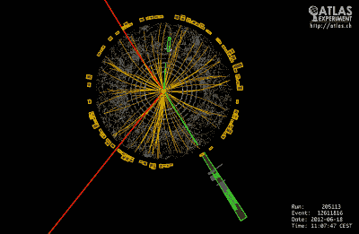
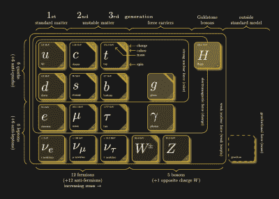
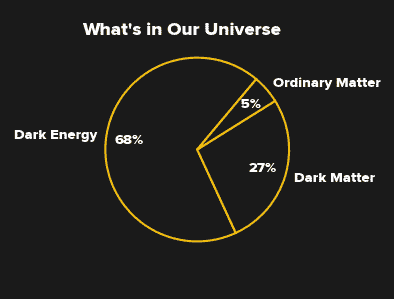
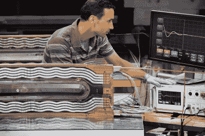

# 未来的环形对撞机:它能解开宇宙之谜吗？

> 原文：<https://hackaday.com/2019/02/07/the-future-circular-collider-can-it-unlock-mysteries-of-the-universe/>

在 20 世纪 90 年代初，我很幸运地在一个 60 兆电子伏的直线加速器上呆了一段时间，作为本科实验课程的一部分。有了这样的经历，我能体会到欧洲核子研究中心的科学家们不得不使用他们目前的 13 TeV 加速器，它只能管理大约 20 万倍的能量。因此，当他们宣布未来圆形对撞机(FCC)的初步设计概念时，我怀着极大的兴趣阅读了这份报告，这份报告承诺对撞机的能量将提高近一个数量级。该计划自 2014 年以来一直在工作，包括三个加速器提案，这些加速器将接替 CERN 目前的大铁 LHC。

想知道高能物理学的前景吗？

## 大型强子对撞机

粒子粉碎领域的卫冕冠军是大型强子对撞机(LHC)，它恰好也在欧洲粒子物理研究所。通过其 27 公里长的环形加速器，这台对撞机迄今已设法将质子束加速到 6.5 TeV 的能量。两条以相反方向旋转的光束相互对准，产生 13 TeV (13 x 10 ^(12) 电子伏特)的碰撞能量。仅供参考，我们过去常常盯着加速到 20 千电子伏(少 6.5 亿倍)左右的电子的那些旧 CRT 显示器和电视，仍然需要管中的含铅玻璃来保护我们免受产生的 x 射线的影响。

LHC ATLAS 探测器捕捉到的希格斯事件。[Image: CERN]

也许它最引人注目的成就是 2012 年宣布证实了希格斯玻色子，这种粒子自 1964 年首次被提出以来一直未能被研究人员发现。由于它的质量很大，这种玻色子需要非常高能的碰撞才能产生，而且由于它的寿命很短，很难被探测到。

LHC 计划运行到 2035 年，这就是未来的环形对撞机被提出的原因。目前的加速器刚刚完成了从 2015 年到 2018 年的第二次运行，现在将关闭两年，以将其能量增加到最初设计的 14 TeV(每束 7 TeV)。在这个所谓的“长时间关闭 2”期间，LHC 还将获得光度升级，包括增加注射器亮度，以在光束中获得更多粒子。目标是让翻新的对撞机，最终被称为高亮度 LHC (HL-LHC)在 2025 年投入运行。通过将光束的亮度增加 10 倍，科学家们将按比例增加碰撞率，创造更多有趣的事件来研究。

鉴于 LHC 的成功，人们自然会问为什么我们需要一个新的、更大的对撞机？

## 标准模型

Particles of the Standard Model (click to enlarge).
[CC-BY [Carsten Burgard](http://www.texample.net/tikz/examples/model-physics/)]

为了理解联邦通信委员会的必要性，简要回顾一下我们对构成我们宇宙的构件的了解会有所帮助。我们目前的知识被简洁地总结为所谓的标准模型，它由 17 个粒子组成。

该模型将粒子分为两大类:费米子和玻色子。费米子构成了宇宙中的物质，而玻色子携带着它们之间的力。费米子进一步分为三代，每代四个粒子。第一代物质粒子包含两种夸克(命名为上夸克和下夸克)、电子和电子中微子。这一组足以构建我们通常认为的宇宙中的物质:上下夸克结合产生质子和中子，添加电子使我们能够按照自己的愿望制造原子。第二代和第三代物质粒子是第一代粒子的重得多的类似物，非常不稳定；它们只被视为能量反应的产物。

在剩下的五种粒子玻色子中，有三种都带有一种在宇宙中观察到的基本力。(重力，第四种观察到的力，不是标准模型的一部分)。胶子携带强大的力，将夸克束缚成质子和中子，然后反过来将这些束缚成原子核。W 和 Z 玻色子携带弱核力，导致某种形式的放射性衰变。电磁力是由光子携带的，光子是这些网页上发布的许多黑客攻击的最终原因。

最后，我们来看看希格斯玻色子，它最初被视为标准模型的副产品。事实证明，粒子从哪里获得其固有质量一直是个谜。然后在 20 世纪 60 年代，提出了布劳特-恩格勒特-希格斯机制的理论。这个理论预言了现在被称为希格斯场的存在，希格斯场产生了其他粒子的质量。

有趣的是，希格斯玻色子的存在于 2012 年被 LHC 证实，它本身并不负责将质量传递给其他粒子。相反，希格斯玻色子仅仅是希格斯场本身的产物；给定足够的能量，我们可以在磁场中产生波纹——这种波纹可以作为粒子检测到。通过探测粒子，可以推断出场本身的存在。

听起来很保守。那么，还剩下什么呢？

## 当前未解之谜

即使标准模型成功了，在粒子物理学中仍有许多未解答的问题，新提出的对撞机可能会有所启发。

如果在我简短讨论标准模型粒子时，你的头在旋转，你并不孤单。物理学家想知道为什么会有三代物质粒子，为什么它们会有如此不同的质量。似乎只要有稳定的第一代就足以建造一个美好的宇宙；为什么我们必须有另外 8 个粒子？

围绕粒子物理这个非常小的世界的其他一些问题，源自对宇宙最大尺度的观察。例如，来自深空的观测表明，引力太弱，无法以星系旋转的速度将它们聚集在一起；他们真应该把自己撕成碎片。为了平衡宇宙，物理学家预测了暗物质的存在，暗物质具有质量，但不与光子相互作用(或仅弱相互作用)，因此难以直接探测。暗物质存在的进一步证据来自于在广阔的太空中观察到的引力透镜:当光线从宇宙的外层传播到我们这里时，一些不明质量正在弯曲光线。这种弯曲不是由暗物质与光子直接相互作用造成的；理论上是做不到的。相反，暗物质的质量会扭曲空间本身，就像所有其他质量一样。

 免得你以为暗物质是对一个接近正确的理论的小修正，估计我们每天经历的正常物质只占宇宙质量的 5%；暗物质被假设占 27%。剩下 68%的余额，这可能属于一种叫做暗能量的东西，据信它填补了空间的“真空”。这种假设的暗能量产生了一种排斥力，解释了观测到的宇宙膨胀率。这两种奇怪的效应在大尺度上都有巨大的影响，但在较小的范围内从未被观察到，标准模型也不包含其中任何一种。它们也不可能在对撞机中被直接探测到。但是，如果我们能够用 FCC 这样的加速器创造暗物质粒子，我们可以通过能量赤字来推断它们的存在:任何进入它们创造过程的能量都会从实验中“消失”。

当我们谈到这个话题时，还有重力本身的神秘。与其他三种力相比，重力弱得惊人:第一个谜团。此外，没有任何理论成功地将重力和量子物理结合起来；它仍然在标准模型之外。将两者统一起来被认为是物理学的众多圣杯之一。

回到微观层面，更多的谜团等待着我们。一个谜是为什么我们能在世界上看到物质——重子不对称的问题。据我们目前所知，物质和反物质应该在大爆炸后以相等的比例产生，只是随后彼此湮灭。相反，我们生活在一个充满物质的世界，所以有些东西并不完全平衡。观察表明，这种不平衡小得令人难以置信——大约是十亿分之一，但尽管如此，我们还是在这里。是什么导致了这种我们如此幸运地观察到的不对称？

## 未来的环形对撞机

那么，新的对撞机将提供什么是目前的 LHC 所没有的呢？嗯，FCC 实际上是三个新对撞机的轮廓，每个都针对不同的问题。其中一个提议是高能版的 LHC。这种氦-LHC，正如它被称为的那样，将使目前的碰撞能量增加近一倍，达到 27 TeV，发光度是计划用于氦-LHC 的两倍，并将重新使用现有的 27 公里长的隧道，目前隧道中有 LHC。

另两个方案更有雄心，需要挖掘一条 80-100 公里长的新隧道。这些机器将在 2040 年和 2050 年连续上线，分别耗资 102 亿美元和 170 亿美元。其中 56 亿美元仅用于挖掘新隧道，但这个数字可能还为时过早:埃隆·马斯克已经在推特上表示，他的 Boring 公司可以为 CERN 节省“数十亿欧元”的建设费用。这条隧道将容纳电子-正电子对撞机 FCC-ee 和新型质子-质子对撞机 FCC-hh。

FCC-ee 的建议能量为 90-350 GeV，将用于更精确地测量 Z、W 和希格斯玻色子的特性。它也可以极大地改善对强相互作用和大质量顶夸克性质的测量。另一方面，FCC-hh 本质上是一个类固醇 LHC，目标碰撞能量为 100 TeV，是 LHC 的 7 倍多。它还会将亮度提高 50 倍，产生更多的相互作用来检测和研究。

这些新机器的目标之一是提高已知粒子参数的测量精度。这些改进的测量方法将允许检测与标准模型的微小偏差，这可能导致新的探索领域。当然，还有可能发生科学上最令人兴奋的事情:发现一些你没有预料到的东西。

 

超导体的进步是 FCC 提出的众多实用分支之一。[Image: CERN]

但是除了对我们的宇宙可能会有新的理解之外，像 FCC 这样的大型、雄心勃勃的项目不可避免地会在其他领域带来创新，有些人可能会认为这些领域更实用。像之前的 LHC 一样，FCC 将要求在强磁场磁体、超导体、材料、真空和制冷技术、电子和大规模计算方面有新的发展。这些创新将渗透到其他领域，提高我们的工程知识。

新提案的价格听起来相当高，但 CERN 估计社会每投入 1 美元将获得 1.3 美元的价值。幸运的是，金融中没有守恒定律。