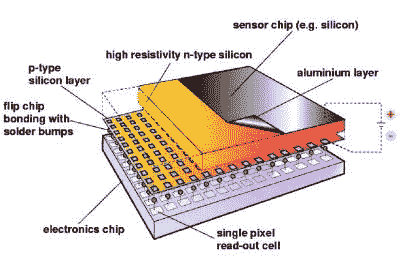
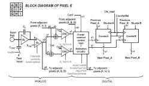
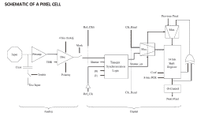

# 新零件日:用于 3D 彩色 X 射线成像的传感器芯片

> 原文：<https://hackaday.com/2019/02/14/new-part-day-a-sensor-chip-for-3d-color-x-ray-imaging/>

我们都知道欧洲粒子物理研究所是一个很酷的地方，物理学家在那里玩巨大的超导环来粉碎原子和亚原子粒子，以揭示宇宙中物质的秘密。为了实现这一目标，他们需要在其他领域进行大量的研究，例如开发特殊的粒子探测器。

虽然这些发展对该中心的核心研究需求至关重要，但它们也带来了造福于整个社会的附带应用。其中一项成果是 [Medipix 合作项目](https://medipix.web.cern.ch/)——一系列用于粒子成像和检测的读出芯片，可以计算单个光子，允许 X 射线和伽马射线转换为电信号。对于我们这些黑客来说，也许[不可能](https://medipix.web.cern.ch/how-get-medipix-or-timepix-licence)得到这些深奥的传感器，但是这些设备非常有趣，值得仔细观察。Medipix 传感器的工作原理类似于照相机，当电子快门打开时，它会检测并计数撞击像素的每个粒子。这使得高分辨率、高对比度、无噪声的图像成为可能，使其在成像应用中独一无二。

几个月前，欧洲核子研究中心宣布使用 Medipix 设备为人类拍摄了第一张 3D 彩色 x 光照片。结果是一个高分辨率的 3D 彩色图像，不仅包括骨骼、肌肉组织和血管等活体结构，还包括金属物体，如随附的照片所示。Medipix 传感器自 20 世纪 90 年代开始研发，目前处于第四代[。每个芯片由一个顶部半导体传感器阵列组成，由砷化镓或碲化镉制成。每个像素收集的电荷通过“凸点键合”传输到 CMOS ASIC 电子器件。集成是垂直的，每个感测像素通过凸点键合连接到模拟部分，然后是数字处理层。早期版本受技术限制，无法创建更大的多个传感器矩阵。它们可以只在三面邻接，第四面用于片上外围逻辑和允许电子读出的引线焊盘。最新的 Medipix4 合作，仍在开发中，消除了这一缺点。硅通孔(TSV)技术提供了通过填铜孔读取芯片的可能性，这些孔将信号从芯片的正面带到背面。与像素矩阵的所有通信都通过芯片背面进行——外围逻辑和控制元件集成在像素矩阵内部。](https://medipix.web.cern.ch/collaboration/medipix4-collaboration)

模拟前端由一个前置放大器和一个窗口鉴频器组成，该鉴频器具有上下限阈值。鉴频器有 4 位用于阈值调整和极性检测。这允许精确设置捕获窗口。其余的数字电子器件——多路复用器、移位寄存器、快门和逻辑控制——帮助提取数据。

Medipix ( [Tech Brief，PDF](https://medipix.web.cern.ch/sites/medipix.web.cern.ch/files/documents/collaboration/tech-brief-medipix3.pdf) )设备的进一步发展导致了一个名为 Timepix ( [Tech Brief，PDF](https://medipix.web.cern.ch/sites/medipix.web.cern.ch/files/documents/collaboration/tech-brief-timepix3.pdf) )的独立版本。这些新设备除了能够计数光子外，还能有两种额外的模式。第一种模式记录“时间超过阈值”，提供关于光子能量的粗略模拟信息。这是通过在信号保持在鉴别水平以上的持续时间内对时钟脉冲进行计数来实现的。另一种模式“到达时间”，测量第一个粒子撞击像素的到达时间。计数器记录触发和探测到能量高于鉴别水平的辐射量子之间的时间，允许飞行时间在成像中的应用。

Medipix3 pixel schematic

Timepix2 pixel schematic

除了医学成像，这些设备还应用于太空、材料分析、教育，当然还有高能物理。希望几年后，黑客们将会接触到这些有趣的设备，我们也能更好地了解它们。目前，如果您想深入了解，Medipix 网站上有更多的详细信息和数据表。要了解这种单光子探测器的发展概况，请查看欧洲核子研究中心的演示文稿—“[单 X 射线光子计数系统:现有系统、正在开发的系统和未来趋势](https://portal.slac.stanford.edu/sites/conf_public/nxd2012/presentations/MCampbellXray.pdf)”(PDF)。