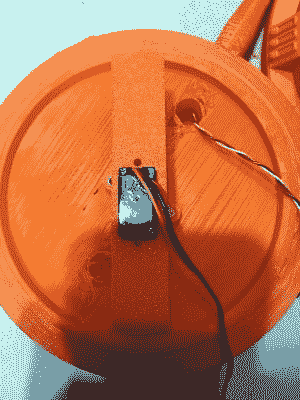

# 帝国用 ESP8266 反击

> 原文：<https://hackaday.com/2019/02/13/the-empire-strikes-back-with-the-esp8266/>

像我们中的许多人一样，[马修·温特沃斯]总是在寻找一个理由来建造一些东西。因此，当他在 Thingiverse 上找到《帝国反击战》的 3D 模型“DF.9”激光炮塔时，他决定这是一个完美的~~借口~~机会，不仅可以让[尝试重新混合现有的 3D 设计，还可以给它添加电子设备以创造一些互动的东西](https://www.instructables.com/id/Star-Wars-DF9-Turret/)。

 由于这个模型原本是为一款桌游设计的，所以显然很小。所以第一件事就是把所有东西的尺寸扩大到原来的两倍。正如[Matthew]所指出的，在如此大的程度上扩展后，它仍然看起来很好，这一事实归功于原始模型的详细程度。一旦放大到更有用的比例，他修改了炮塔的头部和炮筒，以接受他计划移植到模型中的电子设备。

他在炮塔的头部为一个标准的九克伺服系统制作了一个支架，使它可以旋转，炮筒的末端有一个 LED。两者都由 NodeMCU ESP8266 开发板控制，允许[Matthew]通过 WiFi 控制 pew-pew 的方向和强度。他提到，未来他希望添加与炮塔旋转和 LED 闪烁同步的音效。

对于项目的软件方面，他使用 Blynk 快速为炮塔构建智能手机界面。这是他第一次使用 Blynk，他报告说，除了一点尝试和错误，这是他为 Arduino 编写的最简单的代码。这是我们最近经常看到的对 Blynk 的看法，有趣的是看到它现在在 ESP8266 项目中出现的频率。

展望未来[马修]说他想画出炮塔的细节，因为亮橙色的配色方案在霍斯可能不会做得太好。如果他有时间的话，他还想把它加入 OpenCV 驱动的炮塔(T1)的长长名单中，T2 黑客喜欢用 T3 来骚扰他们的朋友和家人。

 [https://www.youtube.com/embed/lTyUZyshCKo?version=3&rel=1&showsearch=0&showinfo=1&iv_load_policy=1&fs=1&hl=en-US&autohide=2&wmode=transparent](https://www.youtube.com/embed/lTyUZyshCKo?version=3&rel=1&showsearch=0&showinfo=1&iv_load_policy=1&fs=1&hl=en-US&autohide=2&wmode=transparent)

