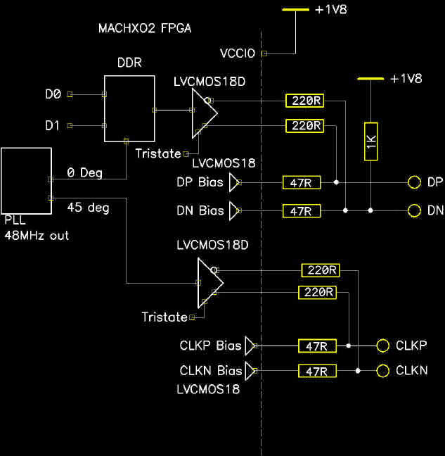

# 好好利用一个坏了的 IPod 显示器

> 原文：<https://hackaday.com/2019/02/12/putting-an-out-of-work-ipod-display-to-good-use/>

[迈克·哈里森]制作了如此多的高质量内容，以至于有时优秀的材料会从编辑的缝隙中溜走。这一次我们注意到，其中一个丢失的宝石是[迈克]对 2013 年第六代 iPod Nano 显示屏的[逆向工程，因为同样多产的[格雷格·达维尔]](http://www.electricstuff.co.uk/nanohack.html)[在最近的董事会上使用了一个](https://twitter.com/GregDavill/status/1094134544175849472)。尽管移动设备显示器取得了长足的进步，但易于连接到业余爱好者风格的设备的小屏幕通常仍然质量相当低。很容易找到更花哨的显示器作为废品，但与它们电连接可能是残酷的，更不用说搞清楚什么信号去哪里所需的逆向工程了。可以说，你可能找不到制造商数据手册，也不会方便地使用 SPI 或 I2C。

在几代奇怪的外形探索之后，苹果几乎放弃了独立的便携式媒体播放器市场；见证这个曾经强大的物种唯一幸存的成员，可悲地过时的 iPod Touch。幸运的是，由于活跃的销售，小方第六代 Nano 的替换零件仍然便宜且容易获得。如果有一个方便的界面，这将是一个相对非常高质量的显示器的巨大来源。输入[迈克]。

Outer edge of FPGA and circuit

这种特殊的显示器通过低压差分 MIPI 接口使用一种称为 DSI 的协议，这是一种常见的组合，仍用于驱动大型、丰富的现代显示器。这些规范在某种程度上是可以获得的…如果你是一家公司的员工，并且是标准化这些规范的工作组的成员——年收入低于 2.5 亿美元的公司有会员折扣，而[的会费是每季度数千美元](https://mipi.org/join-mipi)。

幸运的是，经过一些实验后，[Mike]找到了足够的命令集和信令，可以轻松地生成数据包、校验和等的示意图和参考。项目页面有少量信息，但电路包括一些不寻常的规定来调整信号电平和其他好东西，所以请尝试观看视频，了解正在发生的事情及其原因。当时[Mike]使用 FPGA 来驱动显示器，这当然是越来越便宜和容易了，但我们怀疑他关于使用快速微处理器和巧妙技巧的建议也能很好地工作。

原来我们在报道[Mike]的[微型热成像仪](https://hackaday.com/2014/09/07/building-the-worlds-smallest-thermal-camera/)时偶然提到了这个显示器，但从那以后就没怎么出现过。一如既往，感谢意外提示[格雷格]！我们正等着看你这个实验的最终结果。