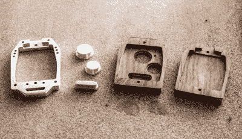

# 本田钥匙扣变成了数控艺术作品

> 原文：<https://hackaday.com/2019/02/19/honda-key-fob-turned-cnc-work-of-art/>

现在，几乎路上的每辆车都配有电子钥匙链，人们迫切希望找到修理这些不可或缺的小配件的方法，而不必在经销商那里支付数百美元。有一个完整的替换外壳市场，你可以将你的(希望)仍然正常工作的电子设备移植到其中，但如果你要经历将电子设备放入新外壳的麻烦，为什么不使它变得特别呢？

 这就是[【Michicanery】决定打造自己的定制钥匙链](https://imgur.com/gallery/4lhiqSC)时的想法。最终的结果是一个完全宏伟的工程壮举，这肯定是一个汽车生命的对话，如果不是超越。他的 OpenBuilds Lead CNC 1010 由木头和铝切割而成，这个造型可能会激发你从一个很高的高度“意外”放下现有的表链。哦不，太遗憾了。

[Michicanery]从拆卸他原来的表链开始，这是一种将钥匙直接集成到设备中的类型。这意味着他的替代品比一个独立的表链需要更多的思考，但至少它不是那种你必须把整个东西都放在仪表板上的东西。为了确保建筑足够坚固，能够经受住在点火装置中转动和通常摆弄的一生，他用 1/4 英寸厚的铝切割了中央框架和按钮。

表链的顶部和底部由车臣木材切割而成，然后在台式刳刨机上进行倒角，这样手感会更好。他在表壳上油，以呈现木材的自然颜色和纹理，但在此之前，他会在表壳背面刻上自己的标志，以增加额外的个性化色彩。从现在开始，我们并不认为[Michicanery]会在识别他的钥匙上有困难。

[就像我们最近看到的令人难以置信的表壳一样](https://hackaday.com/2018/01/10/star-chart-watch-is-a-romantic-tragedy/)，这是一个完美的例子，由于定制的外壳，日常物品获得了定制创作的新生命。诚然，我们不确定本田钥匙链[是否拥有一块好手表](https://hackaday.com/2014/07/08/go-vintage-learn-to-repair-and-restore-mechanical-pocket-and-wrist-watches/)的传家宝潜力，但我们仍然更喜欢它而不是黑色塑料原件。

[通过 [/r/DIY](https://www.reddit.com/r/DIY/comments/apg3k5/i_made_a_custom_hardwood_and_aluminum_key_fob_for/)