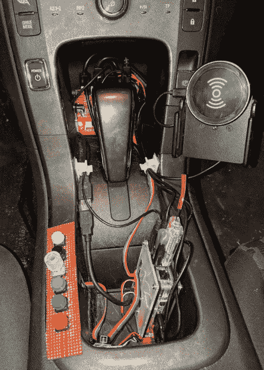

# 用树莓酱给雪佛兰伏特充电

> 原文：<https://hackaday.com/2019/02/15/juicing-up-the-chevy-volt-with-raspberry-pi/>

虽然雪佛兰的创新型电动混合动力车可能会正式走向天空中的大垃圾场，但伏特仍将活在黑客的心中，他们宁愿比较安培小时而不是马力。以相对较低的成本，二手 Volt 为汽车黑客提供了一个迷人的升级和实验平台。其中一位 Volt 车主是[Katie Stafford]，她最近在改装她的混合动力车方面取得了相当大的进展。

 【凯蒂】正在她的博客上撰写系列文章，记录她为她的 Volt 添加新特性和功能的努力。虽然她喜欢这辆车本身，但她主要的抱怨(尽管这肯定不仅限于 Volt)是缺乏触觉控制。为了她的口味，太多的功能必须通过触摸屏来完成，她渴望有一天你可以真正转动旋钮来控制空调。因此，她的第一个目标是为她完全现代化的汽车配备一个明显过时的用户界面。

像大多数新车一样，无论它们使用锂还是液化恐龙，Volt 广泛使用 CAN 总线来做…嗯，几乎所有的事情。以前，只需要一把钢丝钳和几个对接接头连接器就可以插入汽车的附件系统，但今天，通过嗅探 CAN 系统并注入您自己的数据，就可以在软件中完成。取决于你是油脂还是代码猴，这要么是噩梦，要么是梦想成真。

幸运的是[凯蒂]更倾向于后者，所以[在她的 Macchina M2](https://hackaday.com/2017/02/21/first-look-macchina-m2/)的帮助下，她能够一边摆弄汽车的环境控制，一边观察 CAN 总线上的数据。一旦她知道需要什么样的数据来做一些事情，比如打开风扇或设置所需的机舱温度，她只需要一种方法来触发它。为此，她将几个按钮和一个旋转编码器连接到 Raspberry Pi 的 GPIO 引脚，并编写了一些代码，将物理控件与数字控件关联起来。

当您需要与 AC 打交道时，这一切都很好，但是 Pi 在其余时间应该做什么呢？[Katie]决定在仪表板上安装一个小型 HDMI 显示器，这将是 Raspberry Pi 的完美方式，它可以作为信息系统显示从电池电量到冷却液温度的一切信息。它还为车辆改装提供了一个基本的菜单系统，包括她想快速访问但认为不一定值得拥有自己的物理按钮的功能。

在广告之后的视频中，[Katie]向观众展示了这些修改，以及她电池供电的领结的一些其他整洁的新功能。除了将一些电子设备插入 OBD-II 端口之外，她已经成功完成的事情非常令人印象深刻，我们迫不及待地想看看它将从这里走向何方。

今天，好的电动汽车实在是太多了，以至于像雪佛兰伏特和它在 T2 的亲戚凯迪拉克 ELR 这样的混合动力车无法保持竞争力。但是感谢像[Katie]这样的黑客，我们相信这个[不是我们最后一次看到汽车历史上这个重要的里程碑](https://hackaday.com/2019/01/08/goodbye-chevy-volt-the-perfect-car-for-a-future-that-never-was/)。

 [https://www.youtube.com/embed/DEbGnMGrStU?version=3&rel=1&showsearch=0&showinfo=1&iv_load_policy=1&fs=1&hl=en-US&autohide=2&wmode=transparent](https://www.youtube.com/embed/DEbGnMGrStU?version=3&rel=1&showsearch=0&showinfo=1&iv_load_policy=1&fs=1&hl=en-US&autohide=2&wmode=transparent)

