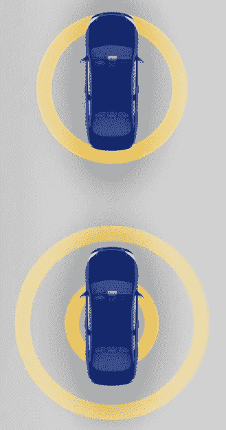
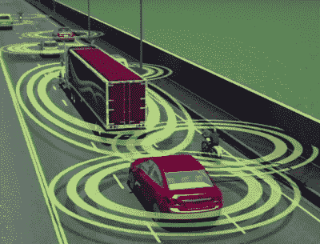
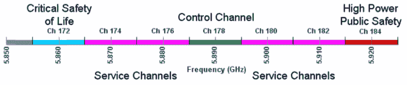

# 我们的汽车什么时候才能最终说同一种语言？车辆用 DSRC

> 原文：<https://hackaday.com/2019/02/21/when-will-our-cars-finally-speak-the-same-language-dsrc-for-vehicles/>

在 21 世纪初，很明显，即使是我们的汽车也无法逃脱数字革命。在有人提出“智能手机”这个术语的几年前，似乎很明显，汽车不仅会变得越来越充满计算机，而且它们需要一种相互之间以及与周围世界通信的方式。毕竟，潜在收益将是巨大的。想象一下，如果路上所有的汽车都能知道它们的同行在做什么？

 忘记追尾；一辆猛踩刹车的汽车会广播它要停下来的意图，并在人类乘客意识到发生了什么之前触发后面车辆的响应。在高速公路上，车辆可以同步它们的巡航控制系统，创造出“成群”的汽车，它们协调一致地移动，彼此保持安全距离。你永远不需要停下来付过路费，因为你的车辆的计算机会与收费站通信，并直接从你的银行账户中扣除这笔钱。所有这些，甚至更多，总有一天会成为可能。但前提是能够开发出一种特殊的低延迟车对车通信协议，并且要求所有新车都必须集成这项技术。

当然，除此之外，那从未发生过。正如预测的那样，虽然现代汽车充满了传感器和计算能力，但它们与道路上的其他车辆隔离开来。尽管如此，今天一辆装备精良的汽车能够完成大约 1998 年汽车杂志向我们承诺的所有技巧，有些甚至是最令人窒息的出版物也会认为太过精彩而无法发表。面对制造越来越“智能”的车辆的挑战，制造商开发了他们自己的独立方法，不依赖于无处不在的车对车通信网络。汽车行业已经接受了雷达、激光雷达和计算机视觉等技术，这些技术在 20 世纪 90 年代就相当于说，未来的汽车只需飞过它们就可以避免交通堵塞。

鉴于所有这些进步，你可能会惊讶地发现，几十年前最初提出的看似过时的车对车通信概念并没有像磁带一样过时。仍然有一种推动实现专用短程通信(DSRC)T1 的力量，这是一种专门为汽车应用设计的 WiFi 衍生协议，目前这项工作已经进行了 20 多年。支持者认为 DSRC 仍然有希望减少事故，但反对者认为这是一种已经被更有能力的系统取代的技术。更复杂的是，联邦通信委员会早在 1999 年就为 DSRC 保留了一段宝贵的无线电频谱，但至今仍未使用。那么 DSRC 到底提供了什么，在我们接近“自动驾驶”汽车时代的时候，我们真的还需要它吗？

## WiFi 触及限速:DSRC

说这项技术是“汽车的 WiFi ”,并不仅仅是出于营销目的的某种过于简单的声音字节，这就是它的确切含义。DSRC 正式命名为 IEEE 802.11p，是对 WiFi 标准的修正，使其更适合汽车应用的独特挑战。车辆之间或车辆与路边的固定物体之间的通信需要非常低的延迟、相对短的范围，从而不会使系统被不相关的数据淹没，并且能够应对可以传输数据的特别短的窗口。这种特定的需求组合并不容易满足，这可能是这么多年来我们还没有看到任何重要的 DSRC 推出的主要原因之一。

 在最基本的实现中，支持 DSRC 的车辆应该以每秒 10 次的速度在 300-500 米的范围内发送其速度和 GPS 坐标。如果路上只有一半的车辆配备了这种信标，你可以想象当你在高速公路上行驶时，大量的数据会涌入你的电脑。高速公路对面或周围地面街道上的车辆将在几秒钟内进出范围，即使它们传输的数据几乎肯定与您自己车辆的操作无关，但仍需要对其进行分析和分类。在你所在的高速公路上，可能有一些可操作的数据隐藏在遥测数据的海洋中，但处理所有这些信息的速度足够快，足以对此做任何事情，这是一项不小的壮举。

由于所有这些数据都在飞来飞去，传统的 WiFi 关联流程是不可能的，根本没有时间等待。因此，DSRC 设备取消了唯一的基本服务集标识符(BSSIDs ),而是使用通配符 ID 来匹配所有潜在的接收者。这也意味着 WiFi 的常规安全考虑(如加密)也不可用，因此 DSRC 设备将需要在更高的级别实现任何种类的认证或数据验证。

## 信任，但要核实

更注重安全的读者可能会在这一点上停下来，想想如果有人部署了一个流氓 DSRC 发射机会发生什么。那个人会不会发出一个信号，模仿一辆停在繁忙十字路口的汽车，让交通陷入停顿？[如果黑客可以用从垃圾场回收的零件制造出一辆功能正常的特斯拉 Model S](https://hackaday.com/2017/09/20/salvaging-your-way-to-a-working-tesla-model-s-for-6500/)，还有多久就会有人把 DSRC 模块挂在 Arduino 上，开始在我们的道路上肆虐？

与此同时，悲观的读者会把注意力转向路上没有安装 DSRC 系统的汽车。当然，你的 DSRC 车辆将对另一辆 DSRC 车辆的减速做出反应，但即使我们强制要求从今天起所有制造的车辆都必须支持这项技术，仍然需要几十年才能指望路上一半的汽车向任何愿意听的人提供有用的信息。一个只能避免与路上少数几辆车发生碰撞的系统，听起来像是给司机制造一种虚假安全感的方法。

不幸的是，在这种情况下，这两个群体都不太可能对官方的答案感到满意。正如汽车和设备制造商协会(MEMA)首席技术官 [Brian Daugherty 在接受 Viodi](http://viodi.com/2017/07/07/dsrc-or-5g/) 采访时解释的那样，DSRC 的现代观点是对当代防撞系统的补充，这些系统依赖于雷达或其他可以检测被动物体的技术:

> 当你收到一辆停在你前方道路上的车辆发出的警告或你可能看不到的紧急刹车时，这些系统具有最大的价值，但现在你的雷达系统或相机系统开始感知到有东西停在你面前，再加上有人在我面前说“是的，我正在停车”的额外知识，再加上数据融合，你就能够采取行动。

换句话说，DSRC 实际上不能依靠自身来防止碰撞。无论是因为有人欺骗了信号，还是因为你前面的汽车没有发射器，你的汽车正在或没有从 DSRC 网络接收“停止”信号的事实都不能被认为与你前面的道路上实际发生的事情有任何关系。

 [https://www.youtube.com/embed/bw8xrQKoX8Q?version=3&rel=1&showsearch=0&showinfo=1&iv_load_policy=1&fs=1&hl=en-US&autohide=2&wmode=transparent](https://www.youtube.com/embed/bw8xrQKoX8Q?version=3&rel=1&showsearch=0&showinfo=1&iv_load_policy=1&fs=1&hl=en-US&autohide=2&wmode=transparent)

## 踩刹车

因此，即使是业内人士也承认，在车辆的车载计算机能够决定对其采取行动之前，DSRC 信息需要与其他传感器进行交叉引用，你不得不怀疑这有什么好处。毕竟，雷达和激光雷达系统不需要二次数据流来接合目前市场上的防碰撞系统中的刹车。将 DSRC 添加到这些系统中的一个最多给他们一个即将发生碰撞的辅助确认，但它对防止甚至减少误报没有任何作用。

由于这种不确定性以及潜在的消费者额外成本，[2017 年，白宫和交通部官员对推进要求所有新制造的汽车和轻型卡车都包括 DSRC 功能的命令表示怀疑](https://apnews.com/9a605019eeba4ad2934741091105de42)。交通部并不否认车对车通信具有拯救生命和缓解交通的潜力，但官方的立场是，在要求汽车制造商实施这项技术之前，还有太多其他因素需要考虑。如果没有这样的命令，DSRC 将很难达到在道路上真正有用所必需的采用率。

## WiFi 需要发展空间

但是对 DSRC 最大的威胁可能不是来自不冷不热的白宫或不断发展的汽车工业；这可能是我们对高速无线互联网贪得无厌的渴望。这是因为 DSRC 和 WiFi 还有一个共同的特点:它们工作的频率。或者至少，他们可以做手术。

1999 年 10 月，FCC 为 DSRC 等“智能交通系统”保留了 5.850-5.925 GHz 的频率。在该频谱片段中，有十个信道，其中一个专用于高优先级的冲突避免消息。二十年前，这可能看起来像是隐藏这项潜在救生服务的一个很好的安静的部分。

但是今天它有一个非常吵闹的邻居。按照 FCC 1999 年的决定，美国最高频率的 WiFi 信道的中心频率为 5.845 GHz。事实上，如果 DSRC 不在众所周知的道路中间，将会有更多的 WiFi 频道被电信公司注意到，[他们一直在敦促 FCC 重新评估这种情况](https://www.ncta.com/whats-new/a-fresh-look-at-the-59-ghz-band)。争论的焦点是，DSRC 有足够多的时间来赶上并证明它应该拥有最终成为频谱中非常有价值的部分的专有权。他们认为，汽车需要做的任何通信都可以通过 LTE 或下一代蜂窝技术来完成。

对他们来说，DOT 不想不战而降地放弃 5.9 GHz。他们承认需要更多的 WiFi 频道，但表示，即使 DSRC 在美国一些地区的有限使用也意味着它需要保持不变。他们提议与联邦通信委员会和相关机构合作，探索允许 WiFi 和 DSRC 在相同频率上共存的技术，只要 DSRC 优先于在网飞播放最新一季《T2 奇人异事》的人。

## 第三个~~时代的~~十年的魅力？

毫无疑问，DSRC 和相关的车对车通信技术在美国还没有取得很大进展，但公平地说，我们只是现在才看到足够智能的汽车来充分利用它。[无论你站在无人驾驶汽车辩论的哪一方，事实是，直到最近几年，大多数消费者都无法获得具有强大防撞系统的车辆。](https://hackaday.com/2016/12/05/self-driving-cars-are-not-yet-safe/)

在这一点上，很难说 DSRC 的未来到底是什么。目前的白宫政府肯定已经把这项技术搁置了，但他们也没有放弃。到目前为止，DSRC 和 WiFi 之间的频谱共享实验很有前景，因此在未来几年内，所有参与方都有可能得到他们想要的东西。事后看来，我们在 1999 年、2009 年甚至 2019 年都不需要 DSRC。但是到 2029 年，我们的汽车可能最终会互相说话。

 [https://www.youtube.com/embed/3z09fCqmILU?version=3&rel=1&showsearch=0&showinfo=1&iv_load_policy=1&fs=1&hl=en-US&autohide=2&wmode=transparent](https://www.youtube.com/embed/3z09fCqmILU?version=3&rel=1&showsearch=0&showinfo=1&iv_load_policy=1&fs=1&hl=en-US&autohide=2&wmode=transparent)

