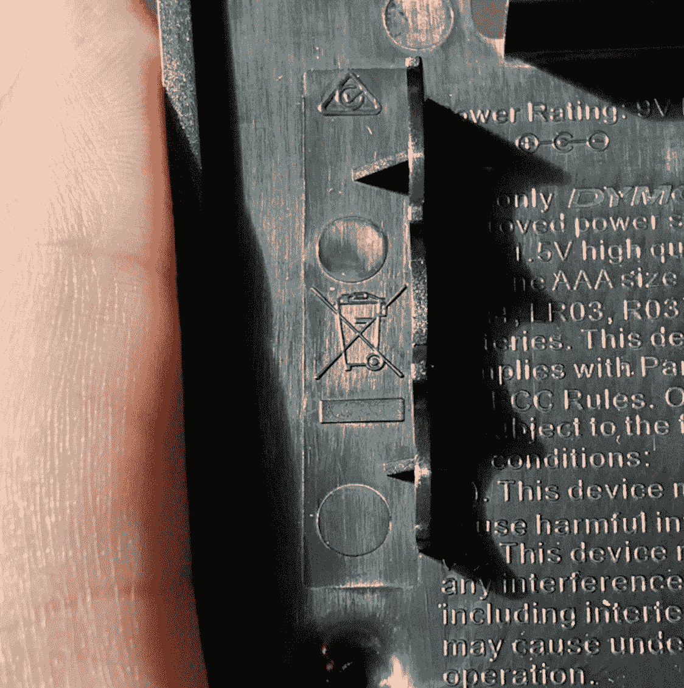
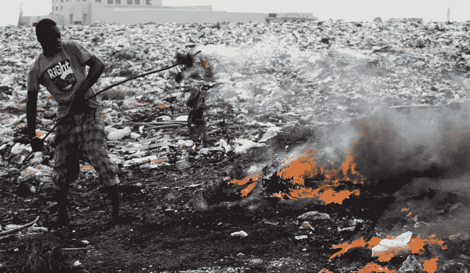
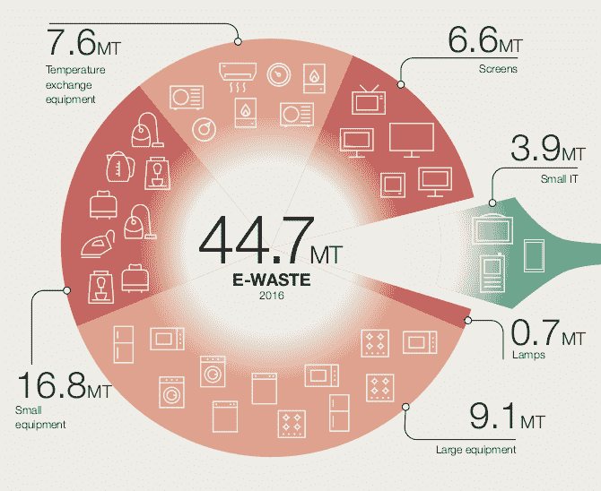

# 全球电子垃圾的悲惨世界

> 原文：<https://hackaday.com/2019/02/20/the-woeful-world-of-worldwide-e-waste/>

你家里有多大的废弃电子产品储藏库？它们曾经是昂贵和珍贵的物品，但现在它们是负责任处理的一个问号。我将深入探讨这个问题——它远远超出了你收集的废弃智能手机的范畴——以及这些东西的最终归宿和最终归宿的问题。为了更好地理解现代电子产品产生的废物流，我甚至打算揭开 WEEE 标志(你一直在电子产品上注意到的那个划掉垃圾桶图标)的神秘面纱，谈论大型喷气式飞机有多重，并触及循环经济。

我们的生活正遭遇越来越多的“我该如何处置这个[X]”的时刻，这里的 X 是成堆的旧电池、液晶显示器、台式机塔等。这导致了车库或壁橱底部的一堆堆潜在的关系测试垃圾。有时旧设备会被卖掉或捐赠。有时会有一个便捷的电子垃圾运动，在社区里来回穿梭，收集堆积的垃圾，有时它最终会被扔进垃圾桶，包裹在我们做错了什么的肮脏感觉中。我们都经历过。很容易发现，负责任地处理我们的旧电子产品可能很难。

有趣的事实:生活在美国的普通人每年产生 20 公斤电子垃圾(约 44 自由磅)。这并不独特，在英国大约是 23 公斤(普通公斤是 23 公斤)，丹麦是 24 公斤，等等。这对一个人来说太多了，对吧？一个人浪费那么多是什么造成的？就此而言，你在恳求脸书的帖子中看到的虚假的电子垃圾统计数据追踪了哪些种类的垃圾？不出所料，有一些共同的定义。世界经济论坛的[非常严肃的人给你们带来了定义，他们也有一些解决方案要考虑](https://www.weforum.org/reports/a-new-circular-vision-for-electronics-time-for-a-global-reboot)。

我们花了很多时间来研究如何建造这些东西。我们是否花了足够的时间来计划一旦设备不再受欢迎该怎么办？让我们把这些垃圾弄个水落石出吧。

## 将“E”放入废物中

让我们从头开始。什么实际上构成了电子垃圾，它有连字符吗？世界经济论坛(World Economic Forum)将电子垃圾定义为“任何带有插头、电线或电池的物品，以及构成这些报废产品的组件。”这很容易申请，对不对？它有电子穿过吗？太好了！那么它将成为电子垃圾。

在我们走远之前，有一个有趣的旁白。WEF 阐明“电子废物也称为废弃电气或电子设备，或简称 WEEE”。有没有注意到在你的电子产品底部，靠近 CE，FCC ID 等等的那些有趣的被划掉的垃圾桶？这叫做 WEEE 标记，它提醒你这个东西是电子垃圾，不应该被正常扔掉。如果你在制作电子产品，可能需要包含一个。顺便说一下，写这篇文章时，我发现我的烙铁没有一个！

为什么我现在拿这个话题来烦你？电子垃圾并不是一个新问题。WEF 在一月底发布了几份关于电子垃圾的白皮书(对于一个被宣传为“经济论坛”的东西来说，可读性令人惊讶)，其中有一些非常可怕的统计数据。就像那个关于美国每个人每年产生大约 20 公斤电子垃圾的故事。

请注意，废物/人的分布极不均匀，虽然 20 公斤接近最高值，但最低值非常接近 0 公斤/人/年。如果我们要求 Wolfram Alpha 将 20 公斤这个数字人性化，我们得到的是一个与金条重量毫无用处的比较(拜托 Wolfram，我们是黑客作家，不是银行家)。没用。但是白皮书中一些完全疯狂的比较有所帮助。

## 就飞机而言的电子垃圾量

根据 2016 年的数据，人类每年在全球产生约 4470 万[吨](https://en.wikipedia.org/wiki/Tonne)电子垃圾。有点过时了，但我们可以用大飞机来形容。一架 747-100 的[最大起飞重量](https://en.wikipedia.org/wiki/Boeing_747#Design)约为 33.3 万公斤。一架 A380 的[零燃油重量](http://www.modernairliners.com/airbus-a380/airbus-a380-specs/)约为 361，000 千克(讽刺的是，这个比较[也有点过时](https://hackaday.com/2019/02/15/airbus-to-halt-production-of-the-a380-goodbye-to-an-engineering-triumph/))。把它分开，我们会产生大约 125，000 架巨型喷气式飞机的电子垃圾。*每年*。

我想问你是否见过如此拥挤的机场，除了一个不可能存在于这个星球上任何地方的机场，因为它实际上会覆盖 T2 曼哈顿 T3。如果喷气式飞机神奇地出现在希思罗机场跑道的尽头，机场满负荷运转([无人驾驶飞机](https://hackaday.com/2019/01/28/drone-sightings-a-new-british-comedy-soap-opera/))，他们需要 *6 个月的 24 小时服务才能起飞*。现在你明白了吗？看起来很大吗？我想把它和埃菲尔铁塔相比，但坦白地说，这是一个不那么令人印象深刻的指标。

## 东西去哪了？

Burning off plastic insulation from copper wiring in, Ghana. Image source: Jon Spaull, [SciDevNet](https://www.scidev.net/global/digital-divide/multimedia/electronic-waste-dump-supplies-ghana.html)

又是一个激动人心的统计数据的时候了！电子垃圾仅占固体废物流(基本上是垃圾)的 2%,但却占了进入垃圾填埋场的有害垃圾总量的 70%。当然不是所有的，但是一些电子产品富含重金属和其他你不想渗入地下的东西。但是没有人会发现清洁工将积满灰尘的机架从数据中心搬到垃圾箱里(我希望如此。你做的不对吗？).出于生态或经济原因，世界各地都有回收项目和私人企业来消耗这些废物流。

事实证明，再循环率很低，只有 20%的电子垃圾进入了适当控制和跟踪的收集点。但是剩下的 80%去了别的地方。4%被扔进了家庭垃圾中，但 76%进入了灰色地带。白皮书的字面意思是“命运未知”，这很有趣，但有点欺骗性。没有关于其消亡的官方文件，但我们知道很多垃圾最终在 WEF 所谓的“劣质条件”下被回收，这是对你在加纳看到的那些冒烟的垃圾的委婉说法。导致普遍出生缺陷和持久环境破坏的条件。

世界经济论坛；作为一个经济实体，有一些关于为什么会发生这种情况的分析。被销毁的货物是有价值的，那么为什么没有以严格的方式重新获得更多的货物呢？为什么事情一开始就以焚烧成堆的垃圾告终。可以说，把它堆在一起烧掉实际上是一种别出心裁的、创造性的方法，可以把有价值的材料从无用的材料中分离出来(上图中，他们正在去除电线的绝缘层)。但我认为 WEF 在这里的意思是“为什么人们不建立花哨的、受监管的工厂和企业来做这件事。”

WEF 会说，在这方面，我们有一个线性经济。线性经济是一种简单的经济，当你考虑任何东西是如何制造的时候，你会想到经典的瀑布。必要的资源被开采，产品被制造、销售和使用，直到它的生命周期结束，然后被处理掉。回收的过程就像抓住那条线性的水流，强行推动它，直到“处理掉”与“矿产资源”相一致。输出流成为输入流。很明显，但是很难。

## 循环价值链

那么循环经济可能吗？在这一点上，描述起来容易，执行起来很难。事实上，我们*现在做*回收意味着我们实际上是在那里，但在一个真正的循环中，既没有大量的“矿产资源”投入，也没有“然后它变成废物”的产出。当然，没有一个系统是完美的，所以期望*零*浪费是缺乏理解的，但是整个生命周期是为资源的大量再利用而设计的。

怎么会？有各种各样的技术和工艺方法可以朝这个方向发展。我们可以在回收过程中提取和分离产品中消耗的所有资源，并将它们重新引入价值链的顶端。产品可以模块化，以便升级和替换。我们可以停止所有的技术发展，这样就不会再有过时的东西了，等等，等等。“循环经济”并不意味着完美的循环利用，也不意味着永不升级。它可以由任何最终减少浪费的方法组合而成。

## 关于实际可修复性的旁注

我认为值得从白皮书中抽身出来，用我们的批判性思维作为日常读者。WEF 对电子垃圾浪潮的贡献者的分类提醒人们，电子垃圾的定义是“带插头的东西”显然手机是电子垃圾，但厨房里的电水壶也是。或者洗衣机和烘干机。这些是基本不同类型的设备，具有基本不同的组成部分。这款手机的半导体中会有更多的稀有稀土金属。车身和中框将采用塑料，也可能是钢或镁。另外还掺入了一些金和铜。电水壶怎么样？它也会有硬塑料，也许还有一些金属。但是电子设备会简单得多。也许有一个控制系统可以驱动加热元件到一个温度设定点。但是也许它可以像一个加热线圈一样简单地成为墙上的一根电线、一个开关和一大块金属。

回到让我们更接近一个循环的方法，很明显，有些解决方案比其他解决方案更适合这些废物类别。不同形式的模块化或可维修的手机已经被一次又一次地尝试，结果都还不错。为什么？用户可服务性通常意味着模块化。如果一个普通用户要进行升级，那么模块需要易于连接，并且足够大，不需要专门的工具就可以操作。一旦你远离[拍摄你的手机充满粘合剂](https://www.ifixit.com/Teardown/Essential+Phone+Teardown/96764)还有其他的权衡。胶水实际上非常小，可以涂在任何配合面上。螺钉和卡扣具有体积，它们穿过的材料需要设计有特征来支持它们，这两者都占用空间。一旦你开始为紧固件占用空间，设计师需要为这些紧固件牺牲电池寿命或尺寸或重量。模块需要连接，这也需要尺寸，特别是因为人类可以容易地使用而不会损坏的连接器比制造商通常使用的[板对板式夹层连接器](https://www.molex.com/molex/products/group?key=mezzanine_products&channel=PRODUCTS)和[微型 U.FL](https://www.digikey.com/catalog/en/partgroup/umcc-ultra-miniature-coax-connectors-u-fl-series/2344) 插孔大得多。并且更多的连接器化影响电线的布线，尤其是设备的不同组件之间的高速、RF 等连接。

My dream home

最终，在产品需求文档中，你将可用性和设计作为另一个特征来权衡。有些人会说这是值得的，真正的“从摇篮到摇篮”设计的实践者会尖锐地向管理层提出这一论点，消费者会对此做出回应。那可能是真的！我个人认为绝对值得一试。但到目前为止，还没有人证明有多少消费者愿意把钱花在实处，并购买这些产品*。* [很少有人知道如何通过销售这些设备来赚钱。](https://www.fairphone.com/en/)

## 分解大的东西

但是这里有其他的路。还记得那些水壶和洗衣机吗？你不需要把它们扔进燃烧坑来提取资源。有人可以用手把它们拆开，拉出电子元件。更好的是，与现代消费电子产品不同，它们易于维修！当你可以拧几个螺丝并更换电子元件时，为什么要扔掉整个水壶呢？更好的是，当它可以在现场维修时，为什么要扔掉它，等待价值链下游的人来更换组件呢？如果用户或维修人员能来修理，它根本就不需要扔掉！较大的设备自然被设计成易于维修，虽然市场可能已经转向粘合剂和带有微小部件的复杂印刷电路板，但我认为这是一个巨大的机会，可以成为现代生态友好设计的灯塔。当然，没有人会在意他们的垫圈是否厚了 3 毫米，以容纳一个金属片螺钉和凸台。

支持将大设备的生命周期优先于小设备的另一点。它们在电子垃圾流中占多大比例？WEF 指出，“小型设备”(水壶、熨斗、吸尘器等)、“大型设备”(冰箱、洗衣机和烘干机等)和“温度交换设备”(空调、加热器等)总共占电子垃圾的 75%!我敢肯定重金属和更多稀有资源的比例在这些类别中并不是平均分布的，但是修复和再利用这些类别将会对减少 125，000 架大型喷气式飞机和改善现状大有帮助。

## 还剩下什么？

同样，作为一个经济组织，WEF 还有一个理由说明为什么循环经济值得追求；降低成本。令人惊讶吧？对于一些资源来说，令人震惊的是，从废物流中提取资源已经比从地下提取资源更节省能源。从字面上看，每吨智能手机的含金量是同等重量金矿的 100 倍；只是包含的方式不同而已。来自 WEF 白皮书的令人惊讶的统计数据表明，每年大约有 625 亿美元的价值被锁定在电子垃圾中，与大多数国家的 GDP 相比毫不逊色。

总之，循环经济包括比这更多的设计考虑，加上聪明的商业模式可以有所作为。我个人可能会有疑虑，但 WEF 认为像“电子服务”这样的技巧可能是一个很好的方法。循环经济的世界是广阔的，值得比一篇太长的文章的结尾更多的报道，所以期待在未来的 Hackaday 上看到更多。如果你想了解更多的细节(或者想看资料来源)，请阅读 WEF 报告。

你呢？你在设计中考虑过再利用或回收吗？请在评论中告诉我们！我们希望看到我们社区中硬件生命周期的状态。