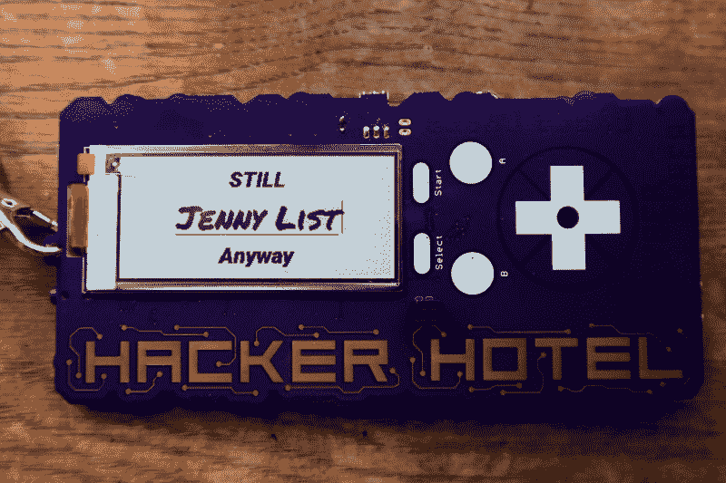
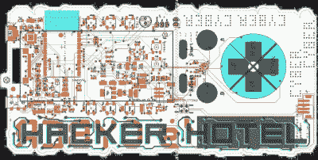

# 动手:黑客酒店 2019 年徽章包 ESP32，E-Ink，和一个共同的遗产

> 原文：<https://hackaday.com/2019/02/26/hands-on-hacker-hotel-2019-badge-packs-esp32-e-ink-and-a-shared-heritage/>

当你参加黑客大会时，你总是希望会有一个硬件徽章。这是一个互动的定制电子产品，让你在进门的同时也能在骗局中获得愉悦和娱乐(希望远远超出这个范围)。

接下来热卖的是 [Hacker Hotel](https://hackerhotel.nl/) 徽章，来自荷兰一家酒店舒适的周末 hacker camp。[正如我们已经注意到的](https://hackaday.com/2019/02/20/badge-team-badges-get-a-platform/)，这个徽章来自创建[sha 2017 黑客营的产品](https://hackaday.com/2017/08/14/hands-on-with-the-shacamp-2017-badge/)的同一个团队，并且共享那个徽章的显示器、ESP32 处理器、电池和固件。该固件演变为 [badge.team](https://hackerhotel.nl/) 平台本身就是一个令人兴奋的发展，但在这个徽章的背景下，它为那些也参加了 2017 年活动的与会者带来了非常熟悉的界面。

## 熟悉的遗产

The SHA2017 heritage of this badge is visible in the nickname app.

从美学设计的角度来看，这个徽章并没有试图与那些你可能在非官方的#Badgelife 场景中发现的艺术作品走极端。相反，它选择了一个 160 毫米乘 80 毫米的非严格矩形外形，采用紫色阻焊和金色外露 ENIG。黑客酒店标志的外部轮廓以一种微妙愉悦的方式破坏了董事会的线条。该徽标位于左侧，使显示屏位于右侧的纵向位置，下方是一组 PCB 触摸按钮，与 SHA 徽章上的按钮非常相似。

显示屏左下方附近有一个[劣质插件](https://hackaday.io/project/52950-shitty-add-ons)连接器，与电路板成 90 度安装，而不是通常的 45 度。这让我的同事 Brian Benchoff 有些好笑，因为 45 度角取向是偶然出现的。

The rear of the Hacker Hotel 2019 badge, showing the vibration motor and IR components at top centre. The Club-Mate RFID sticker is not a standard fitment!

徽章装在一个塑料袋里，上面已经贴上了显示器。包里还有一个小型振动马达、一个红外 LED、一个劣质插件连接器、一个 Grove 连接器、一对耳机以及一套用于连接电池的钩环垫。给徽章加电会直接进入带有活动标志的主屏幕，在这里只需按一下开始键就可以进入菜单。

与 SHA 徽章上更水平的排列相比，垂直方向似乎更容易使用，尽管它也面临着与其前身相同的问题，即看到不需要的按钮触发器。没有开关，所以关闭徽章以使你的昵称在电子墨水屏幕上可见的技巧变成了进出电池连接器的不便。

徽章的所有组件都在背面。与 SHA 徽章的 WROOM 相比，ESP32 模块现在是 WROVER-8，提供 8Mb 的 SRAM 以及更多接口。它与前代产品共享 LED 和电源电路、MPR121QR2 触摸按钮芯片和 CP210X USB 转串行芯片，但增加了 PCM5102A 音频 DAC 和 IR 遥控发射器和接收器。徽章套件中没有最后一个组件，事件徽章栏可以提供一个。缺少的 SHA 徽章组件是 SD 卡插槽和扩展连接器。

## 我们可以解决这个问题

The Gerber view of the Hacker Hotel 2019 badge PCB.

SHA 徽章受到一批假冒 USB 转串行芯片的影响，需要使用额外的 SMD 组件进行紧急返工，该徽章的足迹已准备好进行修复，如果需要的话。这个徽章躲过了更严重的硬件错误，但确实包含了一些错误。Grove 连接器的足迹与到达的组件略有不同，不知何故，音频插孔的足迹颠倒了，这并不影响随附耳机的再现，但这使其无法用作线路输出。连接器只需要一点氰基丙烯酸酯胶，插孔有一个 PCB 返工修复，但这两个问题都不会影响徽章的操作。

## 那么…他们表现如何？

黑客酒店 2019 徽章，然后。这是一个有能力和功能齐全的活动徽章，从活动的第一天起就起作用，并对以后的生活有很大的承诺。这是一项基于现有徽章硬件设计的有趣研究，作为新宣布的 badge.team 项目的首批主要活动之一，它展示了该平台的潜力。它缺少一个标志性的硬件功能，如 [CCCamp 2015 的软件定义无线电](https://hackaday.com/2015/07/12/cccamp-2015-rad1o-badge/)或 [EMF2018 的手机模块](https://badge.emfcamp.org/wiki/TiLDA_MK4)，但与这两个徽章不同的是，它或多或少地通过实际工作来弥补其简单的功能集。如果我们必须找到一些对硬件的批评，它们将包括缺少扩展连接器和开关，但这些省略都不会影响它作为活动徽章的功能。我们喜欢它，并期待这个设计团队的下一个产品是什么形状。

黑客酒店徽章团队对他们工作的谈论嵌入在休息下面。

 [https://www.youtube.com/embed/e_uJkHBewcA?version=3&rel=1&showsearch=0&showinfo=1&iv_load_policy=1&fs=1&hl=en-US&autohide=2&wmode=transparent](https://www.youtube.com/embed/e_uJkHBewcA?version=3&rel=1&showsearch=0&showinfo=1&iv_load_policy=1&fs=1&hl=en-US&autohide=2&wmode=transparent)

