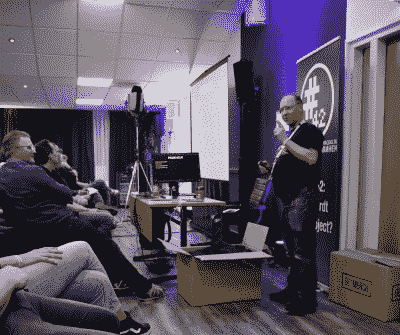
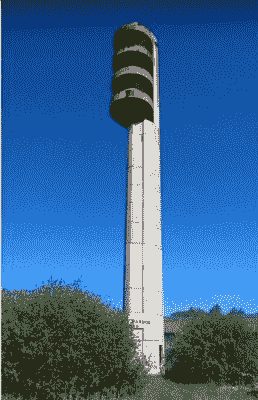
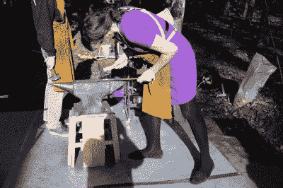
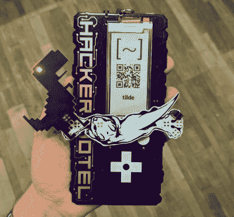

# 文明环境中的仲冬黑客营

> 原文：<https://hackaday.com/2019/03/15/mid-winter-hacker-camp-in-civilised-surroundings/>

想象一个富裕的周末，你在火车站遇见你的同伴，乘坐时速 190 英里的特快列车穿越整个大陆，在仲冬时节享受豪华度假酒店的氛围。打开马提尼酒，这是一个过去时代的优雅和精致的场景！这就是[黑客酒店 2019](https://hackerhotel.nl/) 的大致思路，我玩得很开心！

在最近二月的一个周末，我喝了一杯马提尼酒，而是喝了一杯。我的欧洲之星和 Thalys 之旅的同伴是我在当地黑客空间的朋友 Matt“gas man”west cott，他的 keytar 放在一个大箱子里，准备参加 chiptune 演出，我们正前往荷兰。这是夏季黑客营的一个支点，超过 200 名黑客在周末入住度假酒店，睡在舒适的床上，而不是灰尘或泥浆！

以下是我这个周末的经历。下面和我一起看看为什么你不能错过下一个！

## 直接下火车…

在离阿默斯福特不远的荷兰乡村，位于 Garderen 的 Westcord Hotel De Veluwe 是我们的临时住所，大多数与会者来自该国充满活力的黑客空间，也有一些像我们一样来自其他国家的游客。

Dimitri Modderman delivering the opening talk.

长途旅行后到达酒店，人们通常只对酒吧感兴趣，然后睡觉，但在周五晚上登记入住并收到我们的徽章和腕带后，这才是正事。Orga 负责人 Dimitri Modderman 开始了他的发布演讲，然后直接进入了他们组织的一系列令人印象深刻的演讲和研讨会。有如此多的人可供选择，不可能让所有人都到场，幸运的是，除了少数几个演讲外，我们都拍到了视频，并且[将在未来几周内发布](https://hackerhotel.nl/index.php/talks-hackerhotel-2019/)供您通过 YouTube 欣赏。

当然，对我来说，疲劳战胜了观看周五演讲的欲望，在迪米特里的开幕式和一些户外高压娱乐的壮观景象之后，我只能在睡觉前在酒吧里吃一顿饭和喝一两杯当地特别好的[Veluwse Schavuyt](https://www.veluwseschavuyt.nl/)([谷歌翻译链接](https://translate.google.com/translate?hl=en&sl=nl&u=https://www.veluwseschavuyt.nl/))啤酒来恢复漫长的一天。

## …并加入谈话日程

既然我已经承认一个人不可能抓住所有的事情，那么最好看一看那些引起轰动的讲座和研讨会，我设法看到的，以及我希望我设法看到的。

在最后一个类别中名列前茅的是不会出现在视频中的头条新闻，一位荷兰执法机构的代表在谈论“如何成为一名暗网管理员”。这是一个故事，讲述了作为对贩卖毒品和其他犯罪活动的 TOR 网站的所谓“黑暗网络”的国际调查的一部分，他们如何侵入一个市场并冒充其犯罪所有者经营了几个月，然后利用他们收集的证据逮捕了这些骗子。为什么我会错过？我得到保证说的是荷兰语，尽管 Duolingo 尽了最大努力，我还是说得不够好，所以我坐在酒吧里和其他几个英国人出去玩。当我发现它毕竟是用英语发表的时候，我非常失望。令人高兴的是[《登记薄》很好地总结了更接近他们那个时代的事件](https://www.theregister.co.uk/2018/03/08/dutch_police_detail_how_they_became_the_admins_for_hansa_dark_web_market/)，但它仍然是一个迷人的故事，展示了黑客酒店日程表的魅力。

It’s not every day you hear from someone who bought a water tower by accident.

在撰写本文时，大多数视频都计划在未来几周内发布，其中一些是荷兰语，但为了让大家有所了解，让我们从本·菲茨杰拉德的“[苏联时代晚期水塔的 101 次黑客攻击](https://www.youtube.com/watch?v=QtqYsqs2DY0)”开始吧。这个演讲引起了一阵轰动，详细描述了他是如何意外获得一个拉脱维亚水塔的，以及他打算用它做什么，同时顺便给我们提供了一点苏联和拉脱维亚的社会史。

我提到我的旅伴是马特·韦斯特科特，除了在周六晚上举办一场 chiptune 音乐会之外，他还向我们讲述了他如何参与最近的黑镜互动剧集、 *Bandersnatch* 的故事。如果你注意到在节目结束时隐藏在音频中的 Sinclair Spectrum 游戏的复活节彩蛋，你现在知道是谁创造了它，因为当 Matt 不玩 chiptunes 时，他也是著名的 ZX Spectrum demoscene 编码器。

那些还没有在 YouTube 上发布的，请注意 Lucy Fauth 和 Jana Marie Hemsing 描述的[他们的 TranspOtter 电动运输平台](https://hackerhotel.nl/index.php/timetable/event/building-your-own-transpotter/)，记性好的读者可能会记得[，当我们在 Hackaday](https://hackaday.com/2017/12/03/boxes-form-an-orderly-queue-behind-the-armchair/) 上介绍这个的时候。令人惊讶的是，Klazien Schaap 的“Love hacks”没有吸引太多观众，但却引起了观众的热议。Dimitri 告诉我，她可能会在未来的活动中以更积极的方式回归。

## 大量的工作室让每个人都有事可做

When blacksmithing is in the blood, you’ll risk your officewear.

研讨会与讲座同时进行，分布在酒店的各种功能房间以及酒店内。我以前的 OxHack 会员朋友 Igor 经营着 RevSpace forge，当然，作为一个铁匠的孩子，尽管穿着滑稽的不合适的衣服，我也必须去。户外还有铝热剂铸造，令人印象深刻的使用蒸汽和气压技巧的油桶倒塌，以及使用漂白剂在衣服上印上标志和图案的车间。

室内是一系列主题多样的工作坊，如开锁和钥匙压印(令我羞愧的是，我是班上唯一一个没有打开锁的人！)，通孔和表面贴装的焊接课程，制作赛博朋克头盔，以及火焰喷射器制造车间。火焰喷射器在酒店外进行了测试，有时在会谈进行时可以听到它们的声音。

## 黑客训练营也有社交的一面

The Helpful Otter is no ordinary Shitty Addon adaptor!

与此同时，黑客训练营的正常程序仍在继续，与新老朋友一起闲逛，看看他们带来的作品，了解有趣的东西。我们已经报道了[会议徽章](https://hackaday.com/2019/02/26/hands-on-hacker-hotel-2019-badge-packs-esp32-e-ink-and-a-shared-heritage/)和[在其上运行的徽章.团队固件](https://hackaday.com/2019/02/20/badge-team-badges-get-a-platform/)的发布，也有一个繁忙的徽章黑客区为其服务。如果你读了我们关于徽章的报告，你可能记得它的劣质插件连接器与电路板成 90 度角，而不是通常的 45 度角，所以特别提到[[操作员](https://hackaday.io/operaptor)，他设计了一种叫做[有用的 Otter](https://twitter.com/SuprNova/status/1095732449185857536)的适配器 PCB 来解决这个问题。也有其他的多垃圾插件板，但从来没有这样的艺术！

我不打算撒谎，我们在一家设备齐全的酒店度周末，很多时间是在酒吧度过的，有好啤酒和好伙伴。有史以来对黑客最友好的酒吧问答比赛，然后是 Matt 在周六的 chiptune 演出，无数精彩的对话，当然还有一场非常重要的国际比赛，其中英国 BS1363 电源连接器[战胜了欧洲同类产品](https://www.youtube.com/watch?v=mD4KORnE72M)。

周一早上，我们登上火车，带着通常的黑客营后的忧郁回到了英国，这是对欧洲海洋冬季漫长寒冷和潮湿的一种特别好的解毒剂。这是一个非常不同于正常情况下的营地，但这使它有点特殊。我非常感谢 Dimitri 和我们黑客营的荷兰东道主，感谢 Hotel de Veluwe 的人们在周末容忍了这么多黑客，感谢其他与会者容忍了一个带着相机和一堆愚蠢问题的英国人。我被告知 Hacker Hotel 将于明年 2 月回归，我完全打算将它列入我的行程。