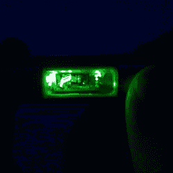

# 构建光泵激光指示器

> 原文：<https://hackaday.com/2019/02/22/building-an-optically-pumped-laser-pointer/>

作为一个社会，我们在很大程度上一致认为激光笔是无用的。他们现在是大学讲师和那些注定要因为骚扰直升机飞行员而被关进监狱的人的领地。大多数指针都是二极管泵浦的固态指针。然而，[芝诺碘顿]走的是一条不同的道路。

The laser cavity glows in operation, though it’s probably inadvisable to look directly at it.

不同于通常的 DPSS 建造，这个指针包了一个光泵半导体激光器，或 OPSL。这些激光器具有输出波长选择范围更广的优点，并且可以制造成在光束参数如发散度方面提供更小的变化。

这是一个吸引人的建筑，指针底盘由黄铜制成，几个部件镀上了黄金和玫瑰金。甚至还有一个滑动窗口来观察激光腔，它在运行中发出明亮的光。[Zenodilodon]详细介绍了加工过程，展示了生产一个视觉上吸引人的设备所需的所有步骤。

这当然是我们见过的最漂亮的激光建筑之一，看到制造商探索不同的技术总是很高兴。[与我们最近推出的 1.4 W 激光笔](https://hackaday.com/2019/02/19/building-a-1-4w-laser-pointer-in-a-tiny-housing/)类似，这主要是一种包装操作，但如果你在家里制作自己的激光二极管——[你知道把它们送到哪里](http://hackaday.com/submit-a-tip)。休息后的视频。

 [https://www.youtube.com/embed/RI_4TpjS5ZE?version=3&rel=1&showsearch=0&showinfo=1&iv_load_policy=1&fs=1&hl=en-US&autohide=2&wmode=transparent](https://www.youtube.com/embed/RI_4TpjS5ZE?version=3&rel=1&showsearch=0&showinfo=1&iv_load_policy=1&fs=1&hl=en-US&autohide=2&wmode=transparent)

