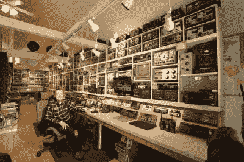
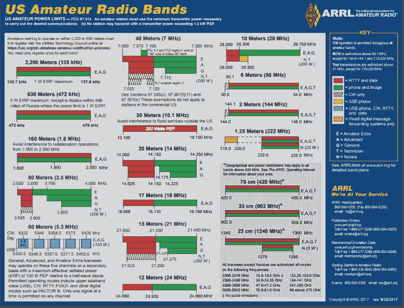
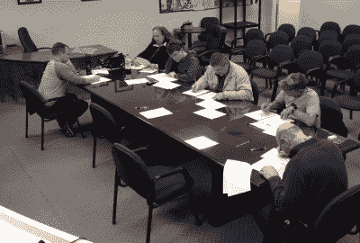

# 50 美元的火腿:让你的票穿孔

> 原文：<https://hackaday.com/2019/03/08/the-50-ham-getting-your-ticket-punched/>

今天，我们开始了一个新的系列，致力于为小气鬼业余无线电。业余无线电有一个“有钱的老家伙”爱好的名声，这个名声在某种程度上可能是实至名归的。从 DX Engineering 拿起一份精美的目录，或者浏览他们的网站，你会发现进入最新最棒的装备并不适合经济困难的人。因此，这位最近退休的人的形象一直存在，他早已过了养家糊口所需的花费和时间，突然有了时间，兴高采烈地在已经设备齐全的火腿小屋中再增加一件昂贵的装备，用他的“OMs”来“嚼碎抹布”。

Not a $50 ham. W9EVT’s shack. Source: [QRZ.com](https://www.qrz.com/db/W9EVT)

正如我几年前在[“我的火腿牛肉广播”](http://hackaday.com/2016/12/12/my-beef-with-ham-radio/)中指出的，我是一个不活跃的火腿。我不练习的主要原因是我不喜欢与陌生人交谈，但我的沉默也有经济方面的原因——当你没有太多话题可聊时，很难在装备上花很多钱。我怀疑有很多想成为火腿的人会因为其明显的花费而放弃这一爱好，也许还有一些像我一样对麦克风感到害羞的人。

这个系列节目旨在消除一个神话，即一个人需要很多钱才能成为一个火腿，而唠叨是一个人在广播中唯一做的事情。每一期都会有一个项目，让你在火腿之旅中走得更远，花费不超过 50 美元左右就可以完成。只要有可能，我会自己构建项目或测试活动，这样我就可以追求自己的目标，实际使用我的许可证来改变。

(感谢罗伯特提出这个系列，并慷慨地允许我实施他的想法。)

## 拿你的票

美国对业余电台的许可可以追溯到 1912 年。(我关注美国关于业余无线电服务的法律和习俗，只是因为我住在那里；请随时在评论区加入其他国家的差异。)任何想要在为业余无线电服务保留的频带上操作的人必须得到联邦通信委员会的许可。没有执照的个人可以自由地——并且被鼓励——收听这些波段，但是如果你没有执照，你就不能传播。相信我，拥有专业知识、设备和世界上所有时间的当地火腿会找到你，导致与联邦通信委员会的不愉快遭遇。

反正真的没理由不领证。这将是火腿旅程中最便宜的部分，甚至可能是免费的。要获得执照，你需要通过笔试，但在冒险之前，你需要了解一些业余无线电执照的种类，以及它们所赋予的特权。

美国目前的入门级执照类叫做技师类；旧的新手课程在 2000 年被取消了，所有课程的莫尔斯电码要求也被取消了。技术人员有权主要在较高频率上操作，主要是在电话模式下的 2 米(144 MHz)和 70 厘米(420 MHz)波段上，这意味着语音传输。技术人员还可以使用数据模式访问 10 米波段的小部分，如果他们学习莫尔斯或使用计算机发送和接收它，还可以访问 15 米、40 米和 80 米的小部分。这限制了技术人员主要进行本地通信，但在这些频段上有很多事情要做，也有很多东西要学。

The band plan for US hams. Note that Technicians only have phone (voice) privileges on 10 meters and below; the long haul bands are off limits unless you use Morse. Source: [ARRL.org](http://www.arrl.org/files/file/Regulatory/Band%20Chart/Band%20Chart%208_5%20X%2011%20Color.pdf)

## 练习，练习，练习

即使有所有的限制，技术人员执照仍然提供了大量的频谱，并作为进入下两个类别的门户，一般和额外。每个人都要从技师执照开始，这需要通过 35 道题的选择题考试。考试是标准化的，从一个固定的库中选择问题[，题目从了解](http://www.arrl.org/question-pools) [FCC 第 97 部分规则](https://www.ecfr.gov/cgi-bin/text-idx?SID=d4b3c60d2d60000a147f885bdee88264&mc=true&node=pt47.5.97&rgn=div5)到基础电子学和射频理论。考试相当容易，尤其是对任何有电子学背景的人来说。事实上，许多新手在进行了足够多的在线模拟测试后参加考试，以查看每个可能的问题并通过考试，而对无线电或电子产品一无所知。关于这是不是一件好事，存在激烈的争论——就我个人而言，我并不支持它——但事实就是如此；技师考试非常简单。

你在技术人员执照上的投资很少，大部分是花在学习上的时间。在线模拟测试——我推荐在[QRZ.com](https://www.qrz.com/hamtest/)进行的测试——是免费的，你需要多少次都可以。一些火腿俱乐部提供旨在帮助你准备的当地课程，这些课程通常只收取象征性的费用。甚至还有[为期一天的强化“火腿补习班”](http://www.w6sf.org/hamcram.html)，在那里你会被引导通过所有的材料，并在一天结束时参加考试。

Typical exam session. Calculators are allowed, but no smartphones, please. Source: [Tri-County Amateur Radio Club](http://wc5c.org)

考试环节由~~志愿考试协调员(vec)~~志愿考官(VEs)负责，他们在考试管理和评分方面受过专门培训。他们也只收取象征性的费用——我想我付了 15 美元——在某些情况下甚至可能免收费用。还有偶尔的特殊活动，如[一年一度的场地日](http://www.arrl.org/field-day)，火腿在公共场所搭起帐篷和摊位，作为对公众的宣传，那里的考试通常是免费的。

老实说，获得技术人员执照对业余无线电爱好来说影响不大。一旦你能始终如一地通过在线模拟考试，真正的考试就轻而易举了。考试是当场评分的，所以你可以立即知道你做得怎么样，如果你准备好了，你甚至可以参加下一次考试，不需要额外的费用。即使你没有学习过，也要试一试——我在普通考试中得了 a 后，差点没通过额外的考试。

## 下次

在下一期文章中，我将开始讨论新培养的技术人员可以用他或她的执照做什么。以不到 50 美元的价格进行广播似乎是一个白日梦，但令人惊讶的是，现在有这么多，你会发现 50 美元对你的第一次接触有很大帮助。