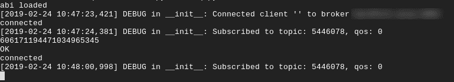
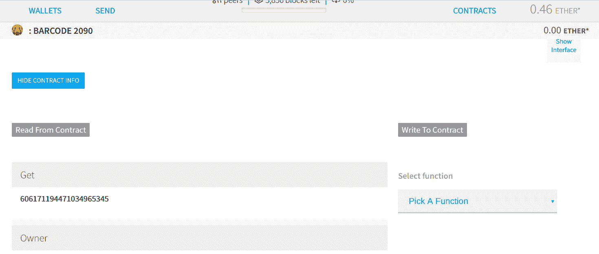

# 是的，您可以使用 Python 和 ESP8266 将物联网放在区块链上

> 原文：<https://hackaday.com/2019/03/01/yes-you-can-put-iot-on-the-blockchain-using-python-and-the-esp8266/>

去年，我们看到相当多的媒体关注区块链的创业公司。他们从公众那里筹集资金，然后大部分消失得无影无踪(或产品)。抛开他们筹款模式的道德和合法性不谈，他们提出的一些想法可能值得有一天重新审视。

我特别纠结的一个想法是物联网和区块链技术的综合。通常当介绍一种产品或技术时，我能理解有人会如何和/或为什么使用它——在这种情况下，我既不理解*也不理解*，它一直在我脑海中某个安静但无法抑制的角落困扰着我。

我见过的典型物联网网络使用廉价和低功耗的设备收集数据，并将其传输到中央服务，而无需在安全上花费过多的精力(有时甚至少得多)。另一方面，区块链往往是一种昂贵的数据存储方式，需要大量的本地存储和处理能力来与它们进行充分的交互，并且通常涉及到公私密钥加密的谨慎使用。

我可以看到一些有用的边缘情况，例如安全地设置一些大型状态机网络的状态——有点像这个系统的更复杂版本,[通过以太坊智能合约](http://hackaday.com/2017/11/09/iot-with-the-ethereum-blockchain)控制单个 LED。

尽管我相信什么并不重要，也许我只是缺乏想象力——*所以无论如何让我们建造它*。

## 块状钉、圆孔


This is what being a programmer feels like, sometimes.

要解决的第一个问题是，每当我想为我的烤面包机启用安全、不可信和分布式的数据存储时，像 Raspberry Pi 一样使用整个嵌入式 Linux 系统是不切实际的。启动时间、功耗和成本无疑会破坏我对烤面包的胃口。

作为一种折衷，让我们考虑一种架构，其中各种物联网设备通过 [MQTT](http://en.wikipedia.org/wiki/MQTT) 使用某种级别的安全性与保存网络上各种设备的公钥和私钥的服务器(可能是现场服务器)进行通信。将密钥存储在每台设备上是可能的，但是由于服务器在某个阶段无论如何都需要明文形式的密钥，我们最好避免重复传输密钥。我还可以向 ESP8266 添加外部密钥管理硬件，并以合理的安全性签署交易，但这是相当大的工作量，超出了快速测试的范围。

无论如何，这种架构让我们可以从每个部署的一个点处理所有的“区块链东西”，并让物联网设备或多或少像往常一样。我们并没有坚持完全的去中心化，但是我认为这个折衷是值得的。无论如何，我之前建造了一个互联网连接的条形码扫描仪，鉴于对供应链使用区块链的兴趣，它似乎是一个有趣的数据源(更重要的是，这意味着我的烤面包机保持完整)。

## 集中式分散服务器

通常，我会从通过 MQTT 发送的授权设备中获取数据，并将其存储在数据库中。我们感兴趣的是，将这些数据放入以太坊的智能合约中。让我们从导入 Python3 模块开始，我们需要完成这项工作:

```

from web3 import Web3, HTTPProvider, IPCProvider, WebsocketProvider
from flask import Flask
from flask_mqtt import Mqtt
import time
import json as json

```

我最近写了关于[使用 Web2Py 来拼接快速 API](http://hackaday.com/2019/02/21/building-a-simple-python-api-for-internet-of-things-gadgets)的文章。添加对 MQTT 的支持看起来并不有趣，所以我们已经转移到了 [Flask](http://flask.pocoo.org) 上。到目前为止，它看起来真的很棒，但我才刚刚开始研究它，所以我们在这里几乎不会用到它。 [Web3](http://web3py.readthedocs.io/en/stable) 是处理与以太坊区块链交互的模块(Web2Py 和 Web3py 是不相关的项目)。无论如何，让我们从一个简单的侦听器开始，它处理关于某个主题的 MQTT 消息:

```

app = Flask(__name__)
app.config['MQTT_BROKER_URL'] = 'yourbroker.com' # your broker address goes here
app.config['MQTT_BROKER_PORT'] = 1883 # default port for non-tls connection
app.config['MQTT_USERNAME'] = '' # No username set for now
app.config['MQTT_PASSWORD'] = '' # no password set for now
app.config['MQTT_KEEPALIVE'] = 5 # keepalive every 5 seconds
app.config['MQTT_TLS_ENABLED'] = False # set TLS to disabled for testing purposes

mqtt = Mqtt()
mqtt.init_app(app)

running = True

@mqtt.on_connect()
def handle_connect(client, userdata, flags, rc):
    print(&quot;connected&quot;)
    mqtt.subscribe('topic') #your MQTT topic here
while running == True:
    @mqtt.on_message()
    def handle_mqtt_message(client, userdata, message):
        data = dict(
            topic=message.topic,
            payload=message.payload.decode()
        )
        barcode = (data[&quot;payload&quot;])
        barcode = int(barcode)
        print (barcode)
        #our function to store the MQTT payload on Ethereum goes here as store_results(barcode)
        print (&quot;OK&quot;)

```

这很好地工作，并返回发送给它的消息，但是除了打印之外，它实际上不处理数据。

### 简单的智能合同

要做更多的事情，我们需要一个简单的智能合同。我在 Solidity 中写了一个简单的例子，在一个名为“barcode”的变量中存储一个整数:

```

pragma solidity &gt;=0.4.0 &lt;0.6.0;
// the pragma line above indicates which version of Solidity can be used to compile this contract. Solidity is updated OFTEN so this is very useful.
// The below names the contract, and the defines the variables it contains and their type
contract Barcode {
    address public owner = msg.sender;
    uint public creationTime = now;
    uint barcode;
// Only allow the contract owner to push barcode data to the contract.
    modifier onlyBy(address _account)
    {
        require(
            msg.sender == _account,
            &quot;Sender not authorized.&quot;
        );
// Do not forget the &quot;_;&quot;! It will be replaced by the actual function body when the modifier is used.
        _;
    }
// This function is what we will call to set the variable x. It costs Ether to do so, and only stores one value (although historical values are preserved on the blockchain)

    function set(uint x) public onlyBy(owner) {
        barcode = x;
    }
// This function returns the value of x, it costs no Ether to do so.

    function get() public view returns (uint) {
        return barcode;
    }
}

```

我发现在 [Remix](http://remix.ethereum.org) 中编写和检查智能合约很有用。在那里编译之后(Solidity 0.5.4+commit.9549d8ff)，你可能会注意到一个标有“ABI”的小按钮。ABI 包含对智能合约提供的功能的描述——web 3 稍后将需要它来与之交互。单击按钮将其复制到剪贴板，并粘贴到文件中。在这个例子中，我们将使用文件 barcode.json。

您还需要将智能合约添加到区块链。在 Ropsten 测试网络上创建帐户后，您可以使用[以太坊钱包](http://github.com/ethereum/mist/releases)来完成此操作。

### 回到我们的应用程序

接下来，我们需要让 Web3 模块将数据从我们的 MQTT 主题推送到以太坊。我们将使用 Ropsten 测试网络来避免搞乱真实网络，并避免在完全没有密钥管理的情况下暴露更有价值的私有密钥。您还需要在 [infura.io](http://infura.io) 拥有一个免费帐户，用于连接以太坊网络，他们会提供一个 URL，您可以粘贴到下面——确保使用 Ropsten 测试网络的 URL:

```

with open('full path to barcode.json') as f:
    abi = json.load(f)
    print(&quot;abi loaded&quot;)

w3 = Web3(HTTPProvider('URL provided by Infura'))
contract_address = 'contract address, including the 0x’
wallet_private_key = 'your test network private key here'
wallet_address = 'testnet wallet address, including the 0x'
contract = w3.eth.contract(address = contract_address, abi = abi)

def store_results(x):
    nonce = w3.eth.getTransactionCount(wallet_address)
#if something is failing, try print (nonce) to test connectivity to Infura here. Chain ID = 3 is Ropsten.
#Below, we craft a transaction to set variable x in the smart contract to the value provided to this function
    txn_dict = contract.functions.set(x).buildTransaction({
        'chainId': 3,
        'gas': 140000,
        'gasPrice': w3.toWei('40', 'gwei'),
        'nonce': nonce,
    })

#Then we sign the transaction with our private key
    signed_txn = w3.eth.account.signTransaction(txn_dict, private_key=wallet_private_key)
#The signed transaction is sent to the blockchain using Infura as an endpoint
    result = w3.eth.sendRawTransaction(signed_txn.rawTransaction)
# Then we wait for a receipt. It can take a short while.
    tx_receipt = w3.eth.getTransactionReceipt(result)
    count = 0
    while tx_receipt is None and (count &lt; 30):
        time.sleep(10)
        tx_receipt = w3.eth.getTransactionReceipt(result)
    return(tx_receipt)
    if tx_receipt is None:
        tx_receipt = &quot;Failed&quot;
        return(tx_receipt)

```

对服务器来说就是这样——所有这些都保存到一个文件中，运行它将监视一个 MQTT 主题，并将任何接收到的整数发送到以太坊的 Ropsten 测试网络。这里走了很多捷径——没有密钥管理、不安全的 MQTT 实现、没有数据类型检查等等。现在这还可以，因为添加这些会使我们的测试变得不必要的复杂。

## 连接条形码扫描仪

最后，我们将需要一些物联网硬件作为数据源。我已经找到了我之前写过的[物联网条形码扫描仪](http://hackaday.com/2018/08/15/track-everything-everywhere-with-an-iot-barcode-scanner/)。我将它连接到一个运行 NodeMCU 的 Wemos 迷你 D1，并添加了一点代码来清理和推送扫描的条形码 MQTT:

```

-- Setup UART and print something so we know it's working

uart.setup(0, 9600, 8, uart.PARITY_NONE, uart.STOPBITS_1, 0)
print(&quot;Scanning&quot;)

-- Set up a couple of variables so they're not nil

data = &quot;&quot;
datac = &quot;&quot;

-- This function prints out the barcode data and clears all variables so the scanner can read a new barcode. If you wanted to send the data over MQTT, your code would replace the print statement here.

function finish()
    ClientID = 5446078
    m = mqtt.Client(ClientID, 120)
    datac = datac:gsub(&quot;%D+&quot;, &quot;&quot;)
    print (datac)
    if datac ~= nil then
        m:connect(&quot;hardfork.asia&quot;, 1883, 0, function(client) print(&quot;connected&quot;) m:publish('5446078',datac,0,0) p = &quot;Sent&quot; print(p) m:close() scansoon() end)
    end
end

function scansoon()
    tmr.alarm(1, 1000, tmr.ALARM_SINGLE, function() scan() end)
    data = &quot;&quot;
    datac = &quot;&quot;
end
-- This function concatenates all data received over 150 milliseconds into the variable datac. The scanner sends the data in multiple parts to the ESP8266, which needs to be assembled into a single variable.

function scan()
    uart.on(&quot;data&quot;, 0, function(data)
        tmr.alarm(0,150,0,finish)
        datac = datac .. data
    end, 0)
end

tmr.alarm(1, 1000, tmr.ALARM_SINGLE, function() scan() end)

```

当我们连接到网络并扫描条形码时，我们看到我们的应用程序监听 MQTT 主题的输出如下:



最后，如果我们打开一个以太坊钱包，并检查智能合约中“Get”功能的值，我们会看到一个条形码——在这种情况下，来自一张过期已久的会员卡。不管是好是坏，我们愚蠢的区块链物联网设备起作用了！



在构建了这个之后，我仍然不明白为什么我们会将数据从物联网设备直接推送到区块链…但至少我现在知道*如何*了。由于来自物联网设备的数据无论如何都是可信的，所以在数据进入你正在使用的任何后端之后，任何区块链魔法似乎都不会那么复杂——也许只是每小时左右使用一个哈希函数将你的数据库锚定到一个公共链上。这是我见过的大多数公司系统的一个非常简单的扩展，当然不是筹集大量资金的充分理由。

话说回来，投资者的想法对我来说永远是陌生的。