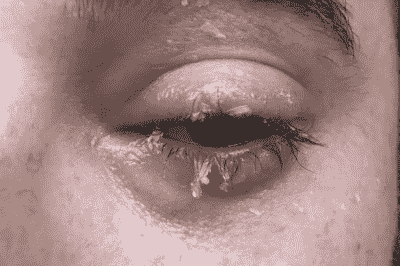

# 从眼睛里的强力胶中拯救你的视力

> 原文：<https://hackaday.com/2019/03/08/saving-your-vision-from-super-glue-in-the-eyes/>

强力胶，正式名称是氰基丙烯酸酯，是一种非常有用的粘合剂。它是在 20 世纪作为一个创造塑料枪瞄准器的项目的结果而发展起来的，因其能够快速有效地粘合各种材料而受到人们的喜爱。木头、金属、各种各样的塑料——强力胶会在瞬间把它们粘在一起。

它还特别擅长粘在人体皮肤上，这就存在一个问题。当它沾到你的手指上就够糟的了。眼睛里进了强力胶会怎么样？

今天，我们来回答这个问题。首先，我是如何抓到一大把胶水的。接下来，我将分享一些当你发现自己处于困境时的通用技巧。

## 我是如何学会不再担心并爱上胶水的

这是郊区一个美丽的夏日傍晚，我被叫去帮一个朋友修车。尾灯里的灯座已经坏了，这使得它在法律上无法驾驶。这一切都很容易解决，只需在涂上胶水之前将塑料片轻轻放回一起，然后将它们粘在一起，也许还可以用一些加固材料来增加强度。

不幸的是，我只带了手工工具，没有意识到这项工作需要粘合剂。现场可用的胶水是强力胶，但不是我喜欢的品牌。这是一种乐泰凝胶混合物——又稠又粘。在这种形式下，胶水很容易精确地涂抹，但它不容易渗入裂缝。

我一直是一个使用廉价和肮脏的东西。它一美元 8 个一包，非常松软。这是一种完美的胶水，当你需要它渗入破裂的塑料部件的裂缝中，并把所有东西重新粘在一起。我决定回家拿一管，因为我不能得到我想要的凝胶。

很快，成功了。我设法把灯座粘了回去，还把管子粘在了我的手指上。这是非常标准的操作程序，所以我并不特别担心。我开始从管子上剥手指。不幸的是，当我的手指从管子中拔出时，喷嘴将一滴厚厚的胶水直接喷向我的脸，落在了我的眼角。

我认为这是一个相当消极的发展。幸运的是，我能够让我的眼睛不眨，并迅速用手指睁开。我也大声叫了起来，但不是很开心。我的朋友们冲过来帮助我，在我尽量避免移动眼睛的时候，他们把我带了进去。

我的一个朋友是隐形眼镜使用者。这意味着可以用生理盐水冲洗眼睛，我眨也不眨地反复冲洗眼睛。在我确定胶水从我精致的眼白中消失后，我小心翼翼地眨了眨眼睛。当我的眼睛重新睁开而没有闭上时，我欣喜若狂，深深地松了一口气。

然后，我开始轻轻地擦去下眼睑和睫毛上变硬的胶水。我确信我侥幸躲过了灾难。一旦一切平静下来，我决定开始研究这到底有多糟糕。

## 事实

Ocular injuries from super glue are surprisingly common. Thankfully, it’s not as bad as it may initially seem.

我确信我差一点就失去了一只眼睛的全部视力。我的研究很快证明事实并非如此。Sagili Chandrasekhara Reddy 博士的一项文献研究涵盖了 30 年间 53 例眼内灌注强力胶的案例。没有严重眼部损伤的病例报告。在大多数情况下，医疗专业人员用镊子从眼睛中取出胶水，修剪粘连的睫毛，并冲洗眼睛。值得注意的是，没有报告严重的眼部发病病例。通俗地说，这意味着每个人都带着一双工作的眼睛回家了。

令人惊讶的是，这适用于大量胶水直接喷入眼睛的情况。这种情况比你想象的更常见——强力胶管经常与眼药水混淆，这是儿童向急诊室陈述的常见方式。即使你把胶水喷到眼睛里，也不太可能造成永久性伤害。

布朗急救医学公司还注意到缺乏强力胶导致严重眼部损伤的报告。他们的建议指出，如果将强力胶粘在眼球或眼睑上，可以简单地用温水冲洗眼睛，贴上眼罩，然后不去管它。胶水会在 1-4 天内从眼睛蛋白质和皮肤上分离，眼睛会再次睁开。

## 胶水粘上时该怎么办

如果你不幸被胶水弄进眼睛，那会是一次相当紧张的经历。虽然这种事件相当具有挑战性，但保持冷静，不做任何鲁莽的事情是保护您视力的关键。以下内容不作为医疗建议，而是作为如何处理眼部粘连事件的一般指南。

你的第一步应该是尽可能避免眨眼。这只会增加眼睑合拢时闭上眼睛的可能性。强力胶在有水分的情况下会凝固，所以这也会使眼睑更有可能粘在眼球上。

接下来，重要的是不要惊慌。轻率的措施比强力胶本身更有可能造成永久性的眼睛损伤。避免试图擦掉胶水，或将任何固体物体放在眼睛附近。

第三，如果安全的话，冲洗眼睛是有帮助的。这可以用清水或适当的医用溶液来完成，例如隐形眼镜使用者使用的盐水。不管你用什么，都应该对眼睛安全。使用任何东西来溶解胶水都是绝对不允许的(像丙酮或指甲油去除剂这样的化学物质会造成巨大的伤害)。如果你不确定，完全跳过这一步。

最后一步是寻求专业的医疗护理。医生、护士和外科医生都受过处理这类伤害的适当培训，并拥有安全处理这类伤害所需的设备。此外，虽然强力胶可能不会造成任何严重的损害，但它可能会导致角膜擦伤或结膜损伤。如果不治疗，这可能会导致视力下降或感染。在这些情况下，可能需要滴眼药水或贴眼罩，并咨询眼科医生。如果你在森林里，救援需要几天的时间，你可以试着冲洗眼睛，并在几天内修补眼睛，眼睛应该会重新睁开，但最好尽可能寻求专业治疗。

## 谨慎行事

总之，强力胶是一种不需要害怕的奇妙工具。然而，为了避免在急诊室度过漫漫长夜和在同事面前尴尬，在外面要小心。想想你在做什么，工作的时候眼睛要放在心上。

希望你觉得这个指南有用，你可以用氰基丙烯酸酯进行更多年的眼睛安全冒险！